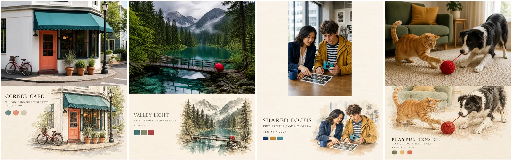

<div align="center">
  <h1>🎨 Codex ImageGen 技能精选</h1>
  <p><strong>中文</strong> · <a href="README_EN.md">English</a></p>
  <p><strong>让好用的视觉方法被发现、被比较、被复用。</strong></p>
  <p>一份持续更新、带真实生成示例的 Codex ImageGen skills 精选清单。</p>
  <p>
    <a href="https://github.com/sindresorhus/awesome"></a>
    
    
    
    <a href="#contributing"></a>
  </p>
  <p>
    <a href="#photo--editorial">浏览 Skills</a> ·
    <a href="#sample-inputs--reproduction">查看示例输入</a> ·
    <a href="#contributing">提交 Skill</a>
  </p>
  <p><strong>喜欢这份清单？欢迎点亮 Star ⭐　发现好 skill？带着 PR 一起上车 🚀</strong></p>
</div>

---

这里收集那些把视觉方法、领域知识和创作流程封装进 `SKILL.md`，并使用 Codex harness 内置 `image_gen` 生成或编辑图片的优秀项目。

> 🖼️ 四联预览均按「人造 / 建筑 · 自然 / 景观 · 人物 / 道具 · 动物 / 互动」排列；点击任意预览可查看四张高清原图。


## 🧭 目录

- 📸 [照片与编辑设计](#photo--editorial)
- 🪄 [品牌与视觉识别](#branding--identity)
- 🧶 [手工艺与织物](#craft--textile)
- 🎨 [插画与海报](#illustrations--posters)
- 📊 [演示与图示](#presentations--diagrams)
- 🖥️ [界面与产品设计](#ui--product-design)
- 🎮 [游戏资产与角色](#game-assets--characters)
- 🎬 [故事板与视觉叙事](#storyboards--visual-narratives)
- 🤝 [参与贡献](#contributing)
- 🔗 [相关合集](#related-collections)

<a id="photo--editorial"></a>
## 照片与编辑设计

### [Photo Abstract Editorial](https://github.com/ZzzLc0405/photo-abstract-editorial)

将一张照片制作成「原始摄影区域 + 照片关系派生的抽象记忆面板 + 诗意英文标题」的竖向编辑作品。

- **Author:** [ZzzLc0405](https://github.com/ZzzLc0405)
- **Input:** 一张照片
- **Output:** 竖版摄影编辑作品
- **ImageGen role:** 保留原摄影区域，并把主体关系、空间轴线、光线与配色转译成抽象记忆面板和诗意英文标题
- **Structure:** `SKILL.md`、`agents/openai.yaml`、中英双语 reference prompts 与示例图片
- **License:** 仅限个人、教育、研究和非商业用途；商业使用需联系作者授权

<details>
<summary><strong>✨ 特色与备注</strong></summary>

**特色**

- 保留原摄影区域，不把任务退化成滤镜或整图风格迁移。
- 先识别主体关系、轴线、间隔、光线、色彩角色与负空间，再把这些关系翻译成抽象图形。
- 对抽象面板设置了很强的克制规则：象牙色平面背景、有限图形家族、取自原图的低饱和配色，以及禁止纹理、阴影、拼贴装饰和无来源元素。
- `SKILL.md` 很短，完整视觉规范按语言放在 `references/`，是不错的 progressive disclosure 案例。

**备注**

示例整体有稳定的上下分区、留白和色彩映射，但“抽象程度”会随题材变化。夕阳等案例接近纯关系抽象，城市与地标案例会保留较强轮廓，部分自然题材更接近插画式重述。其“照片保持原样”主要依赖生成模型遵循指令，并非确定性的逐像素保证。

</details>

<p align="center">
  <a href="examples/photo-abstract-editorial/README.md"></a>
</p>

### [Photo Relic Editorial / 纸上留影](https://github.com/wnby/photo-relic-editorial)

将真实照片与下半部的「纸上记忆版画」配成竖向编辑作品，把主体、光影、空间与情绪压缩成少量可识别的墨块和留白。

- **Author:** [wnby](https://github.com/wnby)
- **Input:** 一张已授权照片；可选标题语言、版式与系列方向
- **Output:** 竖版摄影与纸张版画组合图
- **ImageGen role:** 保留上层摄影区域，从原图身份、光线、色彩、边缘与尺度关系派生下层现代版画
- **Structure:** `SKILL.md`、`agents/openai.yaml`、prompt guide、6 张 Paper Beijing 示例与 `LICENSE`
- **License:** MIT；输入照片与附带视觉素材仍须确认相应使用权

<details>
<summary><strong>✨ 特色与备注</strong></summary>

**特色**

- 生成前提取 3–5 个来源线索，并选择版式、版画语法、笔触重量、标题和静态/动态种子组成的明确配方。
- 以暖白纸、深墨块、负空间切口和一个来源相关的暖色点建立系列感，避免完整水彩重画或无意义色块。
- 人物转为保留姿态与间隔的小型痕迹，不要求下层还原脸部；识别度和缩略图可读性均纳入质量门槛。

**备注**

本仓库仅使用四张合成 fixtures 作为内容输入，不把上游示例图送入生成器。四组保留了建筑、双人物和猫狗的来源关系，但下层整体偏具象，湖景尤其接近水彩重述，未完全达到少量痕迹的抽象目标。照片保真依赖模型指令，没有确定性贴回原图或逐像素校验；它与 Photo Abstract Editorial 的题材相近，但更强调纸张、现代版画笔触与完整主体轮廓，而不是纯几何关系面板。

</details>

<p align="center">
  <a href="examples/photo-relic-editorial/README.md"></a>
</p>

### [Muge Photo Diptych](https://github.com/Yeshmuge/muge-photo-diptych)

将一张照片转化为竖幅 2:3 的手工艺术志双联拼贴，以纯白反相剪影、重复暗影和跨越纸面的连接线缝合现实场景与记忆层。

- **Author:** [Yeshmuge](https://github.com/Yeshmuge)
- **Input:** 一张人物、动物、建筑、景观或静物照片；可选主句、碎片文字、连接方式和点缀色
- **Output:** 竖幅 2:3 的上下双联艺术志拼贴
- **ImageGen role:** 保留场景与主体关系，将上层主体反转为无细节纯白剪影，在下层复现同姿态暗色剪影，并从原图线性元素延伸一根手绘连接线
- **Structure:** `SKILL.md`、`agents/openai.yaml`、视觉规范、规范化 prompt 模板、使用示例和两张官方参考图
- **License:** CC BY-NC 4.0；参考图不自动纳入许可；非商业分享需署名并标注修改，商业使用须另行授权

<details>
<summary><strong>✨ 特色与备注</strong></summary>

**特色**

- 约束优先级非常明确：主体数量、姿态和轮廓优先于纯白剪影、下层复现、分界线、连接线、配色与文字，便于定向检查和重试。
- 提供两种连接方式：Mode A 让线围绕人物或动物的动作展开；Mode B 让线从建筑、栏杆等既有线性元素出发，题材含混时默认使用更稳妥的 Mode B。
- 从原图提取整体色温和唯一点缀色，点缀色同时约束手绘线与全部手写字，避免无来源配色和一层泛黄滤镜。
- 对纯白剪影、文字错误、主体数量和连接线来源均设有拒绝与重试规则，并允许在排字不稳定时采用两阶段工作流。

**备注**

本仓库对咖啡馆和湖景采用 Mode B，人物案例从接触印样边缘引线，猫狗案例则让原图红毛线直接成为 Mode A 的跨页叙事线。四组结果都稳定形成了上下双联和来源相关配色；人物案例需要一次局部修正，才能彻底去除白色剪影内部残留的相机线稿，说明“完全留白”仍值得作为人工质量门槛。公开分享这些衍生作品时应注明 `Diptych Skill by @Yeshmuge`。

</details>

<p align="center">
  <a href="examples/muge-photo-diptych/README.md"></a>
</p>

### [Scenes Gathered Zine v1.3](https://github.com/Zeejay0/gathered-scenes-zine-skill/tree/main/skills/scenes-gathered-zine-v1-3)

把用户照片作为可辨认的真实锚点，再以撕纸边界、抽象插画、版画纹理和克制的微型文字，将场景扩展成有纸张触感的 zine 海报。

- **Author:** [Zeejay0](https://github.com/Zeejay0)
- **Input:** 一张照片；可选标题、语言与画面关系说明
- **Output:** 默认 3:5 竖版，也可顺应原图构图生成横版 zine 拼贴
- **ImageGen role:** 保留照片核心主体和空间关系，并生成源自原图形状、色彩与情绪的插画场
- **Structure:** `SKILL.md`、`agents/openai.yaml`、两组官方 source/result 示例
- **License:** 仅限个人非商业使用；商用、受托创作、组织内部使用及付费服务均需书面许可

<details>
<summary><strong>✨ 特色与备注</strong></summary>

**特色**

- 先生成 Scene Card，记录主体、空间不变量、主导动势、视觉重量、色彩气氛、可抽象形状与安静区域，再进入提示编译，方法比单纯描述风格更可复用。
- Minimal Abstraction Engine 明确要求删除多数微小细节，并限制为一种主要插画语法和至多一种辅助语法，能抑制常见的“什么都画、哪里都满”。
- 新增高饱和色必须承担构图功能；其 Structural Removal Test 会反问“去掉该颜色是否改变画面结构”，是很实用的自检规则。
- 对照片隐私、文字长度、中文/英文微型排版、缩略图检查和一次定向重生成都有具体约束。

**备注**

两组官方示例都能清楚保留原照片的地标、桥梁、人群和空间层次，同时让纸张、撕边和版画/水彩区域承担新的构图功能，视觉方法完成度很高。第二组结果沿用了原图横向构图，说明 3:5 更适合作为默认值而非硬约束。当前 skill 约 400 行且几乎全部集中在 `SKILL.md`，规则完整但上下文开销较大；官方样本目前也只有两组，跨题材稳定性仍需更多案例验证。照片保真依赖生成模型，没有确定性合成或像素级校验。

</details>

<p align="center">
  <a href="examples/scenes-gathered-zine-v1-3/README.md"></a>
</p>

### [Photo to Monthly Zine Postcard](https://github.com/shenchangyi/photo-to-monthly-zine-postcard/tree/main/skills/photo-to-monthly-zine-postcard)

将一张照片制作成 3:4 月度 Zine 明信片：上半完整容纳原图，下半用来源相关的自由边缘水彩、月标、文学短句、歌曲和页脚组成紧凑的摄影月历页。

- **Author:** [shenchangyi](https://github.com/shenchangyi)
- **Input:** 一张照片；可选月份、手写句、署名、日期、页脚、书目或歌曲
- **Output:** 3:4 竖版月度摄影明信片
- **ImageGen role:** 保留上半照片，并从其主体、空间与光线关系派生下半水彩视觉块和整卡排版
- **Structure:** 精简入口 `SKILL.md`、3 份工作 references、完整规则草案、视觉参考与 8 张成品示例
- **License:** MIT

<details>
<summary><strong>✨ 特色与备注</strong></summary>

**特色**

- 根据原图宽高比设置了 5 档路由，对横图、方图、竖图和极窄长图分别规定 `contain` 尺寸与占位；极窄输入会先询问用户，而不是自动裁切。
- 把文学与音乐策展从图片生成中分离：先根据主体、光线、空间、情绪和主色检索并核验，再把最终文字作为锁定字符串交给生成器；找不到可靠内容时使用原创旁白或留空歌曲。
- 对下半页的水彩块、右侧书签栏、月份、竖排文学组、歌曲和三段页脚给出相对尺寸与层级，目标明确且容易复用。
- 主流程将 layout、content curation 和 quality gate 拆入独立 references，是清楚的 progressive disclosure 结构。

**备注**

8 张成品示例在暖白纸张、原图—水彩呼应、右栏层级和页脚节奏上相当统一，且能处理常规风景、超宽场景和自带相机框的输入。但 gallery 没有单独提供原始输入文件，无法独立验证“上半照片完全不变”；`dusk-field-camera-frame.png` 实际为 1024×1536（2:3），也未满足规则声明的 3:4 硬约束。当前质量门槛是人工检查清单，没有确定性合成、尺寸验证或文字校验脚本；`SKILL.md` 要求生成成品，但未显式指定调用内置 `$imagegen`，因此尺寸、逐字排版和原图保真仍取决于 agent 与生成模型执行。

</details>

<p align="center">
  <a href="examples/photo-to-monthly-zine-postcard/README.md"></a>
</p>

### [Photo to Zine Postcard](https://github.com/Whiplashzeb/photo-to-zine-postcard)

把一张照片制作成一套极简 Zine 明信片：正面在上方完整嵌入原图，下方留下大面积空白，只放一个来源明确的手绘元素、少量元数据和三个取自原图的色块；背面则是可直接书写的统一邮资版式。

- **Author:** [Whiplashzeb](https://github.com/Whiplashzeb)
- **Input:** 一张用户照片；可选标题、副标题、地点、日期与编号
- **Output:** 两张相互配套的 2:3 竖版图片，分别为明信片正面与功能性背面
- **ImageGen role:** 将真实原图嵌入正面，按识别度、色彩和轮廓选择一个主元素进行克制的手绘转译，再生成同纸色、线条和比例的背面
- **Structure:** 单文件 `SKILL.md`、中英文 README、定制指南、更新与贡献文档、案例索引及 9 张官方成品
- **License:** MIT

<details>
<summary><strong>✨ 特色与备注</strong></summary>

**特色**

- 正面结构固定为“完整照片—大面积过渡留白—左下元数据—右下单一主元素—恰好三个色块”，明确禁止把下半页做成素材板或拼贴墙。
- 主元素优先选择最能识别原图、色彩鲜明且轮廓清楚的部分；水体、山形、植物和建筑默认手绘，人物、手部、文字与精密器材才回退为原图裁片。
- 只允许标题、短副标题、地点、日期和小编号；用户没有提供的地点与日期必须留空，不能用 `Unknown` 等占位内容补齐。
- 背面保持功能优先：外框、偏右中线、邮票框、地址线和大面积留言区构成一套克制、可打印的系统。

**备注**

上游提供 9 张风景与建筑成品，但未单独发布每张案例的原始输入，因此无法像素级验证“照片完全不变”。本仓库把每次测试的正反面合并为一张展示图：三张横版输入首轮通过，竖版双人照片首轮被裁成横框，经过一次只针对原图比例的修正后通过。四张样例均保留了三色块与功能背面；这也说明在纯生成式合成中，原图 `contain` 仍是需要人工检查的关键约束。

</details>

<p align="center">
  <a href="examples/photo-to-zine-postcard/README.md"></a>
</p>

### [Photo to Handdrawn Poster Postcard](https://github.com/Matthew0824/photo-to-handdrawn-poster-postcard)

将照片制作成暖白纸上的手绘海报明信片：上方清晰原图、左下编辑式文字与三枚色块、右下来源相关的墨线水彩小景。

- **Author:** [Matthew0824](https://github.com/Matthew0824)
- **Input:** 一张照片或照片目录；可选目的地、标题与既有版式
- **Output:** 默认 4:5 竖版摄影与手绘明信片，横图与竖图使用不同布局
- **ImageGen role:** 使用内置 imagegen 生成手绘图案和下半排版，再用上游脚本把清晰原照片贴回指定区域
- **Structure:** `SKILL.md`、Codex metadata、2 份 references、原图复原与线稿 fallback 脚本
- **License:** 未提供独立 License；公开可读不等于允许修改、再分发或商用

<details>
<summary><strong>✨ 特色与备注</strong></summary>

**特色**

- 将“照片保真”从模型指令移到确定性后期合成，保留原图内容、比例和原有署名。
- 横图顶部全宽 fit-width；竖图改用完整的居中高面板，避免挤掉下方文字和手绘区域。
- 手绘小景必须来自当前主体，不以通用地标或相同线稿替代不同来源。

**备注**

这是带有个人 Vatican 系列默认值的工作流；我们显式改用来源相关的咖啡馆、湖景、协作摄影和猫狗标题，避免无关的 Rome 文案。四张最终图采用 1122×1402 画布，并运行上游 `rebuild_sharp_photo_poster.py` 贴回原照片；该过程保持内容与宽高比，但包含 Lanczos 重采样，不意味着保留原始像素尺寸。未执行本地线稿 fallback，也未使用第三方风格垫图。

</details>

<p align="center">
  <a href="examples/photo-to-handdrawn-poster-postcard/README.md"></a>
</p>

### [GC Minimal Zine Poster v0.3.1](https://github.com/LiamGvchi/gc-minimal-zine-poster)

把主题、句子、文章、物件、情绪、照片或参考图转化为安静的纸张质感微编辑海报：以大面积留白承载一个小型视觉事件、克制排版和单一高饱和色彩焦点。

- **Author:** [LiamGvchi](https://github.com/LiamGvchi)
- **Input:** 文本主题、文章、照片、参考图或图片文件夹
- **Output:** 默认 3:5 位图海报、最终生成 prompt、所选 recipe 与简短阐释；也支持仅分析或仅输出 prompt
- **ImageGen role:** 显式调用内置图片生成能力，并在照片模式中传入实际源图、检查保真不变量，必要时定向重生成一次
- **Structure:** `SKILL.md`、5 份专项 references、6 张作者示例、8 条 eval、Codex UI metadata 与三语 README
- **License:** MIT

<details>
<summary><strong>✨ 特色与备注</strong></summary>

**特色**

- 同一 skill 内区分 Generate、Photo Input、Reference Analysis、Prompt-only 和 Analyze + Generate 五种路由，并要求选择满足请求的最小模式。
- 视觉系统具有可检查的尺度：默认 70%–90% 留白、8%–25% 主视觉簇、0.8%–2.5% 画布面积的高饱和主色，以及一个核心隐喻而非完整插画场景。
- Variation Engine 从布局、焦点载体、字体、纹理与装饰系统多轴组合 recipe，并对批量输出设置跨图变化规则，避免反复生成“居中小图加蓝点”。
- 照片模式明确区分 edit target、reference image 和 supporting insert，再按 High、Medium、Low 记录保真等级；对人物、宠物、角色、艺术品和产品默认采用 High preservation。
- Prompt Compiler、Reference Analysis 和 Quality Gate 均独立成文；eval 还覆盖人物身份、产品几何、参考图防复制、prompt-only 和非海洋主题误生航海图标等回归场景。

**备注**

6 张作者示例全部为 686×1144，接近严格 3:5，并稳定呈现纸张扫描感、大留白、小型视觉事件与单色焦点；center fragment、dual panel、type-led 和 offset cluster 等构图也有实际差异。它是当前清单中对内置 ImageGen 调用、输入图片传递和失败后重生成写得最明确的项目之一。不过示例集中于文本主题海报，没有公开 source/result 照片对照或 Reference Analysis 成品，High preservation 等高级路由尚缺视觉验证；质量检查和 eval 仍是声明式规则，没有自动尺寸、留白比例、色彩占比或文字可读性测试，微型生成文字也会受模型能力影响。skill 的可调用名称仍是 `gc-minimal-zine-poster-v0-3`，README 展示版本则为 v0.3.1，这是上游为兼容旧安装保留的命名。

</details>

<p align="center">
  <a href="examples/gc-minimal-zine-poster-v0-3/README.md"></a>
</p>

### [Photo Riso Poster](https://github.com/luckdvr/photo-riso-poster)

把照片或文字主题提炼成一张安静的孔版印刷档案海报：先记录数量、间隔、遮挡、方向与色彩角色，再用 2–3 层彩色油墨、少量排印和大面积留白重建这些关系。

- **Author:** [luckdvr](https://github.com/luckdvr)
- **Input:** 一张照片，或一个文字主题；可选具象、标准或极简抽象程度
- **Output:** 一张画幅随原图方向变化的平面 riso 海报，以及实际 prompt、证据映射、纸色与画幅说明
- **ImageGen role:** 先由 Codex 目视解构照片，再把视觉证据写成纯文本 prompt 交给内置图片生成；源照片不会直接附加到生成调用
- **Structure:** 单文件 `SKILL.md`、中英文 README、MIT License，以及多组 poster、source/result 对照和抽象程度案例
- **License:** MIT

<details>
<summary><strong>✨ 特色与备注</strong></summary>

**特色**

- 每一个图形标记都必须对应可描述的源图事实，禁止为“更像设计”而添加无来源装饰。
- 把原图的大面积冷暖和 2–3 个主要色彩角色映射为纸色与独立油墨层，并用颗粒、渗墨和轻微错版建立真实印刷感。
- 提供 faithful、standard 和 minimal 三档抽象：从可辨认的旧书插图轮廓逐步退化为只保留数量、位置、方向和节奏的几何标记。
- 文字也是证据出口，可承载数量、季节、天气、日期和短诗句，而不是随机填充的伪编辑小字。

**备注**

这是一个很克制的单页方法型 skill，公开仓库提供多组照片与成品对照。它刻意不把照片传入最终 ImageGen 调用，因此更适合测试“视觉分析能否通过文字迁移”，而不是测试人物身份或物件几何的严格保真。本次四张纯文本重建均保留了关键数量、方向、色彩角色与短英文；人物按规则匿名化面孔，山湖和动物题材则尤其清楚地保留了红伞、桥线与红毛线的关系。作者明确注明其方法受到 GC Minimal Zine Poster 与 Travel Photo Abstraction 启发，但没有复制两者的文件、图片或文本。

</details>

<p align="center">
  <a href="examples/photo-riso-poster/README.md"></a>
</p>

### [Dreamcore Collage Poster](https://github.com/AndrwewHan/dreamcore-collage-poster)

把主题或参考照片重组为高密度梦核拼贴：以一个可辨认主锚点、2–5 个回声碎片、记忆环境、几何打断和一个不可能关系构成 3:5 竖版海报。

- **Author:** [AndrwewHan](https://github.com/AndrwewHan)
- **Input:** 文字主题，或最多 5 张分工明确的参考图
- **Output:** 竖版梦核、数字记忆、仪式档案或超现实拼贴海报
- **ImageGen role:** 明确使用 Codex 内置 `image_gen` 生成或编辑，不调用外部图片后端
- **Structure:** 单文件 `SKILL.md`、Codex UI metadata 与精简 README
- **License:** MIT

<details>
<summary><strong>✨ 特色与备注</strong></summary>

**特色**

- 不是只堆“梦核”风格词，而是把画面拆成主锚点、回声、环境、几何打断和 anomaly 五种功能层。
- 提供 fractured mosaic、altar grid、interface collage、dark void 等 7 个构造家族，并要求批次间改变视觉语法而不只是移动主体。
- 将配色限制为 2–4 个主色，并让 CRT 扫描线、网点、JPEG 块、复印污迹或错版印刷承担具体媒介角色。
- 清楚区分高密度梦核与留白主导的 minimal zine，也为参考图 fusion 规定了主锚点、细节、环境、装饰和纹理的顺序角色。

**备注**

方法定义很完整，且原生调用、保存路径、一次定向重生成和意外水印检查都写得清楚；它正好补足当前清单中“高密度拼贴”这一端。不过仓库目前没有作者生成样例、eval 或自动 QA，README 也只有一句简介，因此这些构图家族的跨题材稳定性仍未获得公开视觉证据。对短中文、伪界面标签、几何对齐和参考主体保真仍需人工复核。

</details>

<p align="center">
  <a href="examples/dreamcore-collage-poster/README.md"></a>
</p>

### [Make Photo Stamp Archive](https://github.com/Dlcccc71913/skill-make-photo-stamp-archive)

把照片与一块暖白档案纸直接拼接，在纸面角落放置从原图主体压缩而来的手工图章及小号打字机说明，形成克制的记忆档案视觉。

- **Author:** [Dlcccc71913](https://github.com/Dlcccc71913)
- **Input:** 一张或多张照片；支持针对图章、边框、大小、位置、墨色、标题、纸张年代感或拼接方向的后续修改
- **Output:** 每张源照片对应一张独立平面栅格成品；默认横向左右直拼，约 55% 照片与 45% 纸张
- **ImageGen role:** 每张照片独立调用内置图片生成/编辑工具；修改时编辑最新接受的成品并锁定未被要求变化的属性
- **Structure:** `SKILL.md`、一份 prompt/修订模板、`agents/openai.yaml`、三语 README 与 3 张外链示例
- **License:** MIT

<details>
<summary><strong>✨ 特色与备注</strong></summary>

**特色**

- 先锁定照片区的不变量，包括人物身份、面孔、手势、服装、物件数量、建筑、标牌文字、视角、遮挡与色彩关系，再设计另一侧图章。
- 根据主体语义选择圆形、方框、横向山脊、拱形或自定义轮廓章，不把所有照片统一塞进矩形缩略图。
- 对两块主面板的直拼边界限制很明确：禁止渐变、羽化、书脊、重叠、斜切、翻页和装饰分隔，能稳定保持平面档案感。
- Revision Mapping 把“缩小 10%”“移到右上”“纸张不要那么旧”等常见反馈映射成单属性修改，并要求其余画面保持不变。
- 多图输入会逐张生成独立资产而不是合成 contact sheet，适合制作同一视觉体系下的照片档案系列。

**备注**

3 张官方示例均为 1448×1086（4:3），都具有清楚的笔直拼缝、暖白留白和较小的图章组；建筑轮廓、拱窗与圆形佛像章也证明了形状选择并非固定模板。实际照片区约占 50%–58%，因此 55/45 应理解为指导比例。仓库没有单独发布对应源照片，无法验证照片区的逐像素保真；当前流程把整张照片交给生成/编辑模型，也没有确定性拼接脚本，所以人物身份、标牌文字、精确裁切和只改一个属性仍可能漂移。项目没有 eval 或自动 QA，三张样例也没有覆盖真人、多图批处理、上下拼接和连续修改。“Archive”描述的是视觉气质，产物只是栅格图，不包含原始文件保存、EXIF/元数据、索引或长期归档能力。

</details>

<p align="center">
  <a href="examples/make-photo-stamp-archive/README.md"></a>
</p>

### [Photo Revival / 废片焕新](https://github.com/dacnay816y62-hub/photo-revival)

把普通照片和生活随手拍当作“记忆证据”，保留主体、空间关系与情绪，再重新画成白纸上极小而鲜活的一页诗性手绘插画。

- **Author:** [dacnay816y62-hub](https://github.com/dacnay816y62-hub)
- **Input:** 一张日常照片、废片、旅行片段、建筑、物件、食物、动物或生活场景照片
- **Output:** 默认 3:4 竖版的白纸手绘插画页，带局部色彩、少量纸张/拼贴痕迹和可选微型手写批注
- **ImageGen role:** 识别照片中最重要的 1–3 个记忆点，用内置 ImageGen 重新绘制，而不是进行滤镜、写实精修或逐像素复制
- **Structure:** 精简 `SKILL.md`、`agents/openai.yaml`、中文使用说明、17 张公开成品和 MIT License
- **License:** MIT

<details>
<summary><strong>✨ 特色与备注</strong></summary>

**特色**

- 把 80%–88% 画面留作白纸，主体插画默认只占 10%–16%、绝不超过 18%，用极端尺度控制建立独特节奏。
- 色彩只集中在小幅插画区域，结合铅笔边缘、水彩、干刷、蜡笔和轻微孔版颗粒，避免颜色污染整片留白。
- 保留主体、姿态、空间关系、关键物件与情绪，但明确要求重新绘制，不能退化成照片滤镜。
- 小字只承担日期、field note 或诗性碎片，不让大标题和密集版式抢走照片记忆的主体位置。

**备注**

它与 GC Minimal Zine Poster 都使用大面积留白，但目标不同：GC Minimal 可从文字或照片建立一个微型编辑事件，并通过多轴 recipe 变化；Photo Revival 专门从真实照片提取记忆锚点，再将其压缩为局部手绘。上游示例数量丰富，但没有同时公开对应原图，因此保真度仍需在我们的统一输入中单独验证。

</details>

<p align="center">
  <a href="examples/photo-revival/README.md"></a>
</p>

### [HBG Travel Photo Redraw](https://github.com/Mr-funny/hbg-travel-photo-redraw)

把每张旅行照片作为唯一事实来源，再从版画、水彩、建筑观察、明信片、织物、纪念品和记忆微缩景观等模块中选择一种，生成高保真照片—转绘作品。

- **Author:** [Mr-funny](https://github.com/Mr-funny)
- **Input:** 一张或多张旅行照片；可指定风格、版式和用途
- **Output:** 每张输入对应一张独立作品；默认是 3:4 竖版的“高保真照片 + 同场景转绘”双联海报
- **ImageGen role:** 默认调用内置图像生成工具做高保真编辑，保持人物、物件、建筑、地形与视角事实，再按单一风格模块删减和重组
- **Structure:** 精简 `SKILL.md`、共享约束、风格目录、17 个独立风格模块、扩展规范、Codex metadata 与 27 张官方案例
- **License:** MIT

<details>
<summary><strong>✨ 特色与备注</strong></summary>

**特色**

- 使用“公共照片约束 → 风格目录路由 → 只加载一个具体模块”的三级 progressive disclosure，不把 17 套风格同时塞进上下文。
- 对主体身份与数量、姿态、建筑、地形、观察角度、颜色来源和文字都有明确的不变量；无法确认地点时使用场景主题，不编造地名。
- 多图任务逐张独立调用，禁止九宫格和跨场景拼贴；失败时只允许一次针对性修正，避免连带改变构图、色盘和主体。
- 风格覆盖建筑水墨观察、地形纸雕、邮票浮雕、珐琅磁贴、旅行手账、织物与记忆微缩景观，也提供新增模块的统一接口。

**备注**

上游公开了 17 个风格模块，其中 8 类配有 27 张案例，模块化和渐进加载完成度很高，但案例大多只展示成品，缺少逐一对应的原图和可重复运行记录。本仓库四张实测分别路由到建筑水墨观察、湖畔地形、旅行记忆札记和羊毛毡微缩景观；主体数量、关键物件、色彩与短英文均保持良好。默认“双联照片区保持原样”仍依赖生成模型执行，不是确定性拼接；人物手部、精确像素保真和极短文字仍需人工检查。动物室内图并非该 skill 的原生旅行场景，本例是为了统一输入而将其解释为家庭记忆纪念品。

</details>

<p align="center">
  <a href="examples/hbg-travel-photo-redraw/README.md"></a>
</p>

### [Travel Memory Sticker Card](https://github.com/carolinaaafy/travel-memory-sticker-card)

把一张旅行、街景、风光、生活、人像或宠物照片重绘成横版收藏卡：左侧是主场景插画，右侧是从原图提取的六枚贴纸，下方用三组英文短语概括记忆线索。

- **Author:** [carolinaaafy](https://github.com/carolinaaafy)
- **Input:** 一张旅行、街景、风光、生活、人像或宠物照片
- **Output:** 一张 3:2 横版记忆收藏卡，包含主插画、恰好三组英文关键词与恰好六枚贴纸
- **ImageGen role:** 分析原图，选择识别锚点、贴纸元素与关键词，再调用内置 `image_gen` 重绘整张卡片；仅在硬约束失败时允许一次定向重生成
- **Structure:** `SKILL.md`、Codex metadata、轻量 README 与一份视觉风格指南
- **License:** 上游仓库未声明开源许可证

<details>
<summary><strong>✨ 特色与备注</strong></summary>

**特色**

- 固定采用左侧约 66–68% 主插画、右侧约 30–32% 贴纸栏，以及贯穿全图的暖白纸张边缘。
- 从原图选择一个识别锚点；地标文字默认不写，确有必要时最多出现一次，避免凭空补充地点。
- 用 5–8 组宽泛色系和 3–6 个大色块建立哑光水粉、剪纸与轻微孔版印刷颗粒感。
- 右栏必须是六枚彼此独立、来自原图的贴纸，底部三组英文短语各出现一次。

**备注**

本仓库的四张统一输入均在首轮通过：三组关键词、六枚贴纸、左右比例与主体数量都符合规则，没有触发重生成。尚未覆盖“保留并逐字生成一个真实地标名称”的可选路径；上游也没有提供作者生成案例。由于仓库未声明许可证，复用或再分发前需自行确认授权。

</details>

<p align="center">
  <a href="examples/travel-memory-sticker-card/README.md"></a>
</p>

### [Pocket Postcard](https://github.com/kaijie-czyh/pocket-postcard-skill)

把照片或一句话寄成复古手写明信片：一侧保留可辨认的照片，另一侧放简短手写留言、邮戳、地点与天气速记。

- **Author:** [kaijie-czyh](https://github.com/kaijie-czyh)
- **Input:** 一张照片，或主题、句子、情绪、地点与内容 brief
- **Output:** 一张 3:2 横版或 2:3 竖版的复古手写明信片，以及最终 prompt 和 recipe 说明
- **ImageGen role:** 默认调用内置图片生成；照片模式优先以 image-to-image 保留原主体，再组合照片区、手写区、邮戳与旧纸表面
- **Structure:** `SKILL.md`、中英文 README、6 张作者案例、可选 MiniMax 测试脚本与 MIT License
- **License:** MIT

<details>
<summary><strong>✨ 特色与备注</strong></summary>

**特色**

- 用固定的八字段 prompt compiler 约束画布、照片区、手写区、邮政标记、纸张、色彩、情绪和反向条件。
- 布局、邮票、手写、纸色、情绪和高饱和邮戳色组成可变 recipe，批量结果不只是换个位置。
- 照片模式要求“主体保真优先”、更少更大的装饰元素，并允许为人脸保真缩短文字。
- 单一高饱和邮戳色、哑光卡纸、轻微磨损和折痕让成品更像真正被寄出的物件。

**备注**

四张实测都清晰生成了照片区、手写区和圆形邮戳，地点与天气也可读。为避免伪造真实旅行信息，本次只使用画面内可见场景名称与天气描述；邮戳日期由模型作为视觉道具生成，不应视为真实元数据。

</details>

<p align="center">
  <a href="examples/pocket-postcard/README.md"></a>
</p>

### [Street Photo Illustration](https://github.com/fangzhengjin/skills-hub/tree/main/skills/street-photo-illustration-skill)

在保留真实摄影环境的前提下，只把照片中的人物替换成黑白线稿或彩色 editorial-chibi 角色，可选加入与场景响应的排版和涂鸦。

- **Author:** [fangzhengjin](https://github.com/fangzhengjin)
- **Input:** 街拍、旅行、生活方式、休闲或商业空间照片；可选模式、文字和装饰强度
- **Output:** 默认 3:4 竖版的“真实环境 + 插画人物”编辑图像
- **ImageGen role:** 以原照为结构和人物锁定参考，在同一位置替换人物，保留姿势、服装、配件及摄影环境
- **Structure:** `SKILL.md`、`agents/openai.yaml`、黑白与彩色两份 prompt 模板、图标和 10 张作者案例
- **License:** MIT

<details>
<summary><strong>✨ 特色与备注</strong></summary>

**特色**

- 核心是“角色替换”而非全图插画化：建筑、街道、家具、商品、光线、透视与景深都应保持摄影。
- BLACK INK 与 COLOR CHIBI 都将面部简化为点眼逻辑，却对成年人身体比例、长腿节奏和姿势剪影设置了严格保留规则。
- 自定义文案、自动文案和无文字三种模式相互排他；排版必须来自咖啡店、城市、旅行或商业空间的实际语境。
- 两种执行模板与详细 QA 清单将人物数量、重复、隐挡人脸、衣物细节和环境篡改纳入检查。

**备注**

这个 skill 原生只处理人物。因此本仓库的双人照是正常用法；咖啡店和山湖分别推断了一名骑手与持伞旅人，动物照则将猫狗当作替换对象，三者都是故意越界的泛化压力测试，不代表上游承诺。四张都使用 COLOR CHIBI + NO TEXT；背景保持了明显的摄影质感，但并非逐像素无变化合成。

</details>

<p align="center">
  <a href="examples/street-photo-illustration/README.md"></a>
</p>

### [Heart Sticker ImageGen Skill](https://github.com/SpaceZephyr/heart-sticker-imagegen-skill)

把人物、宠物、物品照片或必须逐字呈现的短文本转换成贴纸：先根据素材推荐风格，等待用户确认，再调用 Codex 内置 `image_gen`。

- **Author:** [SpaceZephyr](https://github.com/SpaceZephyr)
- **Input:** 人物、宠物或物品图片；也可输入需要逐字生成的文字
- **Output:** 11 类图像贴纸、9 类文字贴纸、自定义风格或去背景结果
- **ImageGen role:** 将获选原始风格提示词编译成内置 `image_gen` 编辑或生成请求，追加主体保真、错误约束和文字复核
- **Structure:** `SKILL.md`、Codex metadata、图像/文字风格库、案例索引、来源清单与 31 张实测案例
- **License:** 未声明独立开源许可证；20 套基础提示词源自标注“保留所有权利”的 `mundane799699/heart-sticker`，再分发或商用前需自行确认授权

<details>
<summary><strong>✨ 特色与备注</strong></summary>

**特色**

- 把“获取素材 → 推荐 3–5 种风格 → 等待确认 → 生成”写成硬门槛，避免未经选择就消耗生成次数。
- 图片分支区分本地路径与会话图片，并按目标位置正确选择 `referenced_image_paths` 或 `num_last_images_to_include`。
- 11 套图片风格与 9 套文字风格分开按需读取；人物、宠物、动作场景、干净抠图、短口号和长句分别有推荐规则。
- 文字分支锁定用户原文并要求发现错字后做一次仅针对文字准确性的修正；来源清单记录提示词的原仓库、提交和文件位置。

**备注**

本仓库四张实测分别使用卡通贴纸、复古漫画、可爱 3D 和粘土风；非人物的建筑与自然风景也能被强制适配成贴纸，双人物、相机、猫狗和毛球数量保持正确，`NICE SHOT!` 也完整生成。但咖啡店案例没有严格遵守“米白纯色背景”，说明原始风格提示与追加约束仍可能发生竞争。该项目最大的限制是许可：仓库主动声明没有独立开源许可证，上游基础提示词保留所有权利；此外 `SKILL.md` 还包含“打印贴纸 / 生图 API”关键词触发的硬编码客服微信路由，这属于商业服务入口而不是 ImageGen 方法，使用或改编前应单独审查。

</details>

<p align="center">
  <a href="examples/heart-sticker-imagegen/README.md"></a>
</p>

### [Starryear Threefold Memory](https://github.com/Starryear/Starryear-Threefold-Memory)

把一张锁定的纪实照片拆成三层连续记忆：上层是由原图事实推导的感知抽象，中层是未经改写的原照片，下层是以路线、节点、间隔和残影组织的关系记忆地图。

- **Author:** [Starryear](https://github.com/Starryear)
- **Input:** 一张旅行、风景、建筑、植物、动物、人物或安静纪实照片
- **Output:** 默认 `1920×3240` 的竖向三联画，由三张等高 `1920×1080`、16:9 面板无缝拼接
- **ImageGen role:** 分别生成感知面板和关系记忆面板；原照片锁定为中间证据层，再由确定性脚本完成拼接与尺寸检查
- **Structure:** 根目录 `SKILL.md`；下载包内含两份 references、`agents/openai.yaml`、`compose_triptych.py` 与 10 组官方三联画案例
- **License:** 未声明开源许可证；作者明确保留原创源照片权利，未经许可不得复用

<details>
<summary><strong>✨ 特色与备注</strong></summary>

**特色**

- 明确区分 `WHAT I SAW / WHAT HAPPENED / WHAT STAYED`，禁止把任务退化成同一照片的三个滤镜版本。
- 每个生成痕迹都必须回溯到原图中的形体、轴线、间隔、重复、遮挡、光线或色彩事实。
- 顶层保持最低限度可辨识的全画幅感知语言，底层必须改用路线、节点、网格和残影等关系语法，两层不得复用布局。
- 原照片只参与确定性中间层拼接；`compose_triptych.py` 检查面板比例、顺序、接缝、尺寸和交付状态。

**备注**

官方仓库展示 10 组完成度很高的旅行与自然题材案例，但运行所需的 references、脚本和 examples 只封装在 ZIP 下载包中，直接复制根目录 `SKILL.md` 会遇到相对路径缺失。方法还引用 `photo-abstract-editorial` 与 `travel-photo-abstraction` 的设计原则，不过完整生成脚手架已在下载包中展开。我们的四组样例都通过上游脚本的 `DELIVERY PASS`；动物记忆层经过一次定向修正才与感知层拉开差异，而竖版人物原图在默认 `cover` 中会裁掉部分桌面信息。人物、动物和复杂建筑仍要人工核对数量、识别线索与中间照片裁切；许可仅能确认公开阅读，不能据此推定可再分发或商用。

</details>

<p align="center">
  <a href="examples/starryear-threefold-memory/README.md"></a>
</p>

### [Outsider Art v1.2](https://github.com/fihaaade/skills/tree/main/outsider-art)

把照片语义或文字主题转译成扁平、稠密而安静的朴素艺术海报：俯视地图式地面与直立物件混合投影，大色区各自使用一种手工纹理，并由微小无脸人物建立尺度。

- **Author:** [fihaaade](https://github.com/fihaaade)
- **Input:** 一张仅作语义参考的照片，或一个地点、季节、记忆、日常活动等文字主题
- **Output:** 默认 2:3 竖版、必要时 3:2 横版的无字栅格海报，以及一句中文创作说明
- **ImageGen role:** 根据 Field Card 编译完整提示，调用可用的图像生成能力生成扁平原创插画，并在全尺寸与缩略图检查后最多定向修正一次
- **Structure:** `outsider-art/SKILL.md` 与 `agents/openai.yaml`；当前没有独立参考图、脚本或 eval
- **License:** 上游仓库未声明开源许可证

<details>
<summary><strong>✨ 特色与备注</strong></summary>

**特色**

- Photo mode 只提取地点、空间带、活动、季节色和情绪，明确禁止追踪、裁切、拼贴或保留任何摄影像素。
- 用 2–5 个大色区搭建混合投影世界，并要求每个色区只使用一种均匀纹理；平静来自密集重复，而不是大面积空白。
- 色彩系统锁定纸白、暖墨黑、2–4 个低饱和场景色和恰好一种承担构图职责的高饱和色。
- 对人物尺寸、实心轮廓、无脸、活动姿态、边缘处理、文字和失败修正都有可执行的 gate。

**备注**

这是规则密度很高的单文件 skill，视觉语言、Prompt Compiler 和 QA 都很具体，但仓库目前没有随包官方样图、自动评测或修复脚本，稳定性主要依赖模型按长提示执行。我们的四张样例都保住了关键数量关系和唯一高饱和色，横纵版也能按题材切换；人物身份则如设计所要求被概括成无脸色块。Photo mode 刻意放弃像素和人物身份，因此适合场所、季节与日常活动的语义转译，不适合要求照片构图或人物相貌保真的编辑任务。

</details>

<p align="center">
  <a href="examples/outsider-art-v1/README.md"></a>
</p>

### [Phosphor Relay Style](https://github.com/fihaaade/skills/tree/main/phosphor-relay-style)

“拍屏幕，不拍现场”：把照片或文字简报编排成对发光转播屏幕的近距离重摄，让细密荧光网格、摩尔纹、冷色场、单一暖色事件与两端曝光失效成为画面的物理材料。

- **Author:** [fihaaade](https://github.com/fihaaade)
- **Input:** Treat 模式的一张照片，或 Originate 模式的场景简报
- **Output:** 默认 4:3，也支持 3:2、1:1 或指定尺寸的屏幕重摄影像，并附最终 prompt、九轴 recipe 与 QA 状态
- **ImageGen role:** Treat 模式编辑原照片，Originate 模式生成新帧；随后检查网格、摩尔纹、色场、曝光、焦点、匿名人物与构图，失败时最多修正一次
- **Structure:** `SKILL.md`、Codex metadata、`EXAMPLES.md`、质量锚点索引、16 类故障修复表、10 张参考帧及 28+ 个试跑输出
- **License:** 上游仓库未声明开源许可证

<details>
<summary><strong>✨ 特色与备注</strong></summary>

**特色**

- Treat 模式锁定原照片的主体、构图、裁切和瞬间，只覆盖网格、冷色场、单一暖色块、明暗失效和“主体软／网格锐”的材料系统。
- 九轴 recipe 显式控制比例、取景族、单帧或双联结构、信号状态、色彩事件、焦点行为、时刻、网格类型与文字退化。
- 要求高光、暗部和中间调中都能看到数百列细密荧光结构，并出现真实摩尔干涉；规则网点或简单 scanline overlay 直接判失败。
- 用质量锚点差异表和修复 playbook 抑制范例复制、粗网点、胶片感、VHS、霓虹赛博朋克和通用 glitch art。

**备注**

该 skill 的视觉约束、失败分类和检查流程非常完整，官方也提供较大的参考与压力测试集合。它默认匿名化真实人物，且 Treat 模式要求“仍是同一张照片”但又强制显著改变色温、曝光和清晰度，因此身份与细节保真并非目标。我们的四张 Treat 样例都保住了原场景、数量和单一暖色事件，网格也贯穿高光、暗部和中间调；不过模型仍给画面加了轻微圆角屏幕边缘，因此按上游 gate 应视为 `DONE_WITH_CONCERNS`。内置生成模型能否在纯黑区域持续保留细密网格仍是最脆弱的 gate。仓库没有许可证，参考帧的来源说明也应在再分发前单独审查。

</details>

<p align="center">
  <a href="examples/phosphor-relay-style/README.md"></a>
</p>

<a id="branding--identity"></a>
## 品牌与视觉识别

### [IP as Logo](https://github.com/s1dashu/ip-as-logo-skill)

从指定主体或产品语境出发，生成一组极度简化、圆润可爱、带轻微新拟物层次的方形 IP 吉祥物候选，目标是在 32×32 下仍能保持可辨识轮廓。

- **Author:** [s1dashu](https://github.com/s1dashu)
- **Input:** 明确的动物、物件或角色主体；也可从产品仓库、受众和品牌气质中推导方向
- **Output:** 默认 6 张独立 1:1 位图候选及其标签、方向、构图角、prompt/配色映射、尺寸和保存路径
- **ImageGen role:** 使用内置 ImageGen 分别生成遵守形状、配色、占比和小尺寸辨识约束的候选，不让图片模型制作 contact sheet
- **Structure:** 单文件 `SKILL.md`、README、MIT License 与一张 showcase 拼墙图
- **License:** MIT

<details>
<summary><strong>✨ 特色与备注</strong></summary>

**特色**

- 先根据产品目的、受众和人格提出三个有理由的 IP 方向，再默认生成每个方向两张候选；用户选定单一方向时则生成六个受控变体。
- 六图批次固定测试左右下角构图，并要求每张独立生成、保存和标注，避免图片模型在一张网格里混淆角色与细节。
- Complexity Budget 将识别力压缩为连续外轮廓、至多一个物种特征、两块内部色域和极少面部标记，对“小尺寸吉祥物”这个任务很有针对性。
- 生成 prompt 故意不向图片模型暴露 `logo`、`brand mark` 或 `app icon` 等用途词，减少模型自动添加边框、文字和展示 mockup 的倾向。
- 能根据现代单 prompt 或旧式独立 negative-prompt 接口调整约束传递方式，并要求记录模型、provider 和实际约束模式。

**备注**

showcase 中的动物、幽灵、机器人和物件整体具有清楚的圆形大轮廓、克制配色与下角裁切，视觉家族一致，适合快速品牌探索。但仓库只发布一张 2560×2200 拼墙图，没有独立候选、对应 prompt、产品 brief、32×32 缩略图或多批次复现实验；它也不接受既有角色图作为明确的 edit target，因此名称中的 “IP” 更接近“新吉祥物设计”，不是现有 IP 的身份保真转换。该 skill 刻意把生成视为一次随机抽签，明确不检查、不筛选、不重试、不后处理，适合发散候选，却不能验证三色、纯色背景、构图和小尺寸识别等约束。最终产物是带实色背景的栅格图，不包含 SVG、透明版、单色版、字标组合、商标检索或品牌应用系统，不应直接等同于生产级 Logo 交付。

</details>

<p align="center">
  <a href="examples/ip-as-logo/README.md"></a>
</p>

### [30x-image](https://github.com/norahe0304-art/30x-image)

把品牌 `DESIGN.md` 与 8 类营销模板、组合变化轴和 anti-slop 禁用表结合，生成广告、Logo 探索、演示页、产品图、包装/海报、场景换光、人物场景和社交轮播。

- **Author:** [norahe0304-art](https://github.com/norahe0304-art)
- **Input:** 品牌 profile 或 URL、设计 token、Figma Variables、CSS、截图与文字 brief
- **Output:** 品牌一致的独立营销位图及 JSON manifest
- **ImageGen role:** 要求 OpenAI/Codex 内置 `image_generation`；工具缺失时硬停止，不用 HTML、SVG 或本地绘图冒充
- **Structure:** 约 800 行入口、3 份专项 references、Stripe 与 Google Atmospheric Glass profile 示例、Codex metadata
- **License:** MIT

<details>
<summary><strong>✨ 特色与备注</strong></summary>

**特色**

- 先把品牌抽成 9 段 profile 与 `taste:` 数值，再用 variance、density、art direction、spacing、realism 和 text density 驱动模板轴选择。
- 模板不是一个万能 prompt：不同资产分别锁定构图、光线、文案密度、真实感和变化轴，carousel 还要求每页独立生成而非图生图串联。
- anti-slop 层同时包含通用反例和品牌 profile 中的 `Don't`，用于压制紫色霓虹、空泛 CTA、假品牌占位名和无依据的视觉默认值。
- `init`、generate 和局部 edit 被写成三条独立路径；生成记录包含 prompt、工具参数、轴选择、文件和 manifest。

**备注**

这是目前找到的少数“品牌 profile → 多类营销资产”系统型 skill，方法密度很高。但仓库只捆绑 Stripe profile，并不包含所宣称的其他 60+ 品牌或公开渲染成品；它们运行时依赖 `npx getdesign`。更重要的是，当前说明假定内置工具暴露 `size`、`quality`、`n`、`output_format` 和 `input_image_mask` 等 Responses API 参数；官方 Codex ImageGen skill 把其中多项视为显式 CLI/API fallback 控件，因此不同 harness 上需要先核对真实 tool schema，不能直接承诺精确尺寸、单次四图或 mask 编辑。上游的 M0–M3 状态是作者验收记录，不等同于本仓库独立 benchmark。

</details>

<p align="center">
  <a href="examples/30x-image/README.md"></a>
</p>

### [GPT Image 2 Ecommerce](https://github.com/buluslan/gpt-image2-ecommerce)

用 25 套结构化场景模板把自然语言需求和可选商品参考图转换成电商主图、场景图、A+、社媒、UGC、包装、模特、店铺与 campaign 素材。

- **Author:** [buluslan](https://github.com/buluslan)
- **Input:** 商品描述、品类、卖点、风格与场景需求；可附商品或环境参考图
- **Output:** 覆盖 25 类场景及其变体的独立电商图片
- **ImageGen role:** 匹配并精简一份 JSON 模板，再通过 `codex exec` 调用 Codex 内置 ImageGen；也支持可选的本地 HTTP 图片服务
- **Structure:** 约 180 行 `SKILL.md`、25 份独立 JSON 模板、`imagegen.sh` 混合执行脚本、README、banner 与 MIT License
- **License:** MIT

<details>
<summary><strong>✨ 特色与备注</strong></summary>

**特色**

- 25 类模板覆盖白底主图、生活场景、平铺、微距、海报、社媒、UGC、模特、对比、包装、信息图、爆炸图、隐形模特、季节 campaign、设备 mockup 与实体门店等常见电商任务。
- 只读取与关键词匹配的一份模板，再填充非空变量、风格变体和品类提示，避免把完整模板库塞进一次 prompt。
- UGC、直播与社媒路径专门加入手机型号、噪点、偏色、瑕疵、生活化环境和非专业构图等反 AI 感约束。
- 同时支持无参考图和带商品图生成；脚本还能在直接 Codex CLI 与可选本地 HTTP 服务之间路由。

**备注**

它本质上是“电商模板路由器 + 嵌套 Codex CLI 执行器”，不是直接调用当前 harness 工具：`allowed-tools` 采用 Claude-style 声明，正常路径通过 shell 启动新的 `codex exec`，并假定结果位于 `~/.codex/generated_images/`；清理步骤还要求删除对应 session 目录，集成到其他环境前应审查路径和删除范围。本仓库四张实测覆盖门店、四季雨伞 campaign、相机 lifestyle 与宠物玩具 UGC；门店和人物图对原图变化较克制，四季网格表现出模板价值，UGC 则主要体现在裁切和质感变化。25 个模板目前没有随包逐模板成品或自动 eval，商品 Logo、包装文字、精确结构与多格一致性仍需人工复核。

</details>

<p align="center">
  <a href="examples/gpt-image2-ecommerce/README.md"></a>
</p>

<a id="craft--textile"></a>
## 手工艺与织物

### [Yarn Rug Reference](https://github.com/rlx-better/yarn-rug-reference)

把用户图片简化成低色数的手工纱线、簇绒地毯或织物作品，并生成“原图在上、织物版本在下”的竖版对照图。

- **Author:** [rlx-better](https://github.com/rlx-better)
- **Input:** 一张原图，可选一张织物风格参考图
- **Output:** 2:3 竖版 before/after 对照图
- **ImageGen role:** 将原图重建为 6–8 个主色的大色块纱线地毯，同时保留可辨认的主体、构图与柔软纤维方向
- **Structure:** `SKILL.md`、`agents/openai.yaml` 与 5 张 reference images
- **License:** MIT

<details>
<summary><strong>✨ 特色与备注</strong></summary>

**特色**

- 明确要求先减少摄影细节和颜色，再添加纤维材质，避免把照片直接贴到织物纹理上。
- 对天空、地面、建筑、水体等大区域设定统一色族，能明显减少常见的彩色噪点和碎片化渐变。
- 在保持主体关系的同时主动舍弃次要细节；风景、动物和人物题材的参考图都有较清楚的语义对应。
- 对材质的反例描述具体：排除珠子、塑料、马赛克、规则编织线和装饰性毛边。

**备注**

参考图中的绒面、色块与构图一致性较好，成品具有真实的 tufted rug 触感。当前实现仍是纯提示型 skill：没有确定性拼图或尺寸验证脚本，`SKILL.md` 也没有显式写出调用内置 `$imagegen` 的步骤。因此 1080×1620、固定像素坐标和原图区域保真应理解为生成目标，而不是每次运行都能严格验证的保证。

</details>

<p align="center">
  <a href="examples/yarn-rug-reference/README.md"></a>
</p>

### [Photo to Organic Knit](https://github.com/NalaZhang27/photo-to-organic-knit)

从照片中选择少量识别锚点，再以针织、钩针、毛毡、圈圈纱和松散纤维重新组织成具有明确概念与负空间的手工织物艺术海报。

- **Author:** [NalaZhang27](https://github.com/NalaZhang27)
- **Input:** 一张横版、竖版或方形照片；可选精确的 2–4 词英文标题
- **Output:** 保持原图方向的针织羊毛艺术海报或品牌视觉，默认带单根毛线构成的短标题
- **ImageGen role:** 将原图作为主体事实参考、内置织物图作为质感参考，用内置 ImageGen 重新设计层级、尺度、间距、轮廓、视角、分层、负空间与视觉路径
- **Structure:** `SKILL.md`、`agents/openai.yaml`、完整 style specification、一张风格参考、两组 before/after 展示、贡献与安全文档
- **License:** MIT；上游提醒无授权的来源照片和第三方素材不随 Skill 许可自动开放

<details>
<summary><strong>✨ 特色与备注</strong></summary>

**特色**

- 生成前将原图元素明确分成 retain、transform 和 discard，并要求至少改变三项结构特征，避免只叠加羊毛滤镜。
- 从负空间符号、非对称纪念碑、织物岛屿、毛线路径、尺度对比和分层拼贴中选择一个主手法、最多两个辅助手法。
- 织物主体只占约 55%–60% 画布宽度、50%–55% 高度，四周保留暖象牙色编辑空间，不能满版铺开。
- 用不均匀针脚、少量散线、毛绒纤维、抽丝与不规则边缘模拟可信的手工物件，并排除塑料或光滑 3D 质感。

**备注**

它与 Yarn Rug Reference 都使用纤维材料，但并不重复：Yarn Rug 主要把原构图简化成低色数簇绒版本并形成上下对照；Organic Knit 把照片当作素材库，主动删除背景、发明视觉隐喻并重构成独立海报。其内置 style reference 只作为质感和质量方向，运行时必须禁止复制其中的火车、桥、山丘、配色和文字。

</details>

<p align="center">
  <a href="examples/photo-to-organic-knit/README.md"></a>
</p>

<a id="illustrations--posters"></a>
## 插画与海报

### [Oriental Editorial Poster](https://github.com/dacnay816y62-hub/fantasy-dongfang-jianyuehaibao)

用真实文化物证、材料逻辑、精炼中文标题和结构性留白，制作东方文化主题的编辑海报、出版封面与文字创意实验。

- **Author:** [dacnay816y62-hub](https://github.com/dacnay816y62-hub)
- **Input:** 标题、主题、展览、品牌或文化内容；可附参考图、短关键词批次和 A/B/C 对比要求
- **Output:** 默认 3:4 的完整中文编辑海报，也支持多主题批次、A/B/C 三方向测试与对比总览
- **ImageGen role:** ImageGen 是强制生产步骤；Mode A 生成图文融合更强的完整海报，Mode B 生成标题区和阅读层级更稳定的出版物式完整版面
- **Structure:** `SKILL.md`、`agents/openai.yaml`、两份构图与文字专项 references、参考版式 assets、10 张示例，以及包含图片、prompt 和精选三联图的 v2 测试集
- **License:** 上游仓库未声明开源许可证；参考图也不代表可商用授权

<details>
<summary><strong>✨ 特色与备注</strong></summary>

**特色**

- 每张海报先通过概念门：为材料事实、语义转折、标题机制、不可替换性和文字留白提出六个候选并评分，弱概念不能直接进入生成。
- 默认只保留一个主物证、一个标题动作、一个主轴、一个小型干扰器和至多一个强调色，主动排除红章、泼墨、二维码、伪小字与旅游宣传感。
- A/B/C 分别探索古图档案介入、单一物证和字体结构实验；系列按完整组评估，并限制连续复用大字裁切、投影等机制。
- 对传统文化题材优先寻找博物馆、图书馆与档案机构的真实材料，并要求记录来源与权利状态，不把生成式重构冒充史料。

**备注**

上游公开了规模较大的 Image 2 测试资产和精选三联图，能够看到规则如何从试验收敛为 v2。它比一般“新中式风格 prompt”更强调材料必然性、语义机制和成组评测；代价是 `SKILL.md` 较长，部分路径还要求联网研究书画字形与文化材料。本次四张测试分别使用篷布阴影、水面反射、镜头光带与毛线张力作为标题机制，“檐下”“雾线”“共焦”“牵引”均正确生成，人物数量与猫狗争线关系也得到保留。仓库没有许可证文件，复制、修改、再分发或商用前应先向作者确认。

</details>

<p align="center">
  <a href="examples/oriental-editorial-poster/README.md"></a>
</p>

### [Ian Xiaohei Illustrations](https://github.com/helloianneo/ian-xiaohei-illustrations)

把中文文章里的关键判断、流程、状态和隐喻，转译成 16:9 白底“小黑”手绘正文配图。

- **Author:** [helloianneo](https://github.com/helloianneo)
- **Input:** 中文文章、帖子、博客、Notion/Markdown 文档或单个观点
- **Output:** 默认 4–8 张独立正文配图，也支持只输出 shot list
- **ImageGen role:** 明确要求用内置 `image_gen` 逐张生成，不把多张图拼进一次调用
- **Structure:** 精简入口 `SKILL.md`、5 份专项 references、14 张风格锚点与示例 prompt
- **License:** MIT

<details>
<summary><strong>✨ 特色与备注</strong></summary>

**特色**

- 先找“认知锚点”，不按段落平均配图；每张图只承担一个判断或结构。
- 小黑必须参与核心动作，不能只作为装饰；视觉隐喻需要从当前文章重新发明，禁止把旧案例换字复刻。
- 对白底、留白、有限点缀色、短中文批注和非 PPT 化都有明确的生成与 QA 约束。
- references 将角色设定、风格 DNA、构图模式、prompt 模板和检查表分开，入口文件保持在约百行。

**备注**

公开示例的白底、黑色主角、红橙蓝批注和荒诞物理动作相当稳定，尤其适合中文方法论与职场内容。它的优势是“先提炼观点，再发明一个动作隐喻”，不是通用插画风格包。模型生成的中文字仍可能漂移；角色一致性也依赖提示与人工检查。另有 [illustrations-codex-skill](https://github.com/tonykipkemboi/illustrations-codex-skill) 这一英文包装与吉祥物扩展版，上游已明确注明改编自本项目，因此这里以原作者仓库作为主条目。

</details>

<p align="center">
  <a href="examples/ian-xiaohei-illustrations/README.md"></a>
</p>

### [Ian Xiaohei Scenes](https://github.com/helloianneo/ian-xiaohei-scenes)

用“小黑 + 真实物件 + 物理动作”制作职场处境和项目故事配图，并提供超横版长卷叙事模式。

- **Author:** [helloianneo](https://github.com/helloianneo)
- **Input:** 正文、主题、项目复盘、个人经历或 5–8 个连续节点
- **Output:** 16:9 白色摄影棚场景图，或约 2.6:1–3:1 的长卷故事图
- **ImageGen role:** 先锁定质量母版，再逐张生成、目视比对和定向重做
- **Structure:** 详细 `SKILL.md`、7 份 references 与 7 张母版级示例
- **License:** MIT

<details>
<summary><strong>✨ 特色与备注</strong></summary>

**特色**

- 把抽象概念强制转成一个真实主物件、一个核心物理冲突、小黑动作和 2–4 个短标签。
- 对“参考而非复刻”给出可执行规则：每张标准图至少改变主物件、空间方向、动作、道具、标签位置或视角中的三项。
- 长卷模式不是把卡片横向排开，而是用不等距的曲线路径、真实物件节点和逐段动作形成经历叙事。
- 提供两级质量门：母版锁定、小黑动作、画面比例与事实来源属于不可跳过项；文字与材质小瑕疵则可以标注后继续迭代。

**备注**

7 张示例清楚区分了“手绘解释图”和“白色摄影棚真实物件现场”；长卷母版也展示了少见的个人经历可视化方式。规则非常完整，但 `SKILL.md` 超过 300 行且强依赖母版浏览，运行成本高于轻量 prompt skill。它还带有鲜明作者 IP，不适合作为无品牌痕迹的通用商业插画器。

</details>

<p align="center">
  <a href="examples/ian-xiaohei-scenes/README.md"></a>
</p>

### [Story Cover](https://github.com/worldwonderer/oh-story-claudecode/tree/main/skills/story-cover)

从书名和类型推断视觉方向，再结合参考照生成带精确书名、作者名与平台比例的网文或小说封面。

- **Author:** [worldwonderer](https://github.com/worldwonderer)
- **Input:** 书名、作者/笔名、发布平台；可选类型、参考图和风格要求
- **Output:** 默认 2:3 竖版小说封面；番茄小说适配 3:4，并返回已保存路径
- **ImageGen role:** 默认使用内置 `image_gen`，根据书名关键词推断类型、组合风格与排版，并在有参考图时进行编辑/参考生成
- **Structure:** 章节化写作工具中的 `skills/story-cover/SKILL.md` 与一份十类封面风格 reference
- **License:** MIT

<details>
<summary><strong>✨ 特色与备注</strong></summary>

**特色**

- 先锁定书名、作者和平台，再生成；不让模型用虚构占位信息补齐封面。
- 按古言、都市、玄幻、悬疑、科幻、治愈等十类题材路由对应的色彩、光线、主体与字体策略。
- 将“书名完整、作者正确、类型明确、缩略图可读”定义为封面质量门，比纯风格 prompt 更接近真实发布任务。
- 内置生成不可用时才回退到 API，并要求先检查配置而不输出密钥。

**备注**

本次固定作者行为 `IMAGEGEN SKILLS`，为四张照片分别设定 `CORNER CAFE`、`MIST VALLEY`、`SHARED FOCUS` 和 `RED THREAD`，统一测试书名可读性。四张首轮都正确保留了书名、作者行和主体数量；对于真实出版仍应人工检查字形、安全区与平台裁切。

</details>

<p align="center">
  <a href="examples/story-cover/README.md"></a>
</p>

### [TaiT CRT Interface Skill](https://github.com/TaiT-tt/tait-crt-interface-skill)

把人物、动物、物件或场景重新设计成 1980 年代 CRT 电脑界面插画：一个大面积像素壁纸主体、3–6 个不等大的早期 Macintosh / Minitel 视窗，以及扫描线、信号干扰和球面桶形畸变。

- **Author:** [TaiT-tt](https://github.com/TaiT-tt)
- **Input:** 人像、多人照片、动物、物件、场景或文字主题；需要指定色卡或“如图”，以及生成比例
- **Output:** 一张所选比例的 CRT 复古电脑界面位图插画
- **ImageGen role:** 从少量身份锚点重构独立像素主体、局部提取窗和复古界面；便携模式直接调用 ImageGen 一次，完整 Codex 环境还可接同分辨率 CRT 后处理
- **Structure:** `SKILL.md`、`agents/openai.yaml`、3 份专项 references、色卡与视觉 assets、CRT 后处理脚本及多组作者样例
- **License:** 上游仓库未声明开源许可证

<details>
<summary><strong>✨ 特色与备注</strong></summary>

**特色**

- 先锁定人物或动物的数量、顺序、互动和少量身份锚点，再主动切断源照片轮廓，避免把任务退化为自动像素化滤镜。
- 主体、窗口、图标和字形必须共用同一个方形像素网格，并用 3–6 个不等大的窗口和 1–3 个局部提取窗建立明确层级。
- 通过“色卡 → 比例”的两阶段入口收集必要参数；若初始请求已经给出两项，则立即生成，不重复确认。
- 区分 `codex-full` 与 `portable-direct` 两条能力路径；后者把扫描线、像素辉光、信号错位、桶形畸变和固定署名直接编入单次生成。

**备注**

我们的四张样例使用“如图”色卡，横图按 4:3、人物按 3:4 生成。咖啡店、山湖、两位人物、相机、猫狗和毛球均被正确保留，`tait-crt-interface-skill` 固定署名也清晰可读；输出在扫描线、窗口层级与边缘曲率上具有很强一致性。由于本环境走 `portable-direct`，色彩是否严格只含 2–5 个值、所有元素是否共享精确整数网格只能目视判断，不能声称经过确定性报告验证。上游没有许可证文件或许可声明，复制、修改或商用前需先向作者确认。

</details>

<p align="center">
  <a href="examples/tait-crt-interface-skill/README.md"></a>
</p>

<a id="presentations--diagrams"></a>
## 演示与图示

### [Ian Handdrawn PPT](https://github.com/helloianneo/ian-handdrawn-ppt)

把文章、课程、PDF、DOCX 或已有演示内容制作成完整的中文手绘技术讲解页。

- **Author:** [helloianneo](https://github.com/helloianneo)
- **Input:** 文章、文档、课件、脚本、提纲或粗略想法
- **Output:** 21:9 封面、16:9 正文/幻灯片 PNG，以及多页 contact sheet
- **ImageGen role:** 每页独立生成完整栅格页面；必要时只用确定性工具补精确文字、裁切和尺寸
- **Structure:** 入口 `SKILL.md`、6 份叙事与视觉 references、主题 token 和 4 张成品示例
- **License:** MIT

<details>
<summary><strong>✨ 特色与备注</strong></summary>

**特色**

- 先选择 teaching、persuasive、report 等叙事类型，再按语义为每页选择不同 archetype，而不是机械套模板顺序。
- 在多页生成前锁定纸张、标题、页码、线条、色板、角色和间距，页面中部的语义图形才随内容变化。
- 明确区分封面与正文比例，也要求最终检查页面尺寸、中文准确性和整套节奏。
- 对生成文字不稳有合理降级：先压缩文字预算，仍失败时留出标签位再确定性叠字。

**备注**

公开样例的近白纸面、细线、淡彩和页面骨架一致性不错。不过名称里的 “PPT” 指最终视觉像 PPT；主产物是文字已烘焙进去的 PNG，不是可编辑 PPTX，也不负责 PDF/PPTX 打包。样例目前只有四页，长 deck 的跨页稳定性值得纳入后续 benchmark。

</details>

<p align="center">
  <a href="examples/ian-handdrawn-ppt/README.md"></a>
</p>

### [Codex Illustrator](https://github.com/99Gaoxiaoqi/codex-illustrator)

从 Markdown 文章自动判断哪些段落需要视觉解释，并在 Mermaid、Excalidraw 与 ImageGen 三条路径之间路由。

- **Author:** [99Gaoxiaoqi](https://github.com/99Gaoxiaoqi)
- **Input:** Markdown 文档，也支持封面或演示图需求
- **Output:** 插入图片引用的 Markdown、独立配图、封面或演示页图片
- **ImageGen role:** 创意插画、场景与封面使用内置 `image_gen.imagegen`；结构图优先走确定性图形工具
- **Structure:** `SKILL.md`、`agents/openai.yaml`、3 份 references、5 套 styles、2 个确定性导出脚本与流程示意图
- **License:** MIT

<details>
<summary><strong>✨ 特色与备注</strong></summary>

**特色**

- 不强迫所有内容都走生成模型：流程、层级和关系图可以使用 Mermaid/Excalidraw，隐喻、场景和封面才使用 ImageGen。
- 先扫描标题层级和视觉机会，再生成命名稳定的资产并回写 Markdown，产物与原文之间有明确连接。
- 同一工作流覆盖正文配图、封面和 presentation visuals，适合观察“通用视觉编排器”如何做路由。

**备注**

这是混合型 skill，价值更多在“什么时候该用哪种视觉工具”，而不是单一画风。其说明和风格库较丰富，但公开视觉验证材料少于 Ian 与 Baoyu 系列；自动回写文档也意味着 benchmark 不能只看最终图片，还要检查插入位置和引用完整性。

</details>

<p align="center">
  <a href="examples/codex-illustrator/README.md"></a>
</p>

### [Baoyu Visual Skills Suite](https://github.com/JimLiu/baoyu-skills)

覆盖文章配图、封面、漫画、信息图和小红书卡片的多 skill 视觉套件。

- **Author:** [Jim Liu](https://github.com/JimLiu)
- **Input:** 文章、主题或平台发布需求；可选参考图、品牌色、受众、风格与布局偏好
- **Output:** 按任务生成文章图、横竖封面、连续漫画、信息图或卡片组，并保存生成 prompt
- **ImageGen role:** 同时兼容多种 runtime/backend；在 Codex 环境检测到原生 `imagegen` 时，规则要求优先使用它
- **Structure:** 5 个独立 skill：`baoyu-article-illustrator`、`baoyu-cover-image`、`baoyu-comic`、`baoyu-infographic`、`baoyu-xhs-images`，各自带流程、references 与示例
- **License:** MIT

<details>
<summary><strong>✨ 特色与备注</strong></summary>

**特色**

- 任务覆盖面很广，但没有把所有规则堆进一个入口：文章、封面、漫画、信息图和社媒卡片分别建模。
- 风格与布局通常是两个独立选择轴，并提供相当多的真实样例作为视觉词典。
- 多图任务会先规划内容结构、画面节奏和连续性，再逐张生成；保存 prompt 也方便复盘与重跑。
- 对 Codex 原生 ImageGen 的优先级写得明确，同时保留跨 agent/backend 的可移植性。

**备注**

这是本轮发现中覆盖最完整的一组，适合成为分类 benchmark 的重要参照。代价是仓库和配置面都很大，并非 built-in-only：同一 skill 也包含其他运行时与 provider 的分支。收录时把它视为一套 suite，而不是用五个相近条目挤占清单。

</details>

<p align="center">
  <a href="examples/baoyu-article-illustrator/README.md"></a>
</p>

<p align="center">
  <a href="examples/baoyu-cover-image/README.md"></a>
</p>

<p align="center">
  <a href="examples/baoyu-comic/README.md"></a>
</p>

<p align="center">
  <a href="examples/baoyu-infographic/README.md"></a>
</p>

<p align="center">
  <a href="examples/baoyu-xhs-images/README.md"></a>
</p>

### [Codex Image: Technical Infographics](https://github.com/philipbankier/codex-image-skill)

从 URL、文字 brief、本地文件或代码仓库生成有来源依据的技术信息图、解释图和内容资产包。

- **Author:** [Philip Bankier](https://github.com/philipbankier)
- **Input:** URL、粘贴文本、本地文件或本地 repo
- **Output:** `research-brief.md`、`image-prompt.md` 和 `final.png`；pack 模式输出三个平台目标
- **ImageGen role:** 只使用 Codex 内置 `gpt-image-2`，明确禁止直接调用 API 或索取 API key
- **Structure:** `.agents/skills/codex-image/SKILL.md`、3 份 templates、3 份 examples、验收文档、测试与静态检查脚本
- **License:** MIT

<details>
<summary><strong>✨ 特色与备注</strong></summary>

**特色**

- 在生图前把来源拆成主张、关系、受众、必要标签、文字预算和敏感信息，适合代码库与技术内容。
- 将社交素材和密集信息图分成两条 director 路由，分别控制手机可读性与结构密度。
- 用 P0/P1/P2 约束精确文字，并在 prompt 中强制记录选定视觉语法、生成前检查和单次 retry delta。
- 内置五套“house look”，目标是摆脱常见的深色 SaaS 卡片加箭头默认风格。

**备注**

这是非常新的社区项目，运行契约、隐私边界和质量门写得扎实，也明确依赖当前 Codex 内置能力。当前仓库主要展示 brief、prompt 与验收 fixture，没有足够的公开成品 gallery；视觉风格的稳定性和技术事实保真需要我们自己跑 benchmark 后再评价。

</details>

<p align="center">
  <a href="examples/codex-image/README.md"></a>
</p>

### [Codex Paper Figure Skill](https://github.com/pengqianhan/codex-paper-figure-skill)

先用内置 ImageGen 探索学术图的构图与风格，再把结果重建成可编辑的 Draw.io 原生图形。

- **Author:** [Pengqian Han](https://github.com/pengqianhan)
- **Input:** 论文段落、方法/结果描述、机制图、模型结构或 graphical abstract 构想
- **Output:** 主要交付 `.drawio`；可选保留 raster reference 并导出 PNG/SVG/PDF 预览
- **ImageGen role:** 生成构图参考，不把带有不可靠文字的 raster 图当作可编辑最终稿
- **Structure:** 单个 `SKILL.md`、Codex metadata 与两组 Draw.io/预览示例
- **License:** MIT

<details>
<summary><strong>✨ 特色与备注</strong></summary>

**特色**

- 把 ImageGen 擅长的构图探索与确定性工具擅长的精确文字、连接关系和可编辑性结合起来。
- 先解析科学主张、实体、关系、必需标签和约束，再明确检查 XML、箭头方向、面板顺序与导出预览。
- 对外部图标来源、许可和署名有单独流程，无法确认许可时退回可编辑基础图形。

**备注**

它属于边界条目：ImageGen 是重要中间步骤，但最终作品不是位图。正因为这种“生成参考 → 原生重建”能处理学术图中文字和可编辑性痛点，值得保留在清单中并显式标成 hybrid。当前版本仍很早，示例只有两组。

</details>

<p align="center">
  <a href="examples/codex-paper-figure-skill/README.md"></a>
</p>

### [Image to SVG](https://github.com/cheshireyang/image-to-svg-skills)

把复杂的整体设计拆成经图像模型重生成的独立 PNG 元素，再组装成文字、箭头、面板和布局可二次编辑的自包含 SVG。

- **Author:** [cheshireyang](https://github.com/cheshireyang)
- **Input:** 一张已确认的复杂设计图、概览图、机制图或框架图，以及可选论文/结构上下文
- **Output:** 多个独立生成的 PNG 元素、contact sheet、自包含 SVG 与可选 PNG 预览
- **ImageGen role:** 默认使用内置 `image_gen`，必须以已确认概览图为视觉参考，逐个重新生成可复用子元素，而不是直接裁切原图
- **Structure:** `SKILL.md`、prompt references、Codex metadata、`assemble_svg_layout.py`、Pillow 依赖与完整 SVG/预览案例
- **License:** 上游仓库未声明开源许可证

<details>
<summary><strong>✨ 特色与备注</strong></summary>

**特色**

- 明确拒绝“把完整 PNG 塞进 SVG 外壳”：复杂图必须有多个可对应到实际图片文件的概念元素。
- 每个子元素都必须走 image-to-image，原图只作为风格与内容参考，不能用语义文字或原图裁片替代生成。
- 用 SVG 原生元素承担精确标题、标签、箭头、边框、编号和间距，同时把高细节图像作为可替换的嵌入 PNG 层。
- 所有概览图、元素、contact sheet、SVG 和预览都必须与源图/输出就地存放，方便项目内复现。

**备注**

完整执行会为每张源图生成多个子元素，再运行组装脚本；这与 README 的“每个 skill × 四张输入×每张一个展示图”结构并不等价。因此下方只展示本次 image-to-image 生成的四阶段视觉概览证明，不是完整 SVG 交付，也不声称 PNG 内容已全矢量化。本次只评估拆解与组装概念是否可视化。

</details>

<p align="center">
  <a href="examples/image-to-svg/README.md"></a>
</p>

<a id="ui--product-design"></a>
## 界面与产品设计

### [Prototype Native UI with Image Generation](https://github.com/dnesdan/Skills/tree/main/prototype-ui-with-imagegen)

用内置 image generation 探索多个原生 Apple/Android UI 方向，比较真实产品与平台约束，在用户明确选择后才使用 SwiftUI 或 Jetpack Compose 实现。

- **Author:** [dnesdan](https://github.com/dnesdan)
- **Input:** Apple 或 Android 项目中的一个组件、页面、状态或短流程；可附当前截图、产品内容与平台约束
- **Output:** 默认 3 个、最多 5 个原生 UI 方向、标注 contact sheet、对比建议；选定后可重建为 SwiftUI 或 Jetpack Compose
- **ImageGen role:** 用内置或委托的 Codex ImageGen 生成视觉假设，不把生成截图直接当作生产 UI
- **Structure:** `SKILL.md` 与后端、提示、原生组件、平台实现、对话输出和视觉验证等专项 references
- **License:** 上游仓库未声明开源许可证

<p align="center">
  <a href="examples/prototype-ui-with-imagegen/README.md"></a>
</p>

### [Frontend App Builder](https://github.com/openai/plugins/tree/main/plugins/build-web-apps/skills/frontend-app-builder)

OpenAI 官方组合型 skill。先通过 ImageGen 设计完整页面、界面状态或游戏画面，再落地为代码并进行浏览器视觉验证。

- **Author:** [OpenAI](https://github.com/openai)
- **Input:** 新建或现有前端项目、产品 brief、页面内容与功能需求；可选视觉参考和后端 provider
- **Output:** 完整页面/应用的视觉概念、生产位图素材、可响应前端实现与浏览器验证截图
- **ImageGen role:** 编码前生成完整页面、分区、界面状态或游戏画面的设计依据，并在实现阶段提供生产级位图素材
- **Structure:** `SKILL.md`、`agents/openai.yaml` 与网站概念、视觉验证等专项 references
- **License:** 上游仓库未声明开源许可证

<p align="center">
  <a href="examples/frontend-app-builder/README.md"></a>
</p>

### [Img to Frontend](https://github.com/am-will/codex-skills/tree/main/skills/img-to-frontend)

先用内置 ImageGen 生成四个真正不同的网页方向，等待用户选中一个，再把选定画面实现成可响应的前端页面。

- **Author:** [am-will](https://github.com/am-will)
- **Input:** 现有前端 repo 或建站 brief、内容、参考图与技术约束
- **Output:** 4 张差异化网页概念图、获选方向的响应式前端实现与多视口 QA 截图
- **ImageGen role:** 第一阶段强制用 `$imagegen` 分四次生成四张概念图；未选定方向前不进入实现
- **Structure:** `SKILL.md`、`agents/openai.yaml` 与一份视觉迭代检查 reference
- **License:** MIT

<details>
<summary><strong>✨ 特色与备注</strong></summary>

**特色**

- 把“先画再写代码”做成硬门槛，并要求四个方向在结构、层级、字体、交互模型、信息架构和品牌行为上真正分化，不接受只换配色。
- 用户选择是清楚的阶段边界；选定后才把图像拆成布局、组件、响应式行为和验收标准。
- 最终 QA 不只看单个桌面截图，还覆盖宽屏、受限桌面/平板和移动端，并逐轮修正最大视觉差异。

**备注**

它与 Prototype Native UI with Image Generation 的差别很清楚：前者面向 Web 且要求落地到真实前端，后者更偏 Apple/Android 原生产品方向探索。四张高质量概念图会明显增加一次运行的时间与生成配额，适合完整设计任务，不适合只改一个按钮的轻量请求。

</details>

<p align="center">
  <a href="examples/img-to-frontend/README.md"></a>
</p>

### [Taste Image Generation Suite](https://github.com/Leonxlnx/taste-skill#image-generation-skills)

一组面向设计参考图的 image-only skills：网页 section、移动端 screen/flow，以及完整品牌识别板。

- **Author:** [Leonxlnx](https://github.com/Leonxlnx)
- **Input:** 网站 section、移动端 screen/flow 或品牌系统 brief；可附内容、平台、受众与视觉参考
- **Output:** 每个网页 section 一张横图、移动端 screen/flow 图组，或 2×2 到 3×3 的品牌系统 overview board
- **ImageGen role:** 提供兼容 ChatGPT Images、Codex image mode 和其他图片生成 agent 的视觉指令；不强制特定内置后端
- **Structure:** 3 个独立单文件 `SKILL.md`：`imagegen-frontend-web`、`imagegen-frontend-mobile` 与 `brandkit`
- **License:** MIT

<details>
<summary><strong>✨ 特色与备注</strong></summary>

**特色**

- Web skill 把“一个 section 一张独立图”设成硬规则，并记录每节的 composition anchor 与 background mode，避免整页长图和反复左文右图。
- Mobile skill 先锁定 iOS、Android 或 cross-platform 模式，再约束 safe area、导航、设备框、文字可读性、跨屏状态和设计 bible。
- Brandkit 从类别、受众、情绪承诺和核心隐喻出发，要求 Logo、色彩、字体、影像、数字/实体应用在同一 board 中形成可解释系统。
- 三份 skill 都内置较完整的 anti-slop 清单和变化引擎，覆盖紫蓝渐变、无意义卡片、假奢侈、无关图像、默认 SaaS 构图等常见生成偏差。

**备注**

这套规则非常庞大：三份 `SKILL.md` 合计超过 3,200 行，适合作为视觉规范库，但 progressive disclosure 和单次上下文成本都不理想。它们属于 tool-agnostic 的图片指令，文件本身不显式调用 Codex `image_gen`、不管理本地输出，也没有独立的 imagegen 成品 gallery 或自动 QA；仓库现有 Floria 示例主要证明整个 Taste 前端生态，而不能单独证明这三份图片 skill。收录时因此标作“Codex image mode compatible”，而不是 built-in-only 执行器。

</details>

<p align="center">
  <a href="examples/taste-imagegen-frontend-web/README.md"></a>
</p>

<p align="center">
  <a href="examples/taste-imagegen-frontend-mobile/README.md"></a>
</p>

<p align="center">
  <a href="examples/taste-brandkit/README.md"></a>
</p>

### [HIAPI Icon Skills](https://github.com/HiAPIAI/hiapi-icon-skills)

为 App、网站和产品功能生成风格一致的图标套装，支持整版试稿、独立 PNG、单图返修和透明背景准备。

- **Author:** [HiAPIAI](https://github.com/HiAPIAI)
- **Input:** 1–20 个具体图标主题，可选中文风格、色板、输出模式、背景与参考图角色
- **Output:** 2×2/多图 sheet 或每个主题一张 1:1 图片，附 request、jobs、manifest 和 QC 状态
- **ImageGen role:** 本地 CLI 只生成确定性任务包，实际视觉逐 job 交给 Codex 内置 `image_gen`
- **Structure:** 精简 `SKILL.md`、10 套原创风格、5 套角色化色板、规划/注册/QC CLI、2 张验证样例、12 项测试
- **License:** MIT

<details>
<summary><strong>✨ 特色与备注</strong></summary>

**特色**

- 风格不是模糊形容词，而是锁定材质、表面、几何、比例、相机、光线、阴影、边缘、细节密度、背景和跨图一致性的结构化 preset。
- batch 要求相近的语义与几何复杂度、统一 optical baseline 和视觉重量；individual 模式则为每个主题生成独立 job。
- revision manifest 继承父批次的系统，只修改一个具名问题，不覆盖已确认 prompt；状态严格按 planned → generated_unreviewed → approved/needs_revision 推进。
- 透明背景走色键、alpha 与边缘检查，并明确不把它描述成模型原生透明生成。

**备注**

本地运行上游测试为 12/12 通过；两张 1254×1254 样例也验证了马卡龙角色的材质、相机、脸型、阴影和色板一致性，以及“搜索”单图返修的基本连续性。当前公开视觉证据只覆盖 10 种风格中的一种、5 个图标主题与非透明背景；其他材质、individual export、色键去背和复杂功能图标仍需 benchmark。名称里的 HIAPI 是项目品牌，但正常执行明确不提交付费 HiAPI 任务。

</details>

<p align="center">
  <a href="examples/hiapi-icon-skills/README.md"></a>
</p>

### [Identity Skill](https://github.com/Sac-Y/identity-skill)

面向个人网站的 image-first 工作流：先为每个 section 生成横向参考图，用户锁定后再拆分素材、按图实现，并以逐区截图和证据 manifest 验证。

- **Author:** [Sac-Y](https://github.com/Sac-Y)
- **Input:** 简历、LinkedIn、项目链接、个人叙事、已有参考图或风格方向
- **Output:** 分区设计参考图、render contract、素材 manifest、响应式网站、逐区 fidelity ledger 与 QA 截图
- **ImageGen role:** 优先组合 `imagegen-frontend-web`；未安装时使用随包适配版生成每 section 参考图与获批素材
- **Structure:** 约 480 行主流程、8 份专项 references、12 张正反视觉样本与确定性证据验证器
- **License:** MIT

<details>
<summary><strong>✨ 特色与备注</strong></summary>

**特色**

- 在写代码前设置内容/风格、参考图、素材拆分和生成素材四个确认关卡，把图片从一次性 moodboard 变成受版本锁定的实现契约。
- 每张获批参考图进入不可覆盖目录并记录 SHA-256；变更主角、媒介、裁切、层级或响应式行为会触发 `reference-invalidated`，必须回到设计阶段。
- 把 section 拆成 code-native、共享材质、融合场景和独立媒体槽，并记录包围盒、宽高比、占宽和响应式模式，减少“照图写网页”时的随意解释。
- 最终验证同时检查 desktop、ultrawide、mobile 证据、逐区状态、fresh review、引用哈希和截图是否只是参考图改名。

**备注**

这是 hybrid 边界条目，ImageGen 负责参考图和部分素材，最终交付仍是代码网站。12 张内置样本覆盖安静电影蓝、暗色编辑与多元素 hero，也包含“信件式重复文案”和“过密混乱”两个负例；但 README 的视频案例不是可离线复跑的完整项目。验证器只能证明证据文件与哈希完整，不能自动证明视觉真的 1:1；上游也允许在内置 ImageGen 不可用时退回“把 prompt 贴到 GPT web”，所以实际 backend 必须在运行记录中注明。

</details>

<p align="center">
  <a href="examples/identity-skill/README.md"></a>
</p>

<a id="game-assets--characters"></a>
## 游戏资产与角色

### [Hatch Pet](https://github.com/openai/skills/tree/main/skills/.curated/hatch-pet)

从概念或参考图创建可动画宠物。ImageGen 负责基础视觉与动作行，确定性脚本负责布局、切帧、镜像、验证、图集和预览。

- **Author:** [OpenAI](https://github.com/openai)
- **Input:** 宠物概念、品牌线索、公司/产品名称或一组角色参考图；名称、描述和风格均可省略后推断
- **Output:** Codex 兼容的 8×9 动画 atlas、`spritesheet.webp`、`pet.json`、contact sheet、GIF 预览与验证记录
- **ImageGen role:** 组合系统 `$imagegen` 生成基础角色和动作行；确定性脚本负责透明化、切帧、图集、QA 与打包
- **Structure:** `SKILL.md`、`agents/openai.yaml`、专项 references、完整 spritesheet/验证脚本与 `LICENSE.txt`
- **License:** Apache-2.0

<p align="center">
  <a href="examples/hatch-pet/README.md"></a>
</p>

### [Character Sprite Maker](https://github.com/Clad3815/character-sprite-maker)

角色 sprite 与动画行生产工作流，强调统一角色、严格色键背景、任务状态记录和生成后验证。

- **Author:** [Clad3815](https://github.com/Clad3815)
- **Input:** 角色概念、风格、动画列表、帧数、cell 尺寸、视角，以及可选截图、生成图或视觉参考
- **Output:** 可配置 spritesheet PNG/WebP、逐帧文件、contact sheet、GIF 预览与通用 `character.json` 包
- **ImageGen role:** 通过系统 `$imagegen` 生成角色基准图、动作行和修复图；脚本只承担确定性处理与验证
- **Structure:** `SKILL.md`、`agents/`、`references/`、`scripts/`、`examples/` 与 `LICENSE.txt`
- **License:** Apache-2.0

<p align="center">
  <a href="examples/character-sprite-maker/README.md"></a>
</p>

### [Generating Dot Assets](https://github.com/abagames/agentic-gamedev-skills/tree/main/.agents/skills/generating-dot-assets)

面向游戏物件、道具、图标和透明背景像素素材的 ImageGen skill。

- **Author:** [abagames](https://github.com/abagames)
- **Input:** 单个物件主题、目标像素尺寸和输出位置；可选风格、色板、色数、色键与 fit 模式
- **Output:** 精确尺寸、透明背景的像素游戏素材，以及 prompt、raw/cutout/pixelized 中间文件
- **ImageGen role:** 用内置 `image_gen` 生成单物件高分辨率色键源图，再交给 ImageMagick 脚本去背、像素化、适配画布和验证
- **Structure:** `SKILL.md`、ImageGen CLI 恢复 reference 与 cutout/pixelize/fit/validate 脚本
- **License:** MIT

<p align="center">
  <a href="examples/generating-dot-assets/README.md"></a>
</p>

### [Generate 2D Sprite](https://github.com/0x0funky/agent-sprite-forge/tree/main/skills/generate2dsprite)

面向游戏生产的 2D sprite 工作流：从自然语言或参考图规划角色、怪物、道具与特效资产，再完成色键清理、切帧、对齐、质检和透明导出。

- **Author:** [0x0funky](https://github.com/0x0funky)
- **Input:** 角色、怪物、NPC、道具、法术或特效 brief；可选参考图、动作、视角、帧数、网格、锚点与目标引擎约束
- **Output:** 透明 PNG 帧、动画网格或条带、GIF 预览、组合 atlas、QC 元数据，以及可选 Godot/Unity 运行时资产
- **ImageGen role:** 用内置 `image_gen` 生成纯洋红背景的原始 sprite 或动画网格；本地处理器只负责去背、切帧、统一尺度与锚点、质检和导出
- **Structure:** `SKILL.md`、`agents/openai.yaml`、模式与 prompt references、布局/角色锚点工具、sprite 处理器、atlas/GIF 导出脚本和测试
- **License:** MIT

<details>
<summary><strong>✨ 特色与备注</strong></summary>

**特色**

- 不要求用户预先决定网格和帧数，而是从角色类型、动作与运行时需求推断最小可用资产计划。
- 高价值角色的 idle、run、attack 等动作分别生成和质检，最后再确定性拼装 atlas，降低混合动作导致的身份与比例漂移。
- 对身体动作、投射物、冲击和宽幅攻击特效进行拆层，并提供角色锚点、共享尺度、足底线和安全区约束。
- 除角色外也支持地图道具包、法术 bundle、召唤物、透明 GIF 与引擎 atlas。

**备注**

它和现有 Sprite Pipeline 的核心差异是覆盖范围更宽：后者聚焦从一张已获批 seed frame 标准化动作条，本 Skill 还负责资产规划、参考图派生、角色与特效拆层、复杂 atlas 和引擎交付。流程很完整，但生成质量仍需要逐动作视觉 QA，脚本不能自动判断角色身份是否漂移。

</details>

### [Generate 2D Map](https://github.com/0x0funky/agent-sprite-forge/tree/main/skills/generate2dmap)

从地图 brief 规划烘焙背景、分层场景、tilemap 或横版关卡，并把生成的地形与物件连接到可编辑的地图、碰撞和引擎场景。

- **Author:** [0x0funky](https://github.com/0x0funky)
- **Input:** 地图主题、类型、视角、玩法、目标引擎与可选视觉参考；可进一步指定尺寸、网格、分层、碰撞和交互对象
- **Output:** 地图底图、分层背景、透明物件、tile/terrain atlas、placement/collision/zone 元数据、QA 预览，以及可选 Godot/Unity 场景
- **ImageGen role:** 用内置 `image_gen` 生成地图底图、环境层、场景参考和物件素材；确定性脚本负责切分、组合预览、尺寸校验、位置数据与引擎接线
- **Structure:** `SKILL.md`、`agents/openai.yaml`、地图策略与 layered-map contracts、prop/terrain 提取和预览脚本、Godot/Unity 输出约定及测试
- **License:** MIT

<details>
<summary><strong>✨ 特色与备注</strong></summary>

**特色**

- 将 baked raster、layered raster、tilemap、grid、room chunk 和 side-scroll 视为不同交付模式，而不是用一张扁平图片覆盖所有地图需求。
- 可玩分层地图先生成不含交互物的 foundation，再制作场景参考，最后把平台、门、危险物、拾取物和遮挡物拆成独立运行时资产。
- 明确区分紧凑道具、宽长物件、大型物件、碰撞关键物件与可重复 strip，避免把所有东西硬塞进方形 prop pack。
- 结构化记录 walkability、collision、spawn、camera bounds、trigger 和 occupant policy，并要求在真实游戏相机下检查角色可读性。

**备注**

这是地图生产与引擎交付 Skill，不只是风格化场景生成。我们现有四张照片可以测试它对题材、配色和空间线索的迁移能力，但不能完整覆盖碰撞、可玩性和引擎接线；这些能力需要另设地图型输入才能公平验证。

</details>

### [Minecraft Image Generation](https://github.com/Jahrome907/minecraft-agent-skills/tree/main/.codex/skills/minecraft-imagegen)

为 Minecraft mod、资源包和服务器项目生成 `pack.png` 概念、发布横幅、商城缩略图、纹理 look-dev、服务器品牌图与 HUD/菜单 mockup。

- **Author:** [Jahrome907](https://github.com/Jahrome907)
- **Input:** Minecraft 项目语境、目标资产类型、主题、风格与用途；可附现有 pack、纹理或品牌参考
- **Output:** `pack.png` 概念、横幅、商城缩略图、纹理 look-dev、品牌图、HUD/菜单 mockup 与资产 brief
- **ImageGen role:** 默认调用内置 `image_gen`；生成纹理只作为人工 pixel pass 的概念输入
- **Structure:** 约 190 行 `SKILL.md`、prompt patterns、asset recipes、brief scaffold 与跨 skill 交接约定
- **License:** MIT

<details>
<summary><strong>✨ 特色与备注</strong></summary>

**特色**

- 清楚区分位图概念与 `pack.mcmeta`、block model、blockstate、字体、声音、shader 等确定性资源包工作。
- 每类资产有不同验收目标：`pack.png` 看 64×64 轮廓，横幅看桌面/移动裁切，纹理看正视、均匀光和可重绘性，UI 看真实控件的留白。
- 推荐同时保存高分辨率源图与目标尺寸成品；文字未确定时分离 art-only 与 composed 版本，为后续制作留出可编辑空间。
- 对现有 `pack.png` refresh、纹理概念到资源包交接、UI/服务器品牌 mockup 给出端到端路径。

**备注**

它是领域路由和 brief skill，而不是像 Sprite Pipeline 那样带完整图像几何处理链；缩放、像素清理、平铺和 pack wiring 都明确留给人工或其他 skill。仓库没有专属于 `minecraft-imagegen` 的公开生成样例，因此目前只能验证流程和源码，不能评价视觉质量或 vanilla-faithful 稳定性。

</details>

<p align="center">
  <a href="examples/minecraft-imagegen/README.md"></a>
</p>

### [Sprite Pipeline](https://github.com/openai/plugins/tree/main/plugins/game-studio/skills/sprite-pipeline)

OpenAI 官方 game-studio skill：从基准角色或 seed frame 生成动作条，再用确定性脚本标准化画布、切帧、对齐并制作预览。

- **Author:** [OpenAI](https://github.com/openai)
- **Input:** 已获批的角色 seed frame、目标动作、帧数、slot/输出尺寸与对齐要求
- **Output:** 标准化动画帧、动作条和 preview sheet，可直接进入游戏资产流程
- **ImageGen role:** 通过已安装的通用 `imagegen` skill 一次生成或编辑整行动作素材；本 skill 负责游戏领域约束
- **Structure:** `SKILL.md`、`agents/openai.yaml`、详细 workflow reference 与画布、标准化、预览脚本
- **License:** 上游仓库未声明开源许可证

<details>
<summary><strong>✨ 特色与备注</strong></summary>

**备注**

相比只描述“生成一张 sprite sheet”的 prompt，它把生成模型限制在视觉内容，将几何、帧数、尺寸和预览交给脚本，是更适合作为 benchmark 基准的工程化组合。

</details>

<p align="center">
  <a href="examples/sprite-pipeline/README.md"></a>
</p>

<a id="storyboards--visual-narratives"></a>
## 故事板与视觉叙事

### [Agentara Cinematic Visual Skills](https://github.com/agentara/skills/tree/main/skills/aigc)

同一仓库中的电影海报与逐场景分镜工作流，分别把视频项目语境转成 3:4 key art，以及带时间标签的 3×3、4×3 或 4×4 storyboard sheet。

- **Author:** [agentara](https://github.com/agentara)
- **Input:** 视频计划、故事 brief、角色设定图、已有分镜、产品/品牌素材或先前海报
- **Output:** `posters/{name}.png` 与可选 spec，或 `storyboard/scene-XX.png` 加对应视频生成脚本
- **ImageGen role:** 默认使用内置 `image_gen`，并要求优先加载会话和项目中的角色/分镜参考图
- **Structure:** `video-poster-design/SKILL.md` 与 `video-storyboard/SKILL.md` 两个独立单文件工作流
- **License:** MIT

<details>
<summary><strong>✨ 特色与备注</strong></summary>

**特色**

- Poster skill 在方向不明确时先给 3–5 个构图、字体、光线和情绪都真正不同的概念，再生成获选方向。
- Storyboard skill 根据时长路由 9、12 或 16 格，并把每格编号、持续时间、镜头变化、人物/服装/道具/地理连续性写成同一份生成契约。
- 两者共享角色资产发现逻辑：已有 character sheet 时必须作为图像参考，不能只把外貌重新描述成文字。
- 分镜图之后还生成时间总和一致的视频 prompt script，将静态画面、动作、机位、声音与剪辑节奏连接起来。

**备注**

这两个 skill 的领域信息架构很清楚，但仓库没有随包成品或 eval。Storyboard 又要求图片模型在一张图里同时满足精确网格、编号、时长文字与多格角色一致性，这恰好都是生成模型的薄弱项；它禁止用确定性工具组装网格，因此在我们的 benchmark 中应重点检查 panel count、文字和连续性，而不能把声明的 9/12/16 格当成保证。Poster 的确定性叠字只是建议的第二遍处理，没有附带实现脚本。

</details>

<p align="center">
  <a href="examples/video-poster-design/README.md"></a>
</p>

<p align="center">
  <a href="examples/video-storyboard/README.md"></a>
</p>

### [TT Material Animation](https://github.com/pbwheel/tt-design/tree/main/skills/tt-material-animation)

为粘土、纸张、拼贴、水墨、版画、沙粒与毛毡等实体媒材设计首尾端点，并把两帧之间的物理变化编译为短视频生成 prompt。

- **Author:** [pbwheel](https://github.com/pbwheel)
- **Input:** 带主题/意图的图片或文本 brief，以及选定的媒材方向与执行模式
- **Output:** 单张首尾对照 sheet 或两张 9:16 端点帧，再加一份物理可执行的视频 prompt；可选直接生成视频
- **ImageGen role:** 在用户确认媒材和模式后，使用内置 `image_gen` 生成一张双端点 sheet 或两张连续参考帧，并把前一帧作为后一帧的视觉参考
- **Structure:** `SKILL.md`、Codex metadata、媒材选择说明、8 份物理媒材合同、eval 套件与 MIT License
- **License:** MIT

<details>
<summary><strong>✨ 特色与备注</strong></summary>

**特色**

- 不把“手工感”当作形容词：每种媒材都有材质签名、光线、构图、动作语法、端点差异、禁止项和失败修正。
- 用“选方向→锁定模式→预览端点”三道确认门避免过早生成，同时对已提供完整决策的请求允许直接执行。
- 视频 prompt 必须描述可被材料物理支持的变化，如撕、折、堆叠、吸收、沁散、缝合或牵拉，拒绝无重力 morph。
- 一张 sheet 模式用无标签的左右 9:16 面板展示起点与终点，特别适合快速审核方向。

**备注**

本次依照先前“对每个 skill 强制跑四张 fixture”的选择，直接采用单张双端点模式：咖啡店为手撕纸，山湖为水墨，双人为极简编辑拼贴，猫狗为毛毡织物。四张都形成了可读的首尾差异和统一材质；本次没有继续生成视频，因此不评价时间连续性。

</details>

<p align="center">
  <a href="examples/tt-material-animation/README.md"></a>
</p>

### [Storyboard Skill](https://github.com/abel-vs/storyboard-skill)

使用 imagegen 构建分镜和连续视觉叙事的社区 skill。

- **Author:** [abel-vs](https://github.com/abel-vs)
- **Input:** 已构建、规划中或概念阶段的产品；从代码、规格或对话发现功能，可附设计系统和视觉参考
- **Output:** `docs/storyboards/<slug>/` 下的交互式 HTML、GitHub 可渲染 Markdown、JSON 数据与逐功能分镜图片
- **ImageGen role:** 通过 imagegen CLI 并行生成每个 frame；属于 API-key CLI 路径，不是 built-in-only 工作流
- **Structure:** `SKILL.md`、`assets/template.html`、`references/styles.md` 与 `evals/evals.json`
- **License:** 上游仓库未声明开源许可证

<p align="center">
  <a href="examples/storyboard-skill/README.md"></a>
</p>

<a id="contributing"></a>
## 参与贡献

<a id="sample-inputs--reproduction"></a>
### 示例输入与复现

#### 输入图片

四张输入图都由系统 `imagegen` skill 生成或编辑。这里使用仓库相对路径，fork、clone 和 GitHub 页面都能直接显示。

<p align="center">
  <a href="fixtures/README.md"></a>
</p>

示例输出统一放在 `examples/<skill-id>/`，目录名就是 skill id；其中图片文件名对应输入场景。一个 skill 有多个强制方向时，先组合成一张场景板，README 仍然保持每个输入一张图。

新增或替换样例后，请安装 ImageMagick，并运行 `python3 scripts/build_showcase_previews.py`；脚本会重建轻量四联预览和各 Skill 的高清详情页，同时校验中英文 README 的预览数量。

<a id="curation"></a>
### 收录标准

优先收录满足以下条件的项目：

- 明确面向 Codex，或能在 Codex 中直接发现和运行
- 默认调用 harness 内置 `image_gen`，或清楚说明与通用 imagegen skill 的协作方式
- 不只是单条 prompt，而是可复用的视觉方法或工作流
- 有公开的 `SKILL.md` 与使用说明，优先要求至少一个输出示例；方法独特但暂无样例的条目必须显式标注证据缺口
- 能说明输入、输出、适用场景和关键限制
- 许可清楚；许可不明确的项目会显式标注
- 聚合目录只用于发现候选；收录前仍回溯原作者仓库，检查当前 `SKILL.md`、许可证、示例和实际 ImageGen 路径

以下项目通常不收录：

- 仅包装第三方图片 API、但没有 Codex skill 工作流
- 主要使用 SVG、Canvas、HTML/CSS 或本地绘图库生成视觉
- 只有提示词截图，没有可检查的 skill 源文件
- 冒充、未署名搬运或违反原作者许可的副本
- 与图片生成关系很弱的通用 agent skill

### 提交 Skill

欢迎通过 issue 或 pull request 推荐项目。每条推荐最好包含：

- 项目名称与原始仓库链接
- 一句话说明
- 作者或维护者
- 输入与输出
- `image_gen` 在流程中的职责
- skill 的文件结构与配套资源
- 示例输出位置
- 许可证或已知使用限制
- 推荐理由

建议条目格式：

```md
### [Skill Name](https://github.com/owner/repo)

一句话说明它解决什么视觉任务。

- **Author:** [owner](https://github.com/owner)
- **Input:** ...
- **Output:** ...
- **ImageGen role:** ...
- **Structure:** ...
- **License:** ...
```

## 免责声明

“Awesome” 表示值得研究或使用，不代表本仓库为项目的安全性、稳定性、输出质量或授权范围背书。安装第三方 skill 前请阅读其源代码和许可证；不要把“GitHub 上可见”误解为可以自由复制、修改或商用。

<a id="related-collections"></a>
## 相关合集

下面这些汇总项目覆盖范围比本仓库更广，适合发现候选、比较分类方式或了解 Agent Skills 生态。被它们收录不代表项目自动满足本仓库的 built-in ImageGen、示例与许可标准。

<a id="official-foundations"></a>
### 官方基础

这些是理解或编写 Codex ImageGen skills 时最重要的官方基线，不计入社区精选排名。

- [Image Generation Skill](https://github.com/openai/skills/tree/main/skills/.system/imagegen) — Codex 通用 imagegen skill；内置工具优先，包含生成、编辑、提示组织、产物保存和视觉检查规则。
- [Codex bundled imagegen sample](https://github.com/openai/codex/tree/main/codex-rs/skills/src/assets/samples/imagegen) — Codex 源码中的随附样例，适合跟踪当前实现。
- [OpenAI Plugins](https://github.com/openai/plugins) — 当前官方 plugin 与 skill 示例仓库。
- [Build skills](https://learn.chatgpt.com/docs/build-skills) — 当前 OpenAI Skills 文档与 `SKILL.md` 结构说明。
- [Save workflows as skills](https://learn.chatgpt.com/use-cases/reusable-codex-skills) — OpenAI 官方的可复用 Codex skill 用例。
- [Get from idea to proof of concept](https://learn.chatgpt.com/use-cases/idea-to-proof-of-concept) — OpenAI 官方的 ImageGen 视觉原型用例。

> `openai/skills` 仓库已标记为 deprecated；查找最新官方示例时优先查看 `openai/plugins` 和 `openai/codex`。

### Skills 发现

- [Awesome Codex Skills](https://github.com/composio-community/awesome-codex-skills) — Codex 专门的通用 skills 清单，包含分类、安装说明和部分外部社区项目；不限于视觉或 ImageGen。
- [Awesome Agent Skills](https://github.com/VoltAgent/awesome-agent-skills) — 按官方团队和社区来源整理的大型跨运行时目录，覆盖 Codex，并单列 OpenAI skills 与质量标准；维护者明确提醒其收录项目未经安全审计。
- [Agent Skill Index](https://github.com/heilcheng/awesome-agent-skills) — 多语言 Agent Skills 指南和索引，连接 GitHub 清单、网页目录及多种运行时；适合广泛检索，不应把自动索引或热度当作质量证明。
- [skills.sh](https://skills.sh) / [vercel-labs/skills](https://github.com/vercel-labs/skills) — 可搜索的 Skills 排行与开源安装 CLI，当前支持 Codex 及多种 agent；适合发现和试装，安装前仍需审查来源及内容。

### 设计与 Plugin 生态

- [Awesome Design Skills](https://github.com/bergside/awesome-design-skills) — 面向 Codex、Cursor 等工具的设计系统与 `SKILL.md` / `DESIGN.md` 清单，带预览和拉取命令；主要关注 UI/设计语言，不等同于位图 ImageGen skills。
- [Awesome Codex & ChatGPT Plugins](https://github.com/hashgraph-online/awesome-codex-plugins) — 更广的 Codex plugin、skill 与资源市场，包含 scanner-backed 的提交流程；plugin 可能同时打包 skills、MCP 和 app，边界不同于本仓库。
