<div align="center">
  <h1>🎨 Codex ImageGen 技能精选</h1>
  <p><strong>中文</strong> · <a href="README_EN.md">English</a></p>
  <p><strong>让好用的视觉方法被发现、被比较、被复用。</strong></p>
  <p>一份持续更新、带真实生成示例的 Codex ImageGen skills 精选清单。</p>
  <p>
    <a href="https://github.com/sindresorhus/awesome"></a>
    
    
    
    <a href="#contributing"></a>
  </p>
  <p>
    <a href="#photo--editorial">浏览 Skills</a> ·
    <a href="#sample-inputs--reproduction">查看示例输入</a> ·
    <a href="#contributing">提交 Skill</a>
  </p>
  <p><strong>喜欢这份清单？欢迎点亮 Star ⭐　发现好 skill？带着 PR 一起上车 🚀</strong></p>
</div>

---

这里收集那些把视觉方法、领域知识和创作流程封装进 `SKILL.md`，并使用 Codex harness 内置 `image_gen` 生成或编辑图片的优秀项目。

> 本仓库以索引、分类、简评和实际生成示例为主。第三方 skill 只会按需浅克隆到被 Git 忽略的本地 `upstream/`，不会提交为镜像；所有项目的版权、许可和使用限制仍以原仓库为准。

## 🧭 目录

- 📸 [照片与编辑设计](#photo--editorial)
- 🪄 [品牌与视觉识别](#branding--identity)
- 🧶 [手工艺与织物](#craft--textile)
- 📚 [文章、知识与演示](#articles-knowledge--presentations)
- 🖥️ [UI 与产品设计](#ui--product-design)
- 🎮 [游戏资产与角色](#game-assets--characters)
- 🎬 [故事板与视觉叙事](#storyboards--visual-narratives)
- 🧪 [示例输入与复现](#sample-inputs--reproduction)
- 🤝 [参与贡献](#contributing)
  - 🔎 [收录标准](#curation)
- 🔗 [相关合集](#related-collections)
  - 🧱 [官方基础](#official-foundations)

<a id="photo--editorial"></a>
## 照片与编辑设计

### [Photo Abstract Editorial](https://github.com/ZzzLc0405/photo-abstract-editorial)

将一张照片制作成「原始摄影区域 + 照片关系派生的抽象记忆面板 + 诗意英文标题」的竖向编辑作品。

- **Author:** [ZzzLc0405](https://github.com/ZzzLc0405)
- **Input:** 一张照片
- **Output:** 竖版摄影编辑作品
- **ImageGen role:** 保留原摄影区域，并把主体关系、空间轴线、光线与配色转译成抽象记忆面板和诗意英文标题
- **Structure:** `SKILL.md`、`agents/openai.yaml`、中英双语 reference prompts 与示例图片
- **License:** 仅限个人、教育、研究和非商业用途；商业使用需联系作者授权

#### ✨ 特点

- 保留原摄影区域，不把任务退化成滤镜或整图风格迁移。
- 先识别主体关系、轴线、间隔、光线、色彩角色与负空间，再把这些关系翻译成抽象图形。
- 对抽象面板设置了很强的克制规则：象牙色平面背景、有限图形家族、取自原图的低饱和配色，以及禁止纹理、阴影、拼贴装饰和无来源元素。
- `SKILL.md` 很短，完整视觉规范按语言放在 `references/`，是不错的 progressive disclosure 案例。

<details>
<summary><strong>📝 编辑点评</strong></summary>

示例整体有稳定的上下分区、留白和色彩映射，但“抽象程度”会随题材变化。夕阳等案例接近纯关系抽象，城市与地标案例会保留较强轮廓，部分自然题材更接近插画式重述。其“照片保持原样”主要依赖生成模型遵循指令，并非确定性的逐像素保证。

</details>

<p><strong>🖼️ 示例</strong> · <code>photo-abstract-editorial</code></p>

<table>
  <tr>
    <td width="25%" align="center"><a href="examples/photo-abstract-editorial/01-architecture-cafe.png">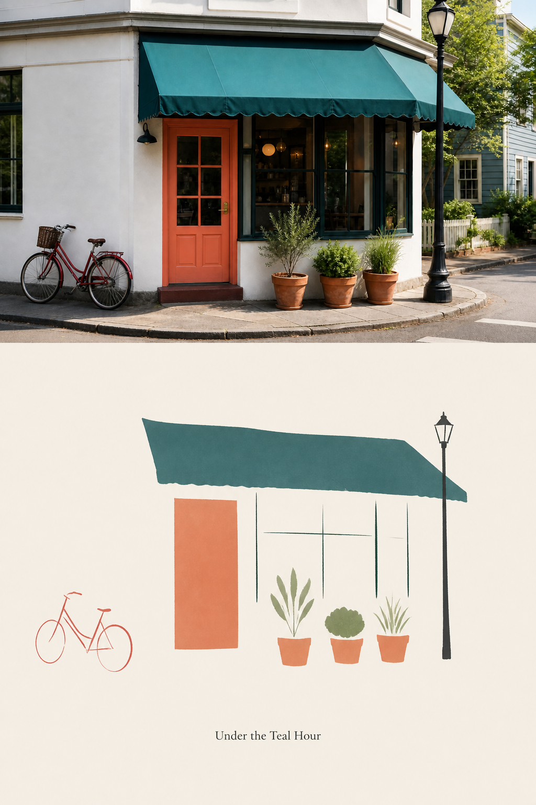</a><br><code>architecture-cafe</code></td>
    <td width="25%" align="center"><a href="examples/photo-abstract-editorial/02-mountain-lake.png">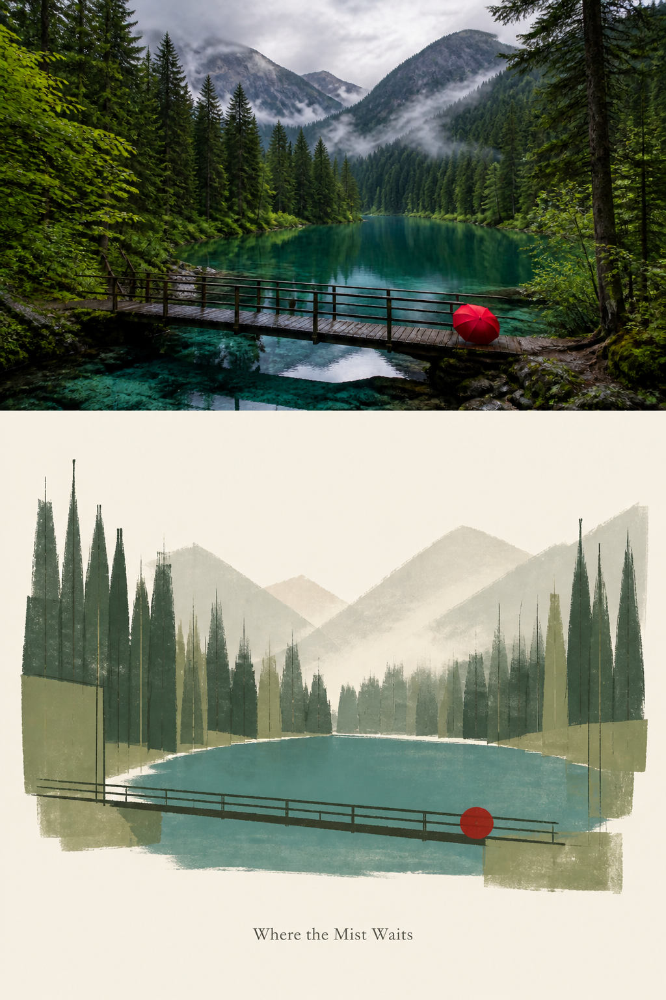</a><br><code>mountain-lake</code></td>
    <td width="25%" align="center"><a href="examples/photo-abstract-editorial/03-portrait-camera-duo.png">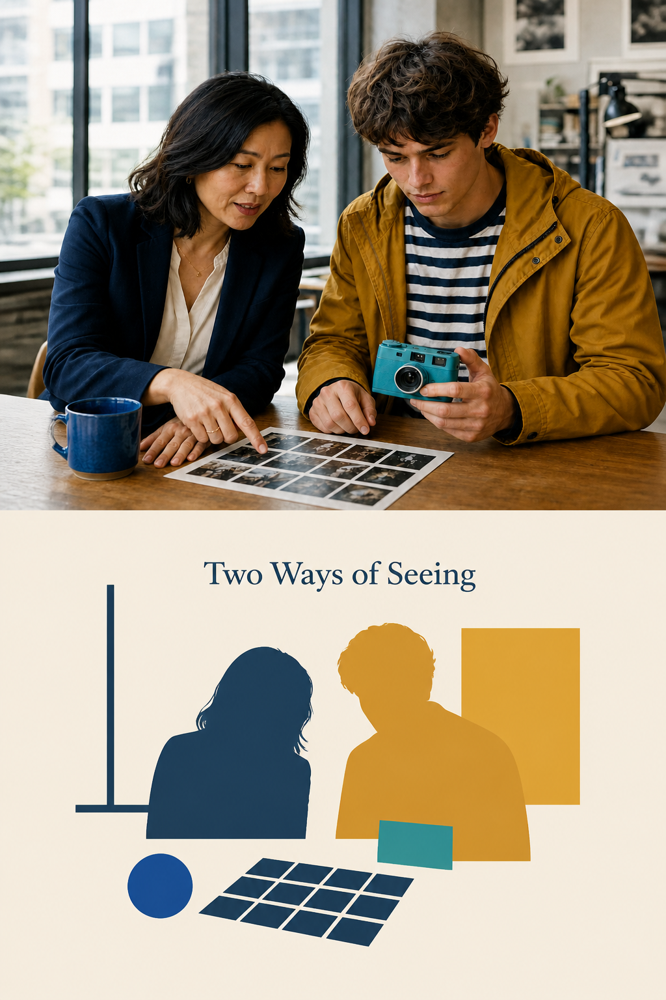</a><br><code>portrait-camera-duo</code></td>
    <td width="25%" align="center"><a href="examples/photo-abstract-editorial/04-animal-cat-dog.png">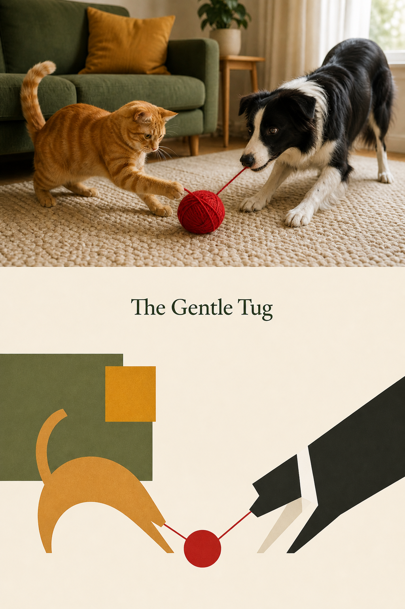</a><br><code>animal-cat-dog</code></td>
  </tr>
</table>

### [Scenes Gathered Zine v1.3](https://github.com/Zeejay0/gathered-scenes-zine-skill/tree/main/skills/scenes-gathered-zine-v1-3)

把用户照片作为可辨认的真实锚点，再以撕纸边界、抽象插画、版画纹理和克制的微型文字，将场景扩展成有纸张触感的 zine 海报。

- **Author:** [Zeejay0](https://github.com/Zeejay0)
- **Input:** 一张照片；可选标题、语言与画面关系说明
- **Output:** 默认 3:5 竖版，也可顺应原图构图生成横版 zine 拼贴
- **ImageGen role:** 保留照片核心主体和空间关系，并生成源自原图形状、色彩与情绪的插画场
- **Structure:** `SKILL.md`、`agents/openai.yaml`、两组官方 source/result 示例
- **License:** 仅限个人非商业使用；商用、受托创作、组织内部使用及付费服务均需书面许可

#### ✨ 特点

- 先生成 Scene Card，记录主体、空间不变量、主导动势、视觉重量、色彩气氛、可抽象形状与安静区域，再进入提示编译，方法比单纯描述风格更可复用。
- Minimal Abstraction Engine 明确要求删除多数微小细节，并限制为一种主要插画语法和至多一种辅助语法，能抑制常见的“什么都画、哪里都满”。
- 新增高饱和色必须承担构图功能；其 Structural Removal Test 会反问“去掉该颜色是否改变画面结构”，是很实用的自检规则。
- 对照片隐私、文字长度、中文/英文微型排版、缩略图检查和一次定向重生成都有具体约束。

<details>
<summary><strong>📝 编辑点评</strong></summary>

两组官方示例都能清楚保留原照片的地标、桥梁、人群和空间层次，同时让纸张、撕边和版画/水彩区域承担新的构图功能，视觉方法完成度很高。第二组结果沿用了原图横向构图，说明 3:5 更适合作为默认值而非硬约束。当前 skill 约 400 行且几乎全部集中在 `SKILL.md`，规则完整但上下文开销较大；官方样本目前也只有两组，跨题材稳定性仍需更多案例验证。照片保真依赖生成模型，没有确定性合成或像素级校验。

</details>

<p><strong>🖼️ 示例</strong> · <code>scenes-gathered-zine-v1-3</code></p>

<table>
  <tr>
    <td width="25%" align="center"><a href="examples/scenes-gathered-zine-v1-3/01-architecture-cafe.png">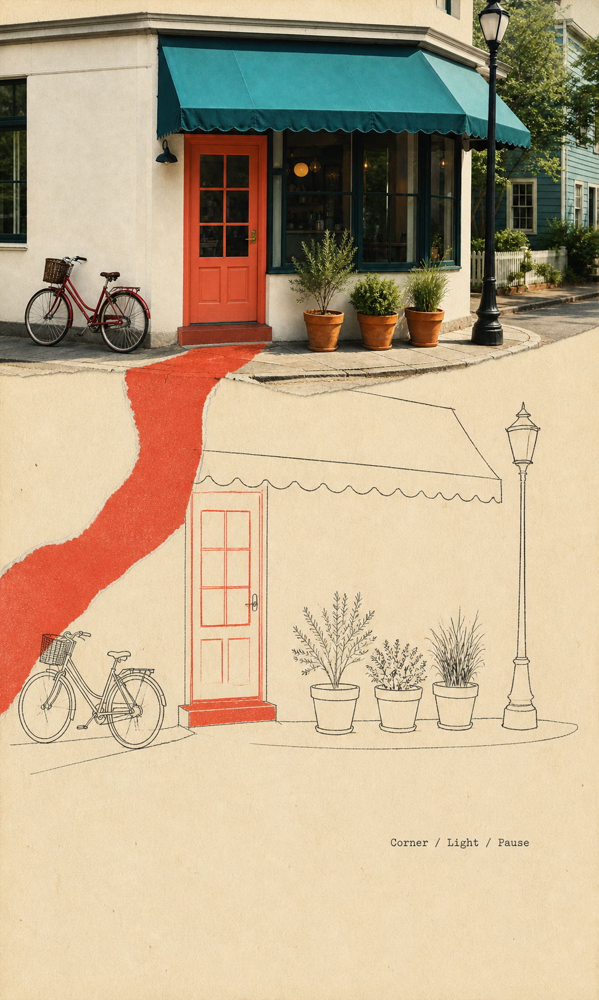</a><br><code>architecture-cafe</code></td>
    <td width="25%" align="center"><a href="examples/scenes-gathered-zine-v1-3/02-mountain-lake.png">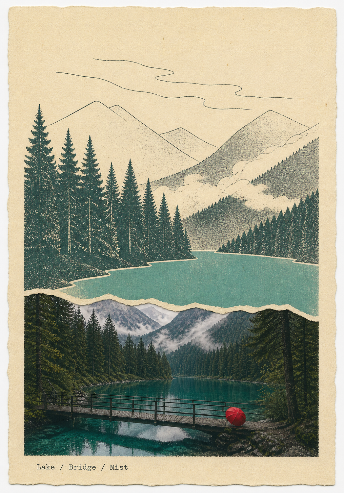</a><br><code>mountain-lake</code></td>
    <td width="25%" align="center"><a href="examples/scenes-gathered-zine-v1-3/03-portrait-camera-duo.png">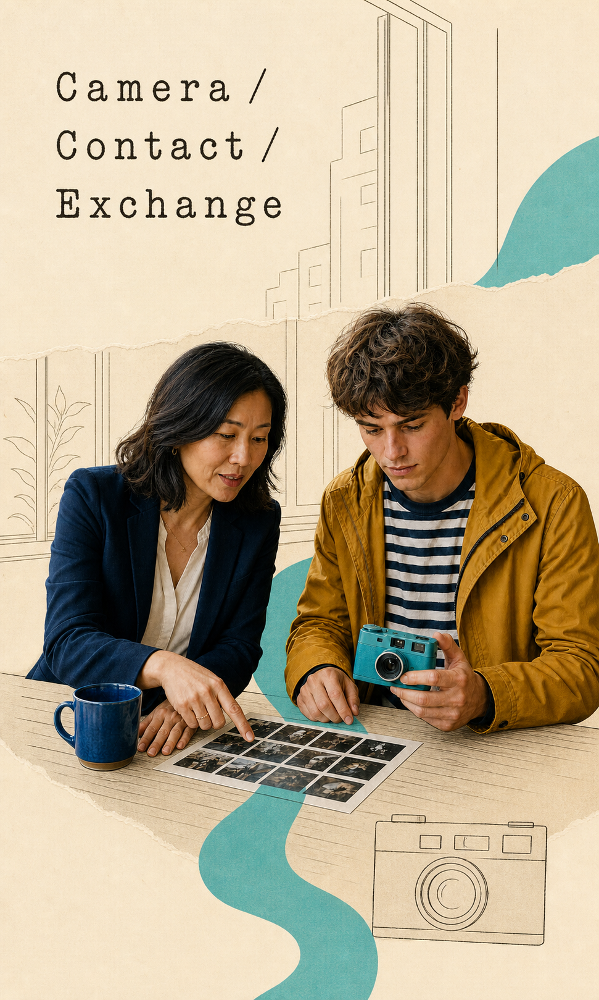</a><br><code>portrait-camera-duo</code></td>
    <td width="25%" align="center"><a href="examples/scenes-gathered-zine-v1-3/04-animal-cat-dog.png">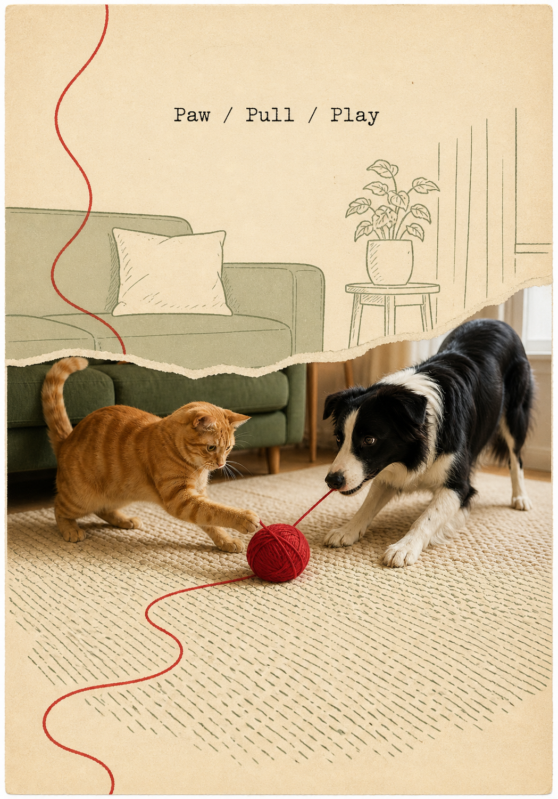</a><br><code>animal-cat-dog</code></td>
  </tr>
</table>

### [Photo to Monthly Zine Postcard](https://github.com/shenchangyi/photo-to-monthly-zine-postcard/tree/main/skills/photo-to-monthly-zine-postcard)

将一张照片制作成 3:4 月度 Zine 明信片：上半完整容纳原图，下半用来源相关的自由边缘水彩、月标、文学短句、歌曲和页脚组成紧凑的摄影月历页。

- **Author:** [shenchangyi](https://github.com/shenchangyi)
- **Input:** 一张照片；可选月份、手写句、署名、日期、页脚、书目或歌曲
- **Output:** 3:4 竖版月度摄影明信片
- **ImageGen role:** 保留上半照片，并从其主体、空间与光线关系派生下半水彩视觉块和整卡排版
- **Structure:** 精简入口 `SKILL.md`、3 份工作 references、完整规则草案、视觉参考与 8 张成品示例
- **License:** MIT

#### ✨ 特点

- 根据原图宽高比设置了 5 档路由，对横图、方图、竖图和极窄长图分别规定 `contain` 尺寸与占位；极窄输入会先询问用户，而不是自动裁切。
- 把文学与音乐策展从图片生成中分离：先根据主体、光线、空间、情绪和主色检索并核验，再把最终文字作为锁定字符串交给生成器；找不到可靠内容时使用原创旁白或留空歌曲。
- 对下半页的水彩块、右侧书签栏、月份、竖排文学组、歌曲和三段页脚给出相对尺寸与层级，目标明确且容易复用。
- 主流程将 layout、content curation 和 quality gate 拆入独立 references，是清楚的 progressive disclosure 结构。

<details>
<summary><strong>📝 编辑点评</strong></summary>

8 张成品示例在暖白纸张、原图—水彩呼应、右栏层级和页脚节奏上相当统一，且能处理常规风景、超宽场景和自带相机框的输入。但 gallery 没有单独提供原始输入文件，无法独立验证“上半照片完全不变”；`dusk-field-camera-frame.png` 实际为 1024×1536（2:3），也未满足规则声明的 3:4 硬约束。当前质量门槛是人工检查清单，没有确定性合成、尺寸验证或文字校验脚本；`SKILL.md` 要求生成成品，但未显式指定调用内置 `$imagegen`，因此尺寸、逐字排版和原图保真仍取决于 agent 与生成模型执行。

</details>

<p><strong>🖼️ 示例</strong> · <code>photo-to-monthly-zine-postcard</code></p>

<table>
  <tr>
    <td width="25%" align="center"><a href="examples/photo-to-monthly-zine-postcard/01-architecture-cafe.png">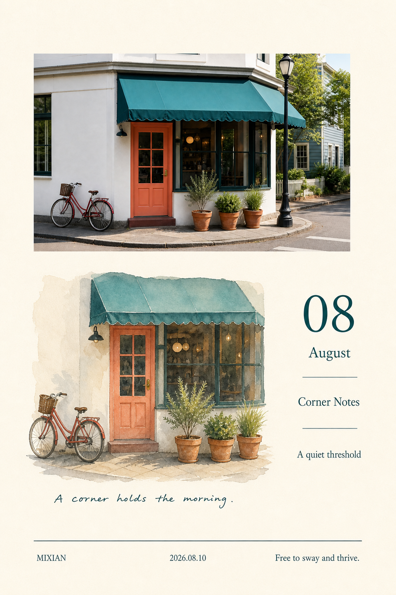</a><br><code>architecture-cafe</code></td>
    <td width="25%" align="center"><a href="examples/photo-to-monthly-zine-postcard/02-mountain-lake.png">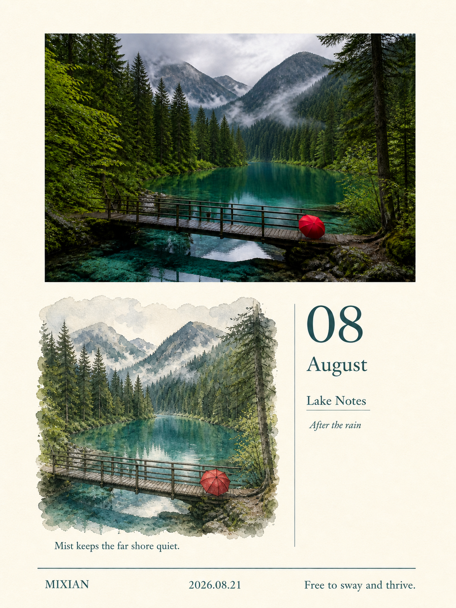</a><br><code>mountain-lake</code></td>
    <td width="25%" align="center"><a href="examples/photo-to-monthly-zine-postcard/03-portrait-camera-duo.png">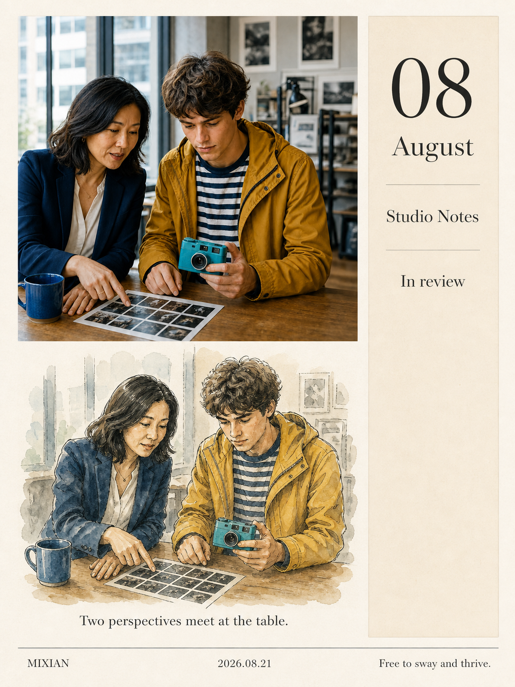</a><br><code>portrait-camera-duo</code></td>
    <td width="25%" align="center"><a href="examples/photo-to-monthly-zine-postcard/04-animal-cat-dog.png">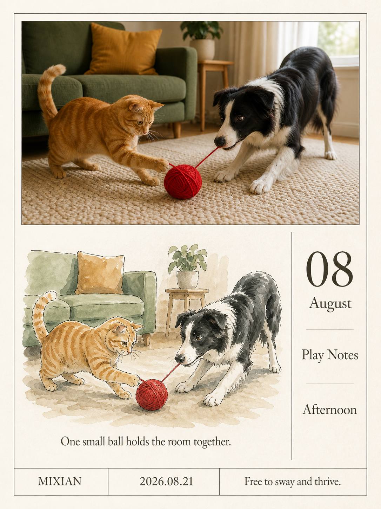</a><br><code>animal-cat-dog</code></td>
  </tr>
</table>

### [GC Minimal Zine Poster v0.3.1](https://github.com/LiamGvchi/gc-minimal-zine-poster)

把主题、句子、文章、物件、情绪、照片或参考图转化为安静的纸张质感微编辑海报：以大面积留白承载一个小型视觉事件、克制排版和单一高饱和色彩焦点。

- **Author:** [LiamGvchi](https://github.com/LiamGvchi)
- **Input:** 文本主题、文章、照片、参考图或图片文件夹
- **Output:** 默认 3:5 位图海报、最终生成 prompt、所选 recipe 与简短阐释；也支持仅分析或仅输出 prompt
- **ImageGen role:** 显式调用内置图片生成能力，并在照片模式中传入实际源图、检查保真不变量，必要时定向重生成一次
- **Structure:** `SKILL.md`、5 份专项 references、6 张作者示例、8 条 eval、Codex UI metadata 与三语 README
- **License:** MIT

#### ✨ 特点

- 同一 skill 内区分 Generate、Photo Input、Reference Analysis、Prompt-only 和 Analyze + Generate 五种路由，并要求选择满足请求的最小模式。
- 视觉系统具有可检查的尺度：默认 70%–90% 留白、8%–25% 主视觉簇、0.8%–2.5% 画布面积的高饱和主色，以及一个核心隐喻而非完整插画场景。
- Variation Engine 从布局、焦点载体、字体、纹理与装饰系统多轴组合 recipe，并对批量输出设置跨图变化规则，避免反复生成“居中小图加蓝点”。
- 照片模式明确区分 edit target、reference image 和 supporting insert，再按 High、Medium、Low 记录保真等级；对人物、宠物、角色、艺术品和产品默认采用 High preservation。
- Prompt Compiler、Reference Analysis 和 Quality Gate 均独立成文；eval 还覆盖人物身份、产品几何、参考图防复制、prompt-only 和非海洋主题误生航海图标等回归场景。

<details>
<summary><strong>📝 编辑点评</strong></summary>

6 张作者示例全部为 686×1144，接近严格 3:5，并稳定呈现纸张扫描感、大留白、小型视觉事件与单色焦点；center fragment、dual panel、type-led 和 offset cluster 等构图也有实际差异。它是当前清单中对内置 ImageGen 调用、输入图片传递和失败后重生成写得最明确的项目之一。不过示例集中于文本主题海报，没有公开 source/result 照片对照或 Reference Analysis 成品，High preservation 等高级路由尚缺视觉验证；质量检查和 eval 仍是声明式规则，没有自动尺寸、留白比例、色彩占比或文字可读性测试，微型生成文字也会受模型能力影响。skill 的可调用名称仍是 `gc-minimal-zine-poster-v0-3`，README 展示版本则为 v0.3.1，这是上游为兼容旧安装保留的命名。

</details>

<p><strong>🖼️ 示例</strong> · <code>gc-minimal-zine-poster-v0-3</code></p>

<table>
  <tr>
    <td width="25%" align="center"><a href="examples/gc-minimal-zine-poster-v0-3/01-architecture-cafe.png">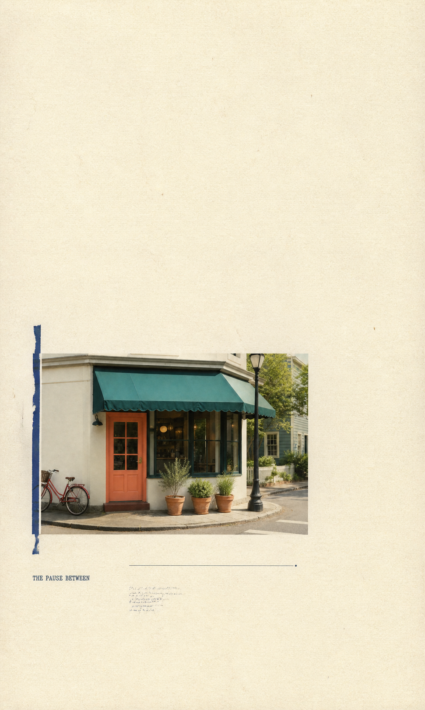</a><br><code>architecture-cafe</code></td>
    <td width="25%" align="center"><a href="examples/gc-minimal-zine-poster-v0-3/02-mountain-lake.png">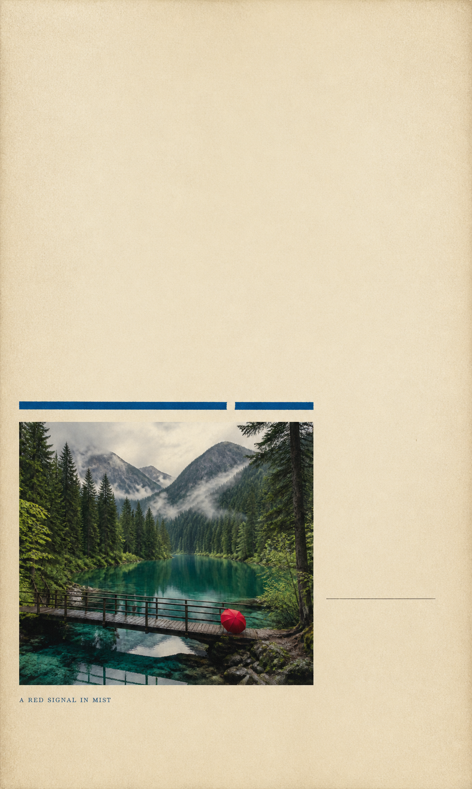</a><br><code>mountain-lake</code></td>
    <td width="25%" align="center"><a href="examples/gc-minimal-zine-poster-v0-3/03-portrait-camera-duo.png">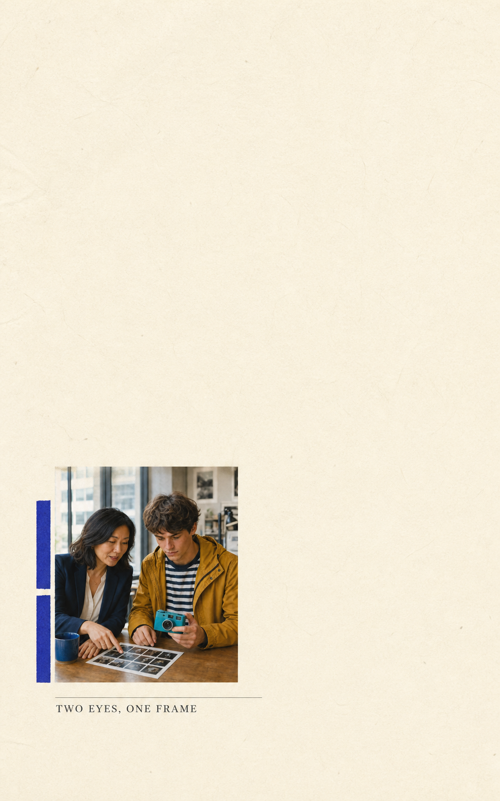</a><br><code>portrait-camera-duo</code></td>
    <td width="25%" align="center"><a href="examples/gc-minimal-zine-poster-v0-3/04-animal-cat-dog.png">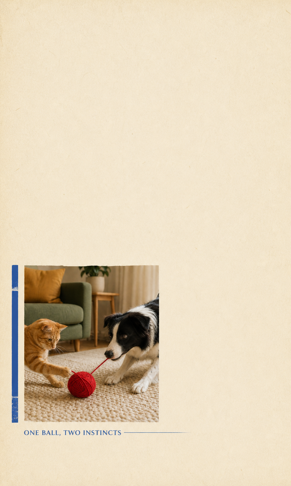</a><br><code>animal-cat-dog</code></td>
  </tr>
</table>

### [Dreamcore Collage Poster](https://github.com/AndrwewHan/dreamcore-collage-poster)

把主题或参考照片重组为高密度梦核拼贴：以一个可辨认主锚点、2–5 个回声碎片、记忆环境、几何打断和一个不可能关系构成 3:5 竖版海报。

- **Author:** [AndrwewHan](https://github.com/AndrwewHan)
- **Input:** 文字主题，或最多 5 张分工明确的参考图
- **Output:** 竖版梦核、数字记忆、仪式档案或超现实拼贴海报
- **ImageGen role:** 明确使用 Codex 内置 `image_gen` 生成或编辑，不调用外部图片后端
- **Structure:** 单文件 `SKILL.md`、Codex UI metadata 与精简 README
- **License:** MIT

#### ✨ 特点

- 不是只堆“梦核”风格词，而是把画面拆成主锚点、回声、环境、几何打断和 anomaly 五种功能层。
- 提供 fractured mosaic、altar grid、interface collage、dark void 等 7 个构造家族，并要求批次间改变视觉语法而不只是移动主体。
- 将配色限制为 2–4 个主色，并让 CRT 扫描线、网点、JPEG 块、复印污迹或错版印刷承担具体媒介角色。
- 清楚区分高密度梦核与留白主导的 minimal zine，也为参考图 fusion 规定了主锚点、细节、环境、装饰和纹理的顺序角色。

<details>
<summary><strong>📝 编辑点评</strong></summary>

方法定义很完整，且原生调用、保存路径、一次定向重生成和意外水印检查都写得清楚；它正好补足当前清单中“高密度拼贴”这一端。不过仓库目前没有作者生成样例、eval 或自动 QA，README 也只有一句简介，因此这些构图家族的跨题材稳定性仍未获得公开视觉证据。对短中文、伪界面标签、几何对齐和参考主体保真仍需人工复核。

</details>

<p><strong>🖼️ 示例</strong> · <code>dreamcore-collage-poster</code></p>

<table>
  <tr>
    <td width="25%" align="center"><a href="examples/dreamcore-collage-poster/01-architecture-cafe.png">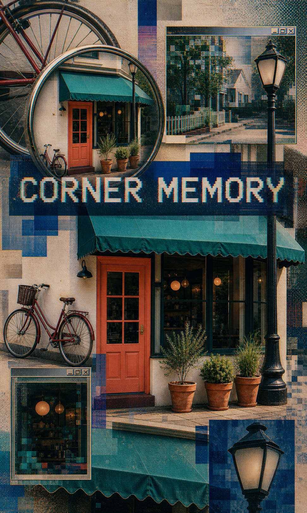</a><br><code>architecture-cafe</code></td>
    <td width="25%" align="center"><a href="examples/dreamcore-collage-poster/02-mountain-lake.png">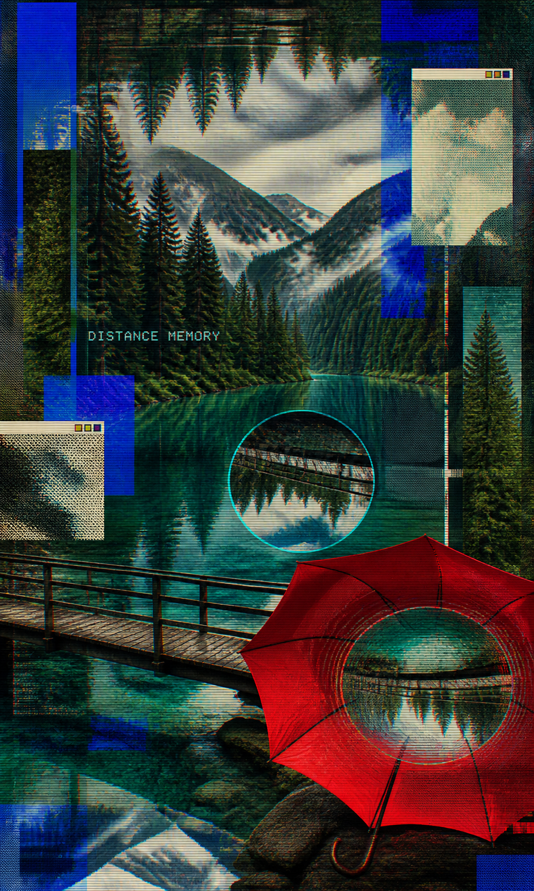</a><br><code>mountain-lake</code></td>
    <td width="25%" align="center"><a href="examples/dreamcore-collage-poster/03-portrait-camera-duo.png">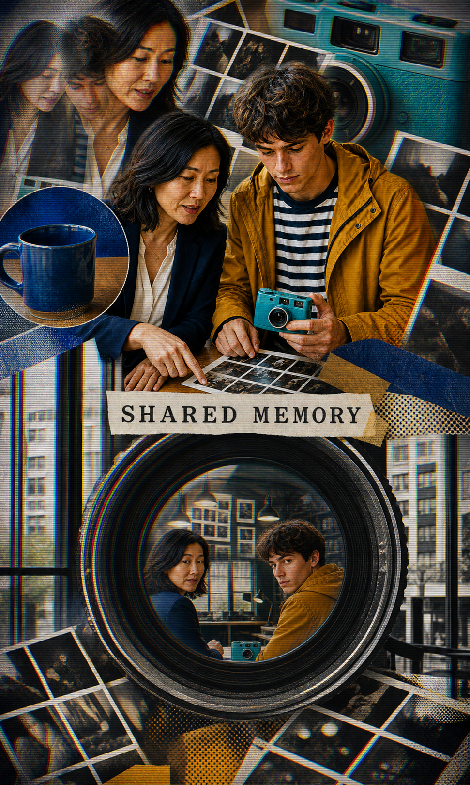</a><br><code>portrait-camera-duo</code></td>
    <td width="25%" align="center"><a href="examples/dreamcore-collage-poster/04-animal-cat-dog.png">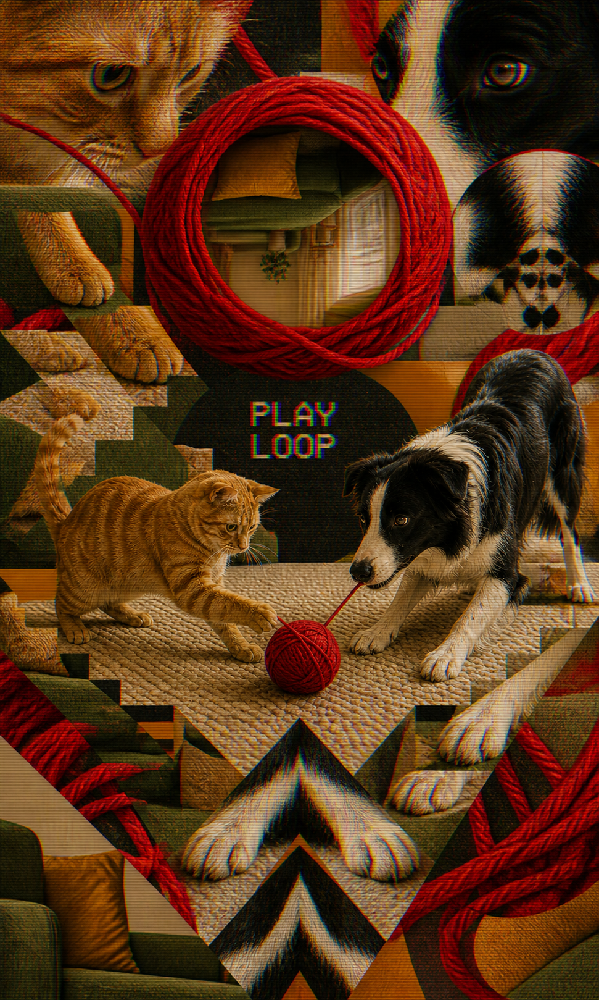</a><br><code>animal-cat-dog</code></td>
  </tr>
</table>

### [Make Photo Stamp Archive](https://github.com/Dlcccc71913/skill-make-photo-stamp-archive)

把照片与一块暖白档案纸直接拼接，在纸面角落放置从原图主体压缩而来的手工图章及小号打字机说明，形成克制的记忆档案视觉。

- **Author:** [Dlcccc71913](https://github.com/Dlcccc71913)
- **Input:** 一张或多张照片；支持针对图章、边框、大小、位置、墨色、标题、纸张年代感或拼接方向的后续修改
- **Output:** 每张源照片对应一张独立平面栅格成品；默认横向左右直拼，约 55% 照片与 45% 纸张
- **ImageGen role:** 每张照片独立调用内置图片生成/编辑工具；修改时编辑最新接受的成品并锁定未被要求变化的属性
- **Structure:** `SKILL.md`、一份 prompt/修订模板、`agents/openai.yaml`、三语 README 与 3 张外链示例
- **License:** MIT

#### ✨ 特点

- 先锁定照片区的不变量，包括人物身份、面孔、手势、服装、物件数量、建筑、标牌文字、视角、遮挡与色彩关系，再设计另一侧图章。
- 根据主体语义选择圆形、方框、横向山脊、拱形或自定义轮廓章，不把所有照片统一塞进矩形缩略图。
- 对两块主面板的直拼边界限制很明确：禁止渐变、羽化、书脊、重叠、斜切、翻页和装饰分隔，能稳定保持平面档案感。
- Revision Mapping 把“缩小 10%”“移到右上”“纸张不要那么旧”等常见反馈映射成单属性修改，并要求其余画面保持不变。
- 多图输入会逐张生成独立资产而不是合成 contact sheet，适合制作同一视觉体系下的照片档案系列。

<details>
<summary><strong>📝 编辑点评</strong></summary>

3 张官方示例均为 1448×1086（4:3），都具有清楚的笔直拼缝、暖白留白和较小的图章组；建筑轮廓、拱窗与圆形佛像章也证明了形状选择并非固定模板。实际照片区约占 50%–58%，因此 55/45 应理解为指导比例。仓库没有单独发布对应源照片，无法验证照片区的逐像素保真；当前流程把整张照片交给生成/编辑模型，也没有确定性拼接脚本，所以人物身份、标牌文字、精确裁切和只改一个属性仍可能漂移。项目没有 eval 或自动 QA，三张样例也没有覆盖真人、多图批处理、上下拼接和连续修改。“Archive”描述的是视觉气质，产物只是栅格图，不包含原始文件保存、EXIF/元数据、索引或长期归档能力。

</details>

<p><strong>🖼️ 示例</strong> · <code>make-photo-stamp-archive</code></p>

<table>
  <tr>
    <td width="25%" align="center"><a href="examples/make-photo-stamp-archive/01-architecture-cafe.png">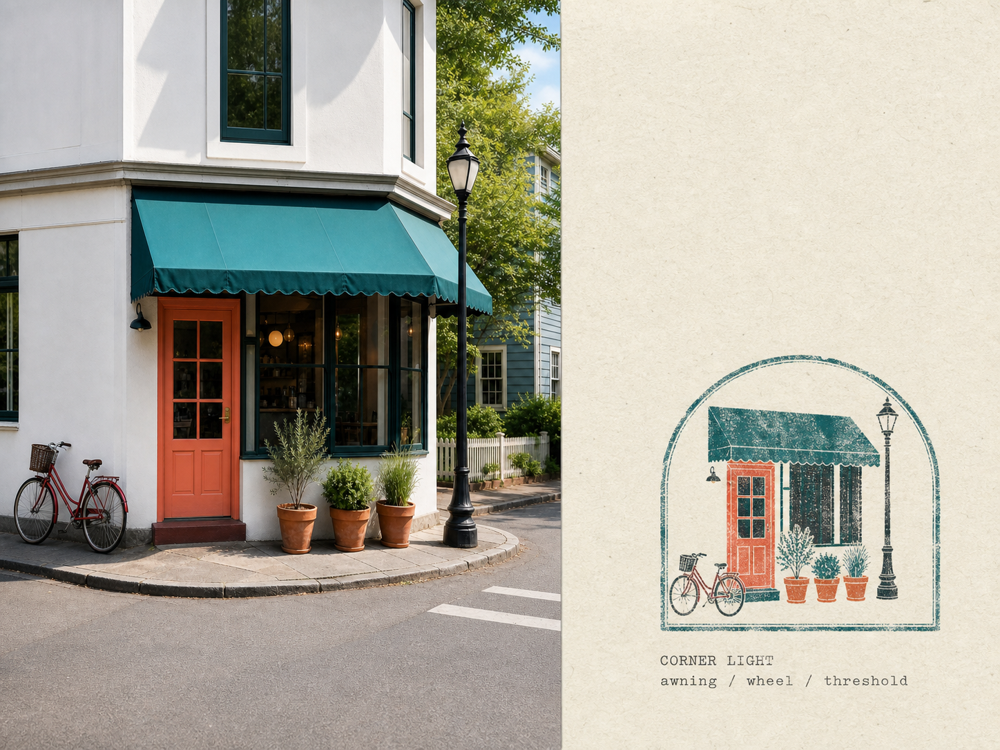</a><br><code>architecture-cafe</code></td>
    <td width="25%" align="center"><a href="examples/make-photo-stamp-archive/02-mountain-lake.png">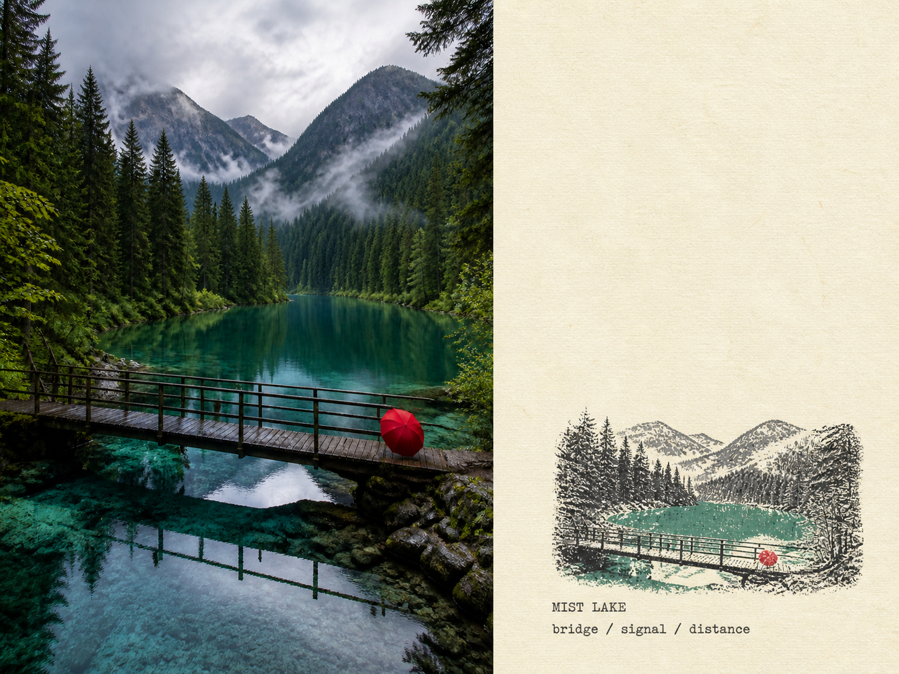</a><br><code>mountain-lake</code></td>
    <td width="25%" align="center"><a href="examples/make-photo-stamp-archive/03-portrait-camera-duo.png">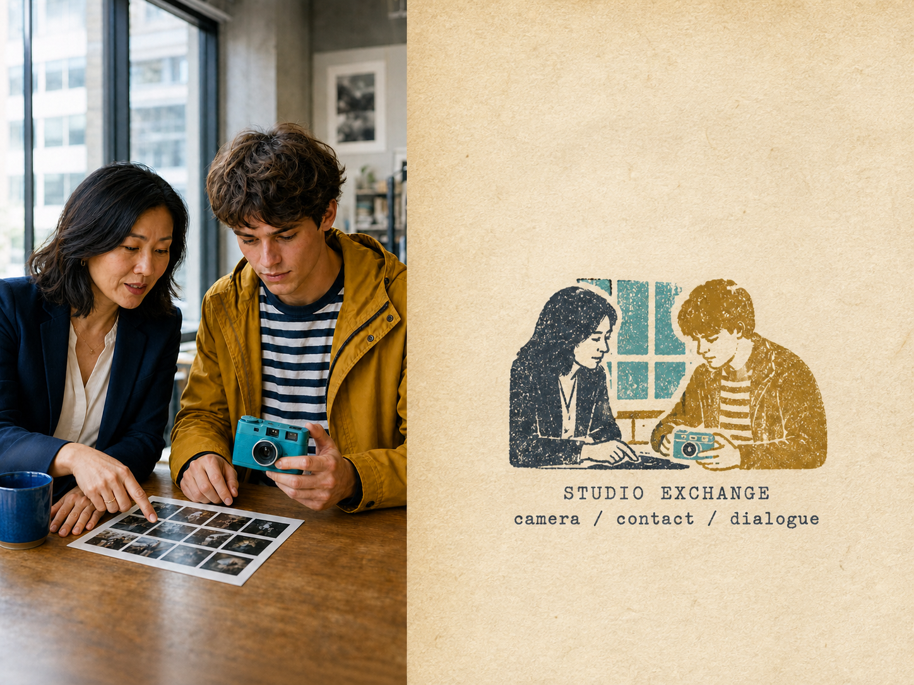</a><br><code>portrait-camera-duo</code></td>
    <td width="25%" align="center"><a href="examples/make-photo-stamp-archive/04-animal-cat-dog.png">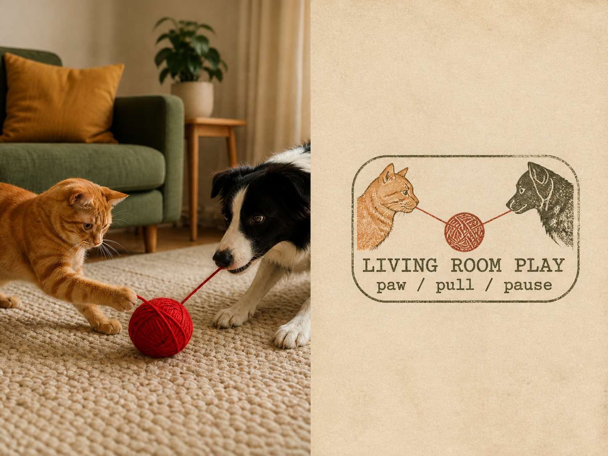</a><br><code>animal-cat-dog</code></td>
  </tr>
</table>

<a id="branding--identity"></a>
## 品牌与视觉识别

### [IP as Logo](https://github.com/s1dashu/ip-as-logo-skill)

从指定主体或产品语境出发，生成一组极度简化、圆润可爱、带轻微新拟物层次的方形 IP 吉祥物候选，目标是在 32×32 下仍能保持可辨识轮廓。

- **Author:** [s1dashu](https://github.com/s1dashu)
- **Input:** 明确的动物、物件或角色主体；也可从产品仓库、受众和品牌气质中推导方向
- **Output:** 默认 6 张独立 1:1 位图候选及其标签、方向、构图角、prompt/配色映射、尺寸和保存路径
- **ImageGen role:** 使用内置 ImageGen 分别生成遵守形状、配色、占比和小尺寸辨识约束的候选，不让图片模型制作 contact sheet
- **Structure:** 单文件 `SKILL.md`、README、MIT License 与一张 showcase 拼墙图
- **License:** MIT

#### ✨ 特点

- 先根据产品目的、受众和人格提出三个有理由的 IP 方向，再默认生成每个方向两张候选；用户选定单一方向时则生成六个受控变体。
- 六图批次固定测试左右下角构图，并要求每张独立生成、保存和标注，避免图片模型在一张网格里混淆角色与细节。
- Complexity Budget 将识别力压缩为连续外轮廓、至多一个物种特征、两块内部色域和极少面部标记，对“小尺寸吉祥物”这个任务很有针对性。
- 生成 prompt 故意不向图片模型暴露 `logo`、`brand mark` 或 `app icon` 等用途词，减少模型自动添加边框、文字和展示 mockup 的倾向。
- 能根据现代单 prompt 或旧式独立 negative-prompt 接口调整约束传递方式，并要求记录模型、provider 和实际约束模式。

<details>
<summary><strong>📝 编辑点评</strong></summary>

showcase 中的动物、幽灵、机器人和物件整体具有清楚的圆形大轮廓、克制配色与下角裁切，视觉家族一致，适合快速品牌探索。但仓库只发布一张 2560×2200 拼墙图，没有独立候选、对应 prompt、产品 brief、32×32 缩略图或多批次复现实验；它也不接受既有角色图作为明确的 edit target，因此名称中的 “IP” 更接近“新吉祥物设计”，不是现有 IP 的身份保真转换。该 skill 刻意把生成视为一次随机抽签，明确不检查、不筛选、不重试、不后处理，适合发散候选，却不能验证三色、纯色背景、构图和小尺寸识别等约束。最终产物是带实色背景的栅格图，不包含 SVG、透明版、单色版、字标组合、商标检索或品牌应用系统，不应直接等同于生产级 Logo 交付。

</details>

<p><strong>🖼️ 示例</strong> · <code>ip-as-logo</code></p>

<table>
  <tr>
    <td width="25%" align="center"><a href="examples/ip-as-logo/01-architecture-cafe.png"></a><br><code>architecture-cafe</code></td>
    <td width="25%" align="center"><a href="examples/ip-as-logo/02-mountain-lake.png">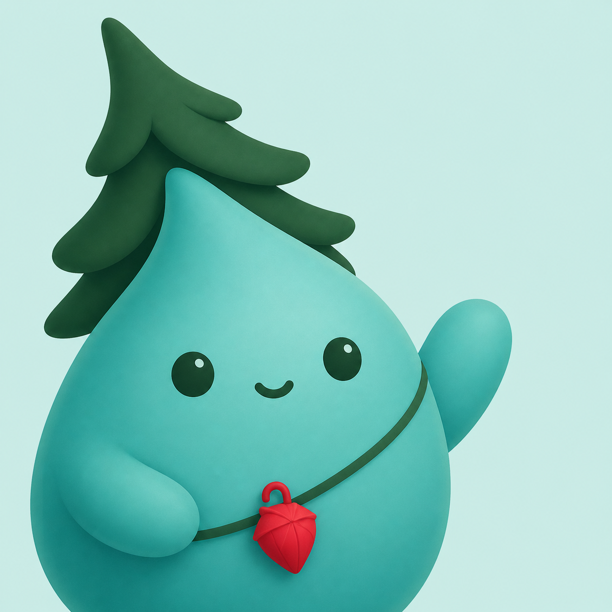</a><br><code>mountain-lake</code></td>
    <td width="25%" align="center"><a href="examples/ip-as-logo/03-portrait-camera-duo.png">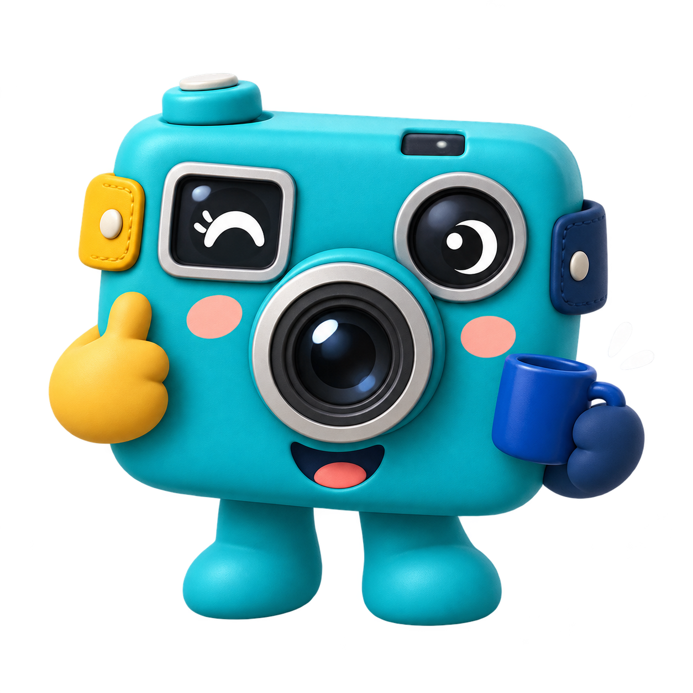</a><br><code>portrait-camera-duo</code></td>
    <td width="25%" align="center"><a href="examples/ip-as-logo/04-animal-cat-dog.png"></a><br><code>animal-cat-dog</code></td>
  </tr>
</table>

### [30x-image](https://github.com/norahe0304-art/30x-image)

把品牌 `DESIGN.md` 与 8 类营销模板、组合变化轴和 anti-slop 禁用表结合，生成广告、Logo 探索、演示页、产品图、包装/海报、场景换光、人物场景和社交轮播。

- **Author:** [norahe0304-art](https://github.com/norahe0304-art)
- **Input:** 品牌 profile 或 URL、设计 token、Figma Variables、CSS、截图与文字 brief
- **Output:** 品牌一致的独立营销位图及 JSON manifest
- **ImageGen role:** 要求 OpenAI/Codex 内置 `image_generation`；工具缺失时硬停止，不用 HTML、SVG 或本地绘图冒充
- **Structure:** 约 800 行入口、3 份专项 references、Stripe 与 Google Atmospheric Glass profile 示例、Codex metadata
- **License:** MIT

#### ✨ 特点

- 先把品牌抽成 9 段 profile 与 `taste:` 数值，再用 variance、density、art direction、spacing、realism 和 text density 驱动模板轴选择。
- 模板不是一个万能 prompt：不同资产分别锁定构图、光线、文案密度、真实感和变化轴，carousel 还要求每页独立生成而非图生图串联。
- anti-slop 层同时包含通用反例和品牌 profile 中的 `Don't`，用于压制紫色霓虹、空泛 CTA、假品牌占位名和无依据的视觉默认值。
- `init`、generate 和局部 edit 被写成三条独立路径；生成记录包含 prompt、工具参数、轴选择、文件和 manifest。

<details>
<summary><strong>📝 编辑点评</strong></summary>

这是目前找到的少数“品牌 profile → 多类营销资产”系统型 skill，方法密度很高。但仓库只捆绑 Stripe profile，并不包含所宣称的其他 60+ 品牌或公开渲染成品；它们运行时依赖 `npx getdesign`。更重要的是，当前说明假定内置工具暴露 `size`、`quality`、`n`、`output_format` 和 `input_image_mask` 等 Responses API 参数；官方 Codex ImageGen skill 把其中多项视为显式 CLI/API fallback 控件，因此不同 harness 上需要先核对真实 tool schema，不能直接承诺精确尺寸、单次四图或 mask 编辑。上游的 M0–M3 状态是作者验收记录，不等同于本仓库独立 benchmark。

</details>

<p><strong>🖼️ 示例</strong> · <code>30x-image</code></p>

<table>
  <tr>
    <td width="25%" align="center"><a href="examples/30x-image/01-architecture-cafe.png">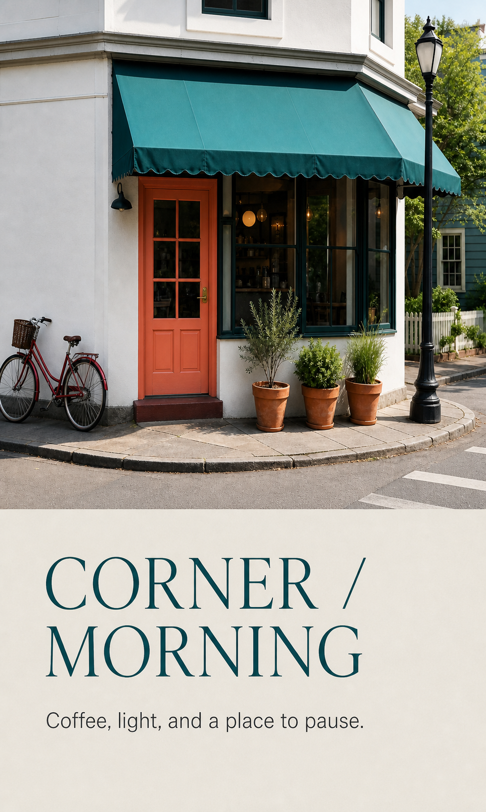</a><br><code>architecture-cafe</code></td>
    <td width="25%" align="center"><a href="examples/30x-image/02-mountain-lake.png">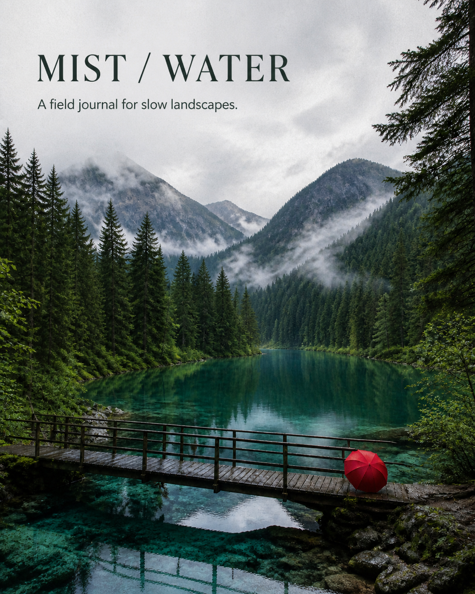</a><br><code>mountain-lake</code></td>
    <td width="25%" align="center"><a href="examples/30x-image/03-portrait-camera-duo.png">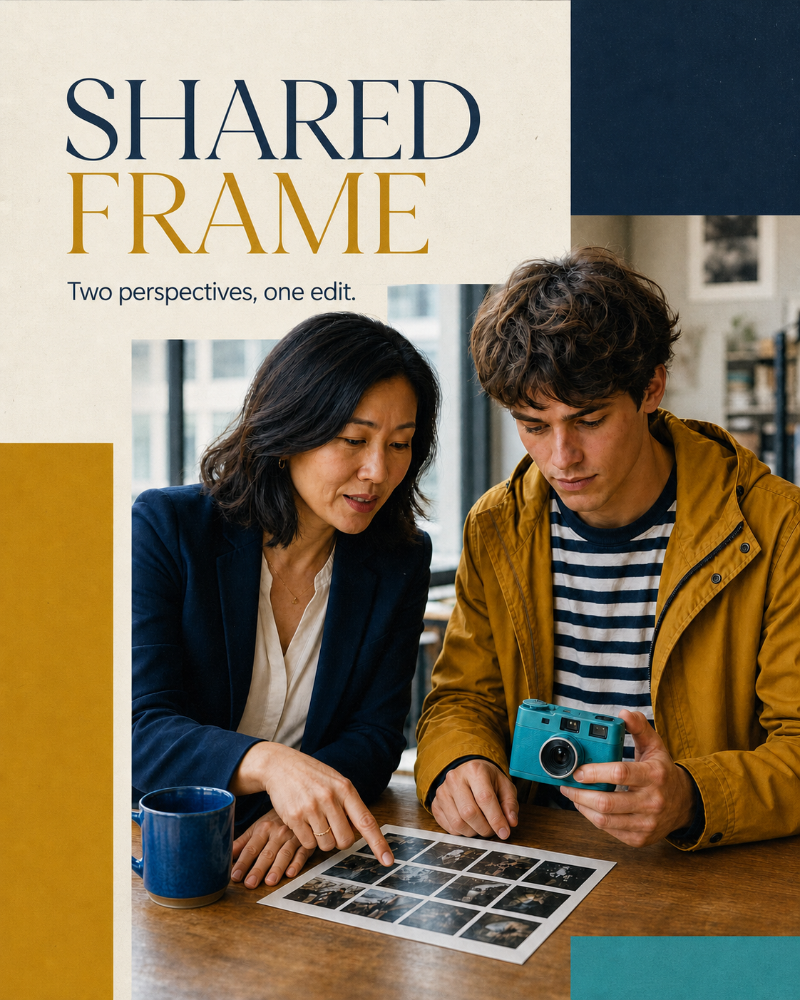</a><br><code>portrait-camera-duo</code></td>
    <td width="25%" align="center"><a href="examples/30x-image/04-animal-cat-dog.png">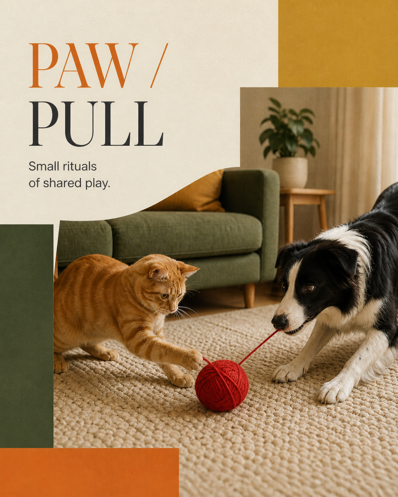</a><br><code>animal-cat-dog</code></td>
  </tr>
</table>

<a id="craft--textile"></a>
## 手工艺与织物

### [Yarn Rug Reference](https://github.com/rlx-better/yarn-rug-reference)

把用户图片简化成低色数的手工纱线、簇绒地毯或织物作品，并生成“原图在上、织物版本在下”的竖版对照图。

- **Author:** [rlx-better](https://github.com/rlx-better)
- **Input:** 一张原图，可选一张织物风格参考图
- **Output:** 2:3 竖版 before/after 对照图
- **ImageGen role:** 将原图重建为 6–8 个主色的大色块纱线地毯，同时保留可辨认的主体、构图与柔软纤维方向
- **Structure:** `SKILL.md`、`agents/openai.yaml` 与 5 张 reference images
- **License:** MIT

#### ✨ 特点

- 明确要求先减少摄影细节和颜色，再添加纤维材质，避免把照片直接贴到织物纹理上。
- 对天空、地面、建筑、水体等大区域设定统一色族，能明显减少常见的彩色噪点和碎片化渐变。
- 在保持主体关系的同时主动舍弃次要细节；风景、动物和人物题材的参考图都有较清楚的语义对应。
- 对材质的反例描述具体：排除珠子、塑料、马赛克、规则编织线和装饰性毛边。

<details>
<summary><strong>📝 编辑点评</strong></summary>

参考图中的绒面、色块与构图一致性较好，成品具有真实的 tufted rug 触感。当前实现仍是纯提示型 skill：没有确定性拼图或尺寸验证脚本，`SKILL.md` 也没有显式写出调用内置 `$imagegen` 的步骤。因此 1080×1620、固定像素坐标和原图区域保真应理解为生成目标，而不是每次运行都能严格验证的保证。

</details>

<p><strong>🖼️ 示例</strong> · <code>yarn-rug-reference</code></p>

<table>
  <tr>
    <td width="25%" align="center"><a href="examples/yarn-rug-reference/01-architecture-cafe.png">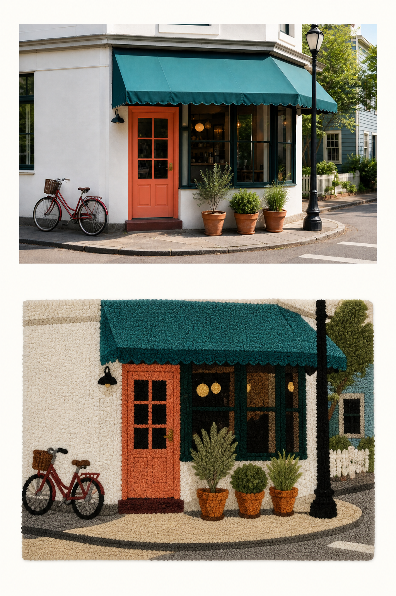</a><br><code>architecture-cafe</code></td>
    <td width="25%" align="center"><a href="examples/yarn-rug-reference/02-mountain-lake.png">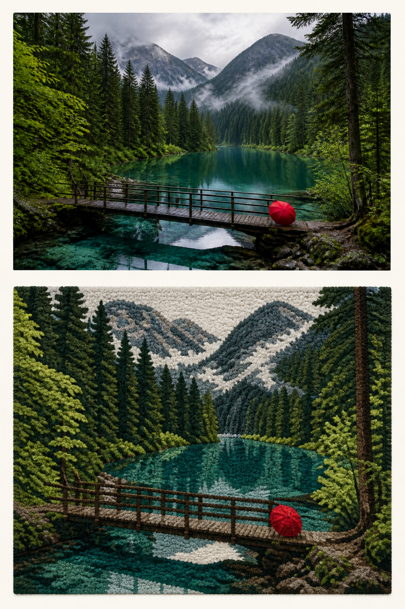</a><br><code>mountain-lake</code></td>
    <td width="25%" align="center"><a href="examples/yarn-rug-reference/03-portrait-camera-duo.png">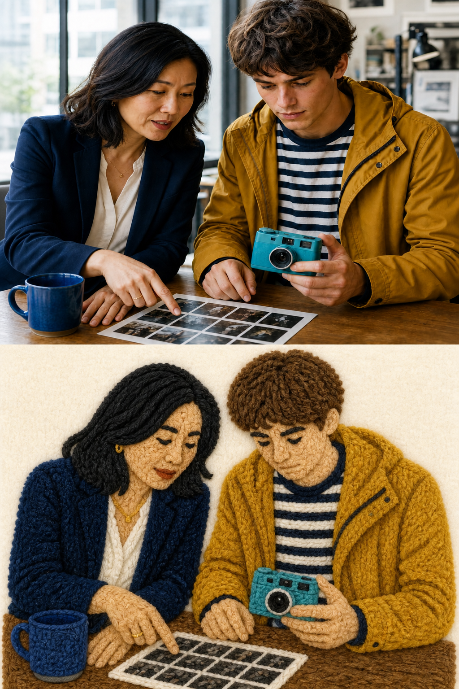</a><br><code>portrait-camera-duo</code></td>
    <td width="25%" align="center"><a href="examples/yarn-rug-reference/04-animal-cat-dog.png">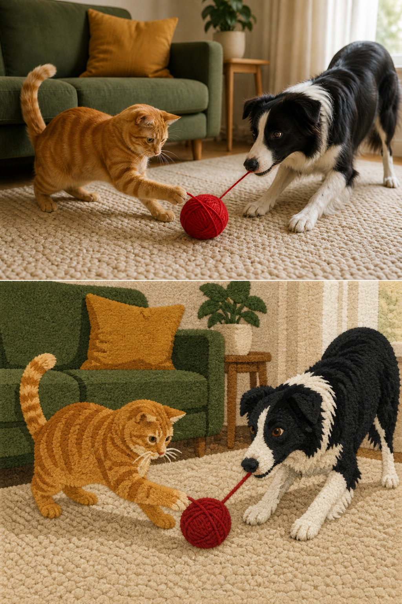</a><br><code>animal-cat-dog</code></td>
  </tr>
</table>

<a id="articles-knowledge--presentations"></a>
## 文章、知识与演示

### [Ian Xiaohei Illustrations](https://github.com/helloianneo/ian-xiaohei-illustrations)

把中文文章里的关键判断、流程、状态和隐喻，转译成 16:9 白底“小黑”手绘正文配图。

- **Author:** [helloianneo](https://github.com/helloianneo)
- **Input:** 中文文章、帖子、博客、Notion/Markdown 文档或单个观点
- **Output:** 默认 4–8 张独立正文配图，也支持只输出 shot list
- **ImageGen role:** 明确要求用内置 `image_gen` 逐张生成，不把多张图拼进一次调用
- **Structure:** 精简入口 `SKILL.md`、5 份专项 references、14 张风格锚点与示例 prompt
- **License:** MIT

#### ✨ 特点

- 先找“认知锚点”，不按段落平均配图；每张图只承担一个判断或结构。
- 小黑必须参与核心动作，不能只作为装饰；视觉隐喻需要从当前文章重新发明，禁止把旧案例换字复刻。
- 对白底、留白、有限点缀色、短中文批注和非 PPT 化都有明确的生成与 QA 约束。
- references 将角色设定、风格 DNA、构图模式、prompt 模板和检查表分开，入口文件保持在约百行。

<details>
<summary><strong>📝 编辑点评</strong></summary>

公开示例的白底、黑色主角、红橙蓝批注和荒诞物理动作相当稳定，尤其适合中文方法论与职场内容。它的优势是“先提炼观点，再发明一个动作隐喻”，不是通用插画风格包。模型生成的中文字仍可能漂移；角色一致性也依赖提示与人工检查。另有 [illustrations-codex-skill](https://github.com/tonykipkemboi/illustrations-codex-skill) 这一英文包装与吉祥物扩展版，上游已明确注明改编自本项目，因此这里以原作者仓库作为主条目。

</details>

<p><strong>🖼️ 示例</strong> · <code>ian-xiaohei-illustrations</code></p>

<table>
  <tr>
    <td width="25%" align="center"><a href="examples/ian-xiaohei-illustrations/01-architecture-cafe.png">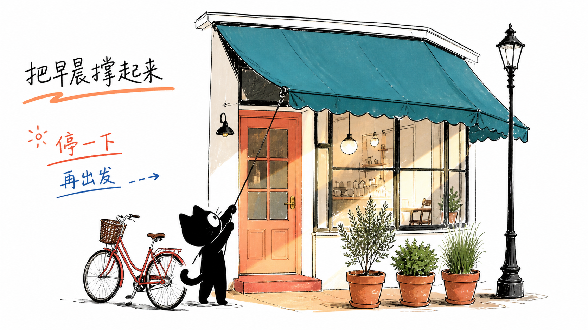</a><br><code>architecture-cafe</code></td>
    <td width="25%" align="center"><a href="examples/ian-xiaohei-illustrations/02-mountain-lake.png">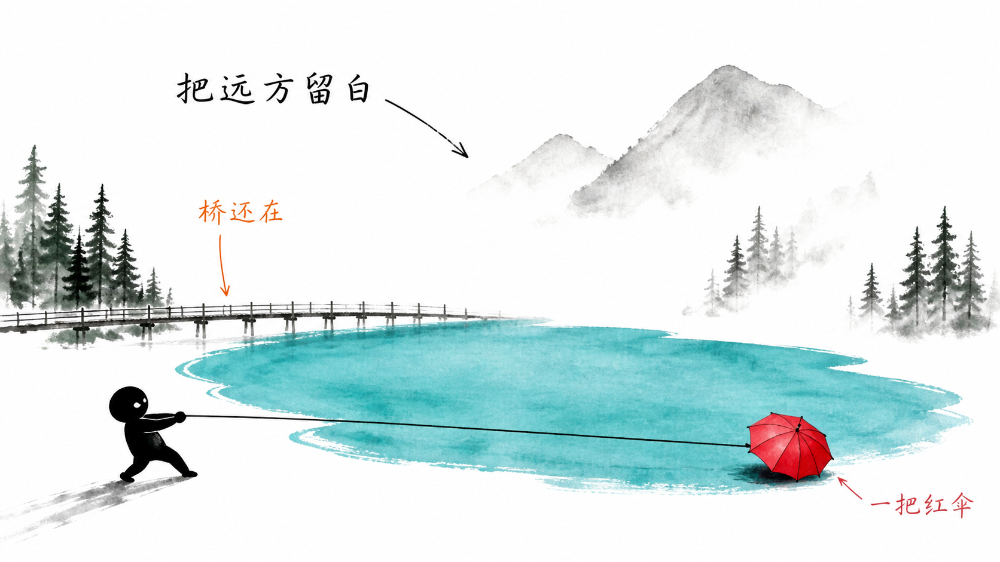</a><br><code>mountain-lake</code></td>
    <td width="25%" align="center"><a href="examples/ian-xiaohei-illustrations/03-portrait-camera-duo.png">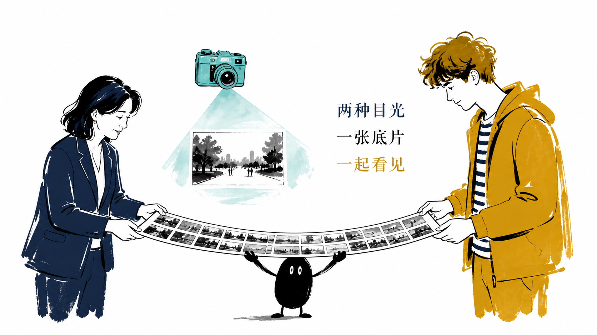</a><br><code>portrait-camera-duo</code></td>
    <td width="25%" align="center"><a href="examples/ian-xiaohei-illustrations/04-animal-cat-dog.png">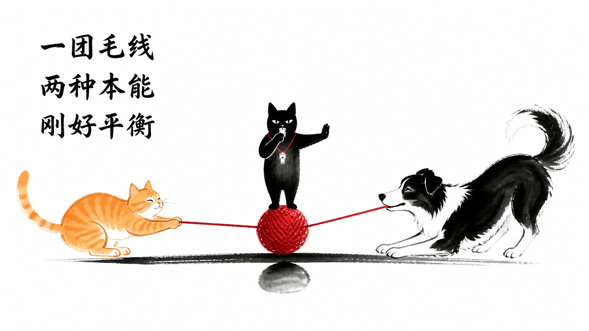</a><br><code>animal-cat-dog</code></td>
  </tr>
</table>

### [Ian Xiaohei Scenes](https://github.com/helloianneo/ian-xiaohei-scenes)

用“小黑 + 真实物件 + 物理动作”制作职场处境和项目故事配图，并提供超横版长卷叙事模式。

- **Author:** [helloianneo](https://github.com/helloianneo)
- **Input:** 正文、主题、项目复盘、个人经历或 5–8 个连续节点
- **Output:** 16:9 白色摄影棚场景图，或约 2.6:1–3:1 的长卷故事图
- **ImageGen role:** 先锁定质量母版，再逐张生成、目视比对和定向重做
- **Structure:** 详细 `SKILL.md`、7 份 references 与 7 张母版级示例
- **License:** MIT

#### ✨ 特点

- 把抽象概念强制转成一个真实主物件、一个核心物理冲突、小黑动作和 2–4 个短标签。
- 对“参考而非复刻”给出可执行规则：每张标准图至少改变主物件、空间方向、动作、道具、标签位置或视角中的三项。
- 长卷模式不是把卡片横向排开，而是用不等距的曲线路径、真实物件节点和逐段动作形成经历叙事。
- 提供两级质量门：母版锁定、小黑动作、画面比例与事实来源属于不可跳过项；文字与材质小瑕疵则可以标注后继续迭代。

<details>
<summary><strong>📝 编辑点评</strong></summary>

7 张示例清楚区分了“手绘解释图”和“白色摄影棚真实物件现场”；长卷母版也展示了少见的个人经历可视化方式。规则非常完整，但 `SKILL.md` 超过 300 行且强依赖母版浏览，运行成本高于轻量 prompt skill。它还带有鲜明作者 IP，不适合作为无品牌痕迹的通用商业插画器。

</details>

<p><strong>🖼️ 示例</strong> · <code>ian-xiaohei-scenes</code></p>

<table>
  <tr>
    <td width="25%" align="center"><a href="examples/ian-xiaohei-scenes/01-architecture-cafe.png">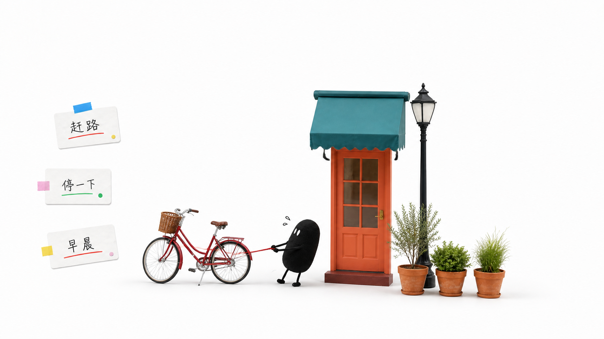</a><br><code>architecture-cafe</code></td>
    <td width="25%" align="center"><a href="examples/ian-xiaohei-scenes/02-mountain-lake.png">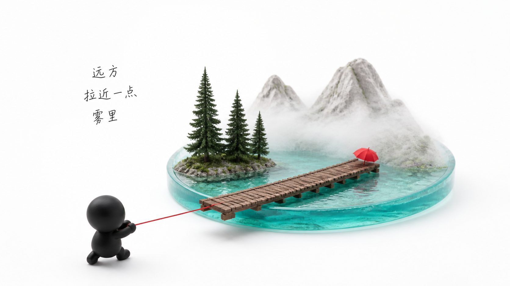</a><br><code>mountain-lake</code></td>
    <td width="25%" align="center"><a href="examples/ian-xiaohei-scenes/03-portrait-camera-duo.png">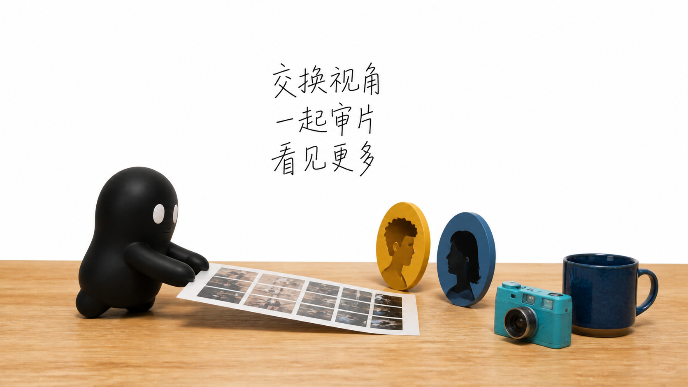</a><br><code>portrait-camera-duo</code></td>
    <td width="25%" align="center"><a href="examples/ian-xiaohei-scenes/04-animal-cat-dog.png">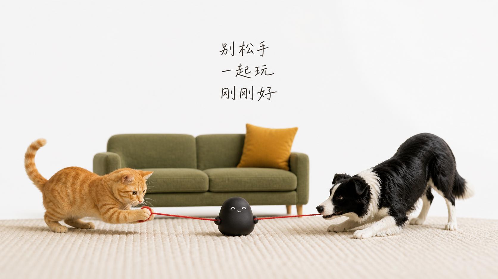</a><br><code>animal-cat-dog</code></td>
  </tr>
</table>

### [Ian Handdrawn PPT](https://github.com/helloianneo/ian-handdrawn-ppt)

把文章、课程、PDF、DOCX 或已有演示内容制作成完整的中文手绘技术讲解页。

- **Author:** [helloianneo](https://github.com/helloianneo)
- **Input:** 文章、文档、课件、脚本、提纲或粗略想法
- **Output:** 21:9 封面、16:9 正文/幻灯片 PNG，以及多页 contact sheet
- **ImageGen role:** 每页独立生成完整栅格页面；必要时只用确定性工具补精确文字、裁切和尺寸
- **Structure:** 入口 `SKILL.md`、6 份叙事与视觉 references、主题 token 和 4 张成品示例
- **License:** MIT

#### ✨ 特点

- 先选择 teaching、persuasive、report 等叙事类型，再按语义为每页选择不同 archetype，而不是机械套模板顺序。
- 在多页生成前锁定纸张、标题、页码、线条、色板、角色和间距，页面中部的语义图形才随内容变化。
- 明确区分封面与正文比例，也要求最终检查页面尺寸、中文准确性和整套节奏。
- 对生成文字不稳有合理降级：先压缩文字预算，仍失败时留出标签位再确定性叠字。

<details>
<summary><strong>📝 编辑点评</strong></summary>

公开样例的近白纸面、细线、淡彩和页面骨架一致性不错。不过名称里的 “PPT” 指最终视觉像 PPT；主产物是文字已烘焙进去的 PNG，不是可编辑 PPTX，也不负责 PDF/PPTX 打包。样例目前只有四页，长 deck 的跨页稳定性值得纳入后续 benchmark。

</details>

<p><strong>🖼️ 示例</strong> · <code>ian-handdrawn-ppt</code></p>

<table>
  <tr>
    <td width="25%" align="center"><a href="examples/ian-handdrawn-ppt/01-architecture-cafe.png">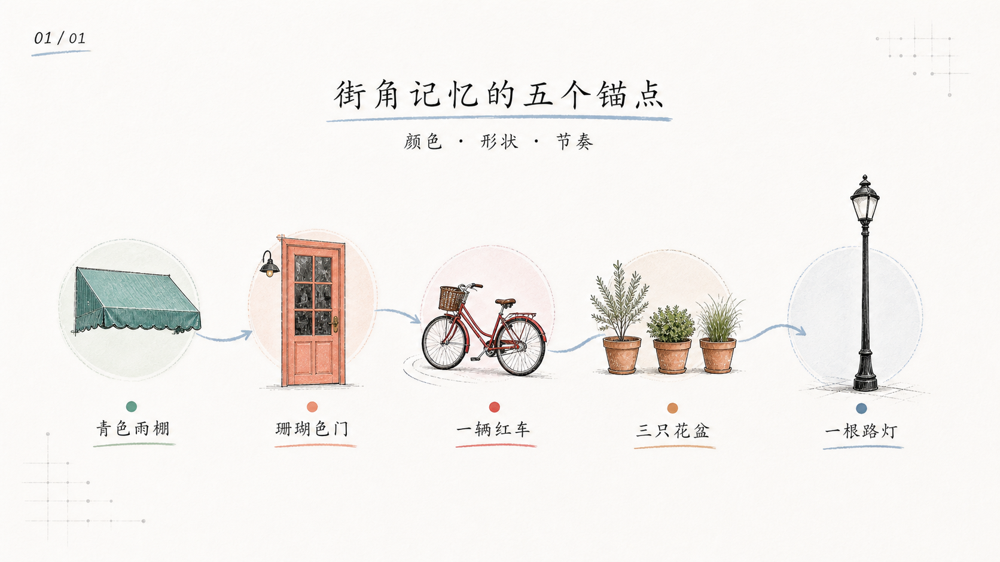</a><br><code>architecture-cafe</code></td>
    <td width="25%" align="center"><a href="examples/ian-handdrawn-ppt/02-mountain-lake.png">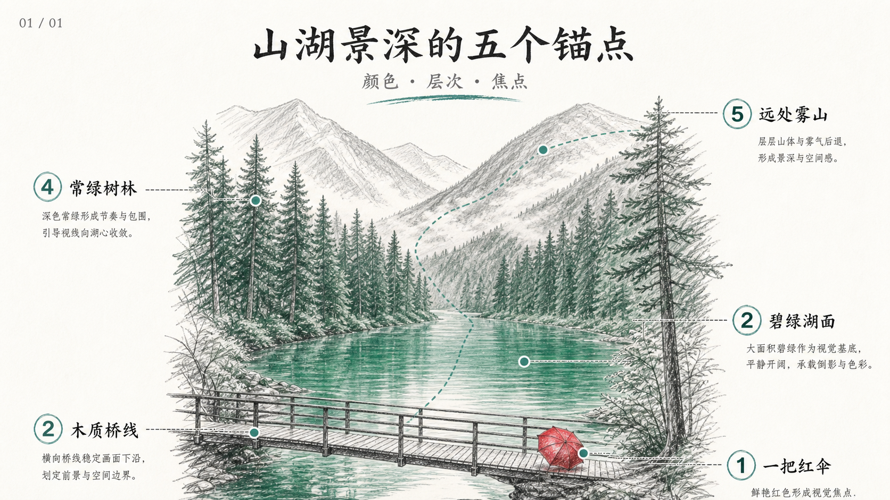</a><br><code>mountain-lake</code></td>
    <td width="25%" align="center"><a href="examples/ian-handdrawn-ppt/03-portrait-camera-duo.png"></a><br><code>portrait-camera-duo</code></td>
    <td width="25%" align="center"><a href="examples/ian-handdrawn-ppt/04-animal-cat-dog.png">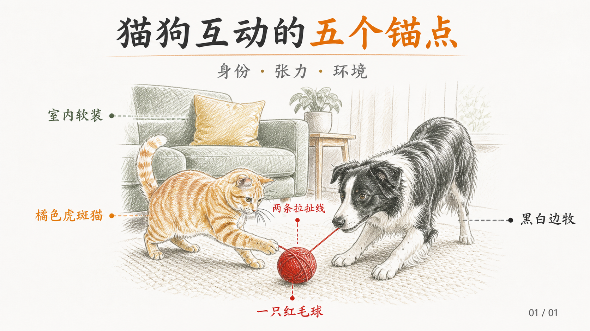</a><br><code>animal-cat-dog</code></td>
  </tr>
</table>

### [Codex Illustrator](https://github.com/99Gaoxiaoqi/codex-illustrator)

从 Markdown 文章自动判断哪些段落需要视觉解释，并在 Mermaid、Excalidraw 与 ImageGen 三条路径之间路由。

- **Author:** [99Gaoxiaoqi](https://github.com/99Gaoxiaoqi)
- **Input:** Markdown 文档，也支持封面或演示图需求
- **Output:** 插入图片引用的 Markdown、独立配图、封面或演示页图片
- **ImageGen role:** 创意插画、场景与封面使用内置 `image_gen.imagegen`；结构图优先走确定性图形工具
- **Structure:** `SKILL.md`、`agents/openai.yaml`、3 份 references、5 套 styles、2 个确定性导出脚本与流程示意图
- **License:** MIT

#### ✨ 特点

- 不强迫所有内容都走生成模型：流程、层级和关系图可以使用 Mermaid/Excalidraw，隐喻、场景和封面才使用 ImageGen。
- 先扫描标题层级和视觉机会，再生成命名稳定的资产并回写 Markdown，产物与原文之间有明确连接。
- 同一工作流覆盖正文配图、封面和 presentation visuals，适合观察“通用视觉编排器”如何做路由。

<details>
<summary><strong>📝 编辑点评</strong></summary>

这是混合型 skill，价值更多在“什么时候该用哪种视觉工具”，而不是单一画风。其说明和风格库较丰富，但公开视觉验证材料少于 Ian 与 Baoyu 系列；自动回写文档也意味着 benchmark 不能只看最终图片，还要检查插入位置和引用完整性。

</details>

<p><strong>🖼️ 示例</strong> · <code>codex-illustrator</code></p>

<table>
  <tr>
    <td width="25%" align="center"><a href="examples/codex-illustrator/01-architecture-cafe.png">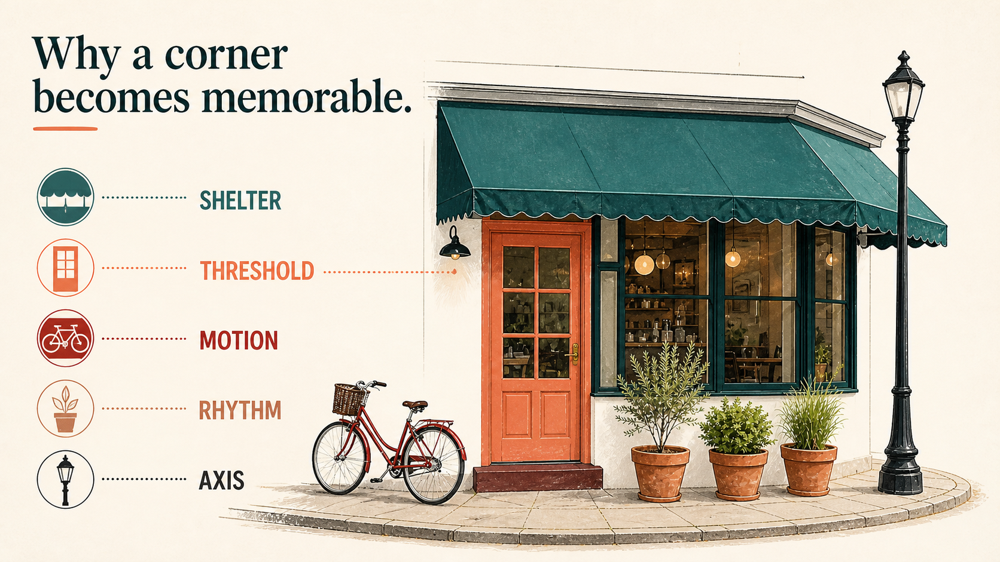</a><br><code>architecture-cafe</code></td>
    <td width="25%" align="center"><a href="examples/codex-illustrator/02-mountain-lake.png">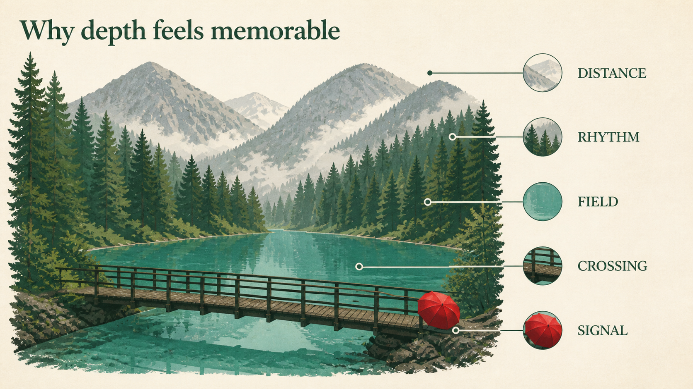</a><br><code>mountain-lake</code></td>
    <td width="25%" align="center"><a href="examples/codex-illustrator/03-portrait-camera-duo.png">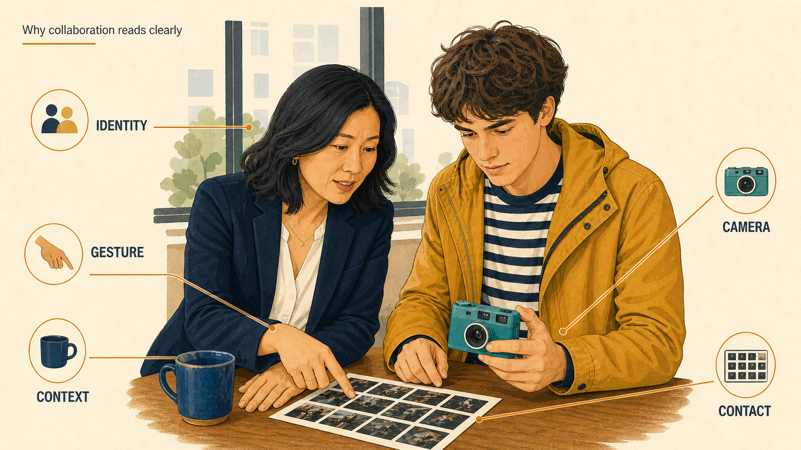</a><br><code>portrait-camera-duo</code></td>
    <td width="25%" align="center"><a href="examples/codex-illustrator/04-animal-cat-dog.png">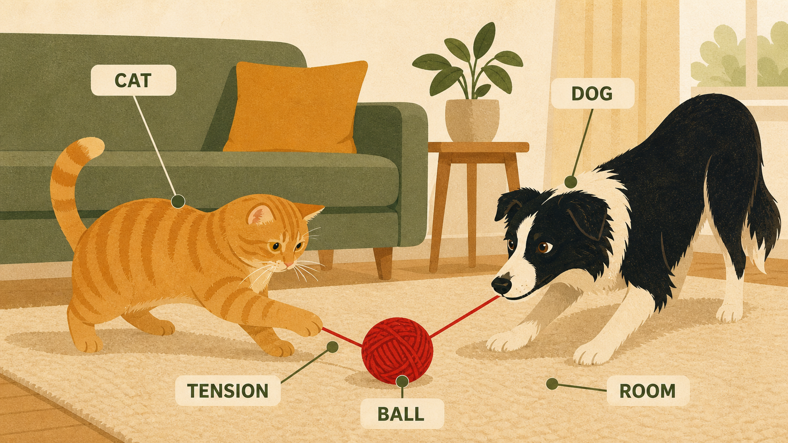</a><br><code>animal-cat-dog</code></td>
  </tr>
</table>

### [Baoyu Visual Skills Suite](https://github.com/JimLiu/baoyu-skills)

覆盖文章配图、封面、漫画、信息图和小红书卡片的多 skill 视觉套件。

- **Author:** [Jim Liu](https://github.com/JimLiu)
- **Input:** 文章、主题或平台发布需求；可选参考图、品牌色、受众、风格与布局偏好
- **Output:** 按任务生成文章图、横竖封面、连续漫画、信息图或卡片组，并保存生成 prompt
- **ImageGen role:** 同时兼容多种 runtime/backend；在 Codex 环境检测到原生 `imagegen` 时，规则要求优先使用它
- **Structure:** 5 个独立 skill：`baoyu-article-illustrator`、`baoyu-cover-image`、`baoyu-comic`、`baoyu-infographic`、`baoyu-xhs-images`，各自带流程、references 与示例
- **License:** MIT

#### ✨ 特点

- 任务覆盖面很广，但没有把所有规则堆进一个入口：文章、封面、漫画、信息图和社媒卡片分别建模。
- 风格与布局通常是两个独立选择轴，并提供相当多的真实样例作为视觉词典。
- 多图任务会先规划内容结构、画面节奏和连续性，再逐张生成；保存 prompt 也方便复盘与重跑。
- 对 Codex 原生 ImageGen 的优先级写得明确，同时保留跨 agent/backend 的可移植性。

<details>
<summary><strong>📝 编辑点评</strong></summary>

这是本轮发现中覆盖最完整的一组，适合成为分类 benchmark 的重要参照。代价是仓库和配置面都很大，并非 built-in-only：同一 skill 也包含其他运行时与 provider 的分支。收录时把它视为一套 suite，而不是用五个相近条目挤占清单。

</details>

<p><strong>🖼️ 示例</strong> · <code>baoyu-article-illustrator</code></p>

<table>
  <tr>
    <td width="25%" align="center"><a href="examples/baoyu-article-illustrator/01-architecture-cafe.png">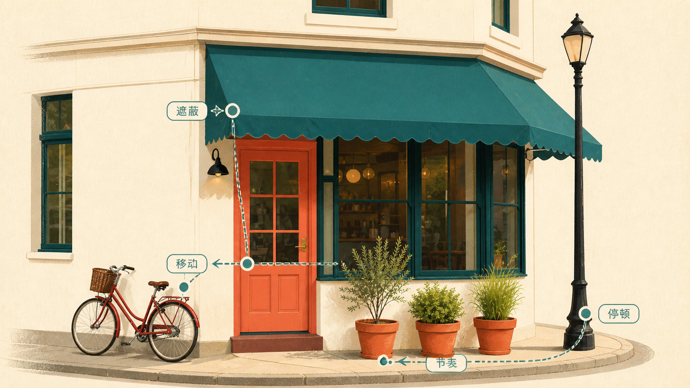</a><br><code>architecture-cafe</code></td>
    <td width="25%" align="center"><a href="examples/baoyu-article-illustrator/02-mountain-lake.png"></a><br><code>mountain-lake</code></td>
    <td width="25%" align="center"><a href="examples/baoyu-article-illustrator/03-portrait-camera-duo.png"></a><br><code>portrait-camera-duo</code></td>
    <td width="25%" align="center"><a href="examples/baoyu-article-illustrator/04-animal-cat-dog.png"></a><br><code>animal-cat-dog</code></td>
  </tr>
</table>

<p><strong>🖼️ 示例</strong> · <code>baoyu-cover-image</code></p>

<table>
  <tr>
    <td width="25%" align="center"><a href="examples/baoyu-cover-image/01-architecture-cafe.png"></a><br><code>architecture-cafe</code></td>
    <td width="25%" align="center"><a href="examples/baoyu-cover-image/02-mountain-lake.png"></a><br><code>mountain-lake</code></td>
    <td width="25%" align="center"><a href="examples/baoyu-cover-image/03-portrait-camera-duo.png"></a><br><code>portrait-camera-duo</code></td>
    <td width="25%" align="center"><a href="examples/baoyu-cover-image/04-animal-cat-dog.png"></a><br><code>animal-cat-dog</code></td>
  </tr>
</table>

<p><strong>🖼️ 示例</strong> · <code>baoyu-comic</code></p>

<table>
  <tr>
    <td width="25%" align="center"><a href="examples/baoyu-comic/01-architecture-cafe.png"></a><br><code>architecture-cafe</code></td>
    <td width="25%" align="center"><a href="examples/baoyu-comic/02-mountain-lake.png"></a><br><code>mountain-lake</code></td>
    <td width="25%" align="center"><a href="examples/baoyu-comic/03-portrait-camera-duo.png"></a><br><code>portrait-camera-duo</code></td>
    <td width="25%" align="center"><a href="examples/baoyu-comic/04-animal-cat-dog.png"></a><br><code>animal-cat-dog</code></td>
  </tr>
</table>

<p><strong>🖼️ 示例</strong> · <code>baoyu-infographic</code></p>

<table>
  <tr>
    <td width="25%" align="center"><a href="examples/baoyu-infographic/01-architecture-cafe.png"></a><br><code>architecture-cafe</code></td>
    <td width="25%" align="center"><a href="examples/baoyu-infographic/02-mountain-lake.png"></a><br><code>mountain-lake</code></td>
    <td width="25%" align="center"><a href="examples/baoyu-infographic/03-portrait-camera-duo.png"></a><br><code>portrait-camera-duo</code></td>
    <td width="25%" align="center"><a href="examples/baoyu-infographic/04-animal-cat-dog.png"></a><br><code>animal-cat-dog</code></td>
  </tr>
</table>

<p><strong>🖼️ 示例</strong> · <code>baoyu-xhs-images</code></p>

<table>
  <tr>
    <td width="25%" align="center"><a href="examples/baoyu-xhs-images/01-architecture-cafe.png"></a><br><code>architecture-cafe</code></td>
    <td width="25%" align="center"><a href="examples/baoyu-xhs-images/02-mountain-lake.png"></a><br><code>mountain-lake</code></td>
    <td width="25%" align="center"><a href="examples/baoyu-xhs-images/03-portrait-camera-duo.png"></a><br><code>portrait-camera-duo</code></td>
    <td width="25%" align="center"><a href="examples/baoyu-xhs-images/04-animal-cat-dog.png"></a><br><code>animal-cat-dog</code></td>
  </tr>
</table>

### [Codex Image: Technical Infographics](https://github.com/philipbankier/codex-image-skill)

从 URL、文字 brief、本地文件或代码仓库生成有来源依据的技术信息图、解释图和内容资产包。

- **Author:** [Philip Bankier](https://github.com/philipbankier)
- **Input:** URL、粘贴文本、本地文件或本地 repo
- **Output:** `research-brief.md`、`image-prompt.md` 和 `final.png`；pack 模式输出三个平台目标
- **ImageGen role:** 只使用 Codex 内置 `gpt-image-2`，明确禁止直接调用 API 或索取 API key
- **Structure:** `.agents/skills/codex-image/SKILL.md`、3 份 templates、3 份 examples、验收文档、测试与静态检查脚本
- **License:** MIT

#### ✨ 特点

- 在生图前把来源拆成主张、关系、受众、必要标签、文字预算和敏感信息，适合代码库与技术内容。
- 将社交素材和密集信息图分成两条 director 路由，分别控制手机可读性与结构密度。
- 用 P0/P1/P2 约束精确文字，并在 prompt 中强制记录选定视觉语法、生成前检查和单次 retry delta。
- 内置五套“house look”，目标是摆脱常见的深色 SaaS 卡片加箭头默认风格。

<details>
<summary><strong>📝 编辑点评</strong></summary>

这是非常新的社区项目，运行契约、隐私边界和质量门写得扎实，也明确依赖当前 Codex 内置能力。当前仓库主要展示 brief、prompt 与验收 fixture，没有足够的公开成品 gallery；视觉风格的稳定性和技术事实保真需要我们自己跑 benchmark 后再评价。

</details>

<p><strong>🖼️ 示例</strong> · <code>codex-image</code></p>

<table>
  <tr>
    <td width="25%" align="center"><a href="examples/codex-image/01-architecture-cafe.png"></a><br><code>architecture-cafe</code></td>
    <td width="25%" align="center"><a href="examples/codex-image/02-mountain-lake.png"></a><br><code>mountain-lake</code></td>
    <td width="25%" align="center"><a href="examples/codex-image/03-portrait-camera-duo.png"></a><br><code>portrait-camera-duo</code></td>
    <td width="25%" align="center"><a href="examples/codex-image/04-animal-cat-dog.png"></a><br><code>animal-cat-dog</code></td>
  </tr>
</table>

### [Codex Paper Figure Skill](https://github.com/pengqianhan/codex-paper-figure-skill)

先用内置 ImageGen 探索学术图的构图与风格，再把结果重建成可编辑的 Draw.io 原生图形。

- **Author:** [Pengqian Han](https://github.com/pengqianhan)
- **Input:** 论文段落、方法/结果描述、机制图、模型结构或 graphical abstract 构想
- **Output:** 主要交付 `.drawio`；可选保留 raster reference 并导出 PNG/SVG/PDF 预览
- **ImageGen role:** 生成构图参考，不把带有不可靠文字的 raster 图当作可编辑最终稿
- **Structure:** 单个 `SKILL.md`、Codex metadata 与两组 Draw.io/预览示例
- **License:** MIT

#### ✨ 特点

- 把 ImageGen 擅长的构图探索与确定性工具擅长的精确文字、连接关系和可编辑性结合起来。
- 先解析科学主张、实体、关系、必需标签和约束，再明确检查 XML、箭头方向、面板顺序与导出预览。
- 对外部图标来源、许可和署名有单独流程，无法确认许可时退回可编辑基础图形。

<details>
<summary><strong>📝 编辑点评</strong></summary>

它属于边界条目：ImageGen 是重要中间步骤，但最终作品不是位图。正因为这种“生成参考 → 原生重建”能处理学术图中文字和可编辑性痛点，值得保留在清单中并显式标成 hybrid。当前版本仍很早，示例只有两组。

</details>

<p><strong>🖼️ 示例</strong> · <code>codex-paper-figure-skill</code></p>

<table>
  <tr>
    <td width="25%" align="center"><a href="examples/codex-paper-figure-skill/01-architecture-cafe.png"></a><br><code>architecture-cafe</code></td>
    <td width="25%" align="center"><a href="examples/codex-paper-figure-skill/02-mountain-lake.png"></a><br><code>mountain-lake</code></td>
    <td width="25%" align="center"><a href="examples/codex-paper-figure-skill/03-portrait-camera-duo.png"></a><br><code>portrait-camera-duo</code></td>
    <td width="25%" align="center"><a href="examples/codex-paper-figure-skill/04-animal-cat-dog.png"></a><br><code>animal-cat-dog</code></td>
  </tr>
</table>

<a id="ui--product-design"></a>
## UI 与产品设计

### [Prototype Native UI with Image Generation](https://github.com/dnesdan/Skills/tree/main/prototype-ui-with-imagegen)

用内置 image generation 探索多个原生 Apple/Android UI 方向，比较真实产品与平台约束，在用户明确选择后才使用 SwiftUI 或 Jetpack Compose 实现。

- **Author:** [dnesdan](https://github.com/dnesdan)
- **Input:** Apple 或 Android 项目中的一个组件、页面、状态或短流程；可附当前截图、产品内容与平台约束
- **Output:** 默认 3 个、最多 5 个原生 UI 方向、标注 contact sheet、对比建议；选定后可重建为 SwiftUI 或 Jetpack Compose
- **ImageGen role:** 用内置或委托的 Codex ImageGen 生成视觉假设，不把生成截图直接当作生产 UI
- **Structure:** `SKILL.md` 与后端、提示、原生组件、平台实现、对话输出和视觉验证等专项 references
- **License:** 上游仓库未声明开源许可证

<p><strong>🖼️ 示例</strong> · <code>prototype-ui-with-imagegen</code></p>

<table>
  <tr>
    <td width="25%" align="center"><a href="examples/prototype-ui-with-imagegen/01-architecture-cafe.png"></a><br><code>architecture-cafe</code></td>
    <td width="25%" align="center"><a href="examples/prototype-ui-with-imagegen/02-mountain-lake.png"></a><br><code>mountain-lake</code></td>
    <td width="25%" align="center"><a href="examples/prototype-ui-with-imagegen/03-portrait-camera-duo.png"></a><br><code>portrait-camera-duo</code></td>
    <td width="25%" align="center"><a href="examples/prototype-ui-with-imagegen/04-animal-cat-dog.png"></a><br><code>animal-cat-dog</code></td>
  </tr>
</table>

### [Frontend App Builder](https://github.com/openai/plugins/tree/main/plugins/build-web-apps/skills/frontend-app-builder)

OpenAI 官方组合型 skill。先通过 ImageGen 设计完整页面、界面状态或游戏画面，再落地为代码并进行浏览器视觉验证。

- **Author:** [OpenAI](https://github.com/openai)
- **Input:** 新建或现有前端项目、产品 brief、页面内容与功能需求；可选视觉参考和后端 provider
- **Output:** 完整页面/应用的视觉概念、生产位图素材、可响应前端实现与浏览器验证截图
- **ImageGen role:** 编码前生成完整页面、分区、界面状态或游戏画面的设计依据，并在实现阶段提供生产级位图素材
- **Structure:** `SKILL.md`、`agents/openai.yaml` 与网站概念、视觉验证等专项 references
- **License:** 上游仓库未声明开源许可证

<p><strong>🖼️ 示例</strong> · <code>frontend-app-builder</code></p>

<table>
  <tr>
    <td width="25%" align="center"><a href="examples/frontend-app-builder/01-architecture-cafe.png"></a><br><code>architecture-cafe</code></td>
    <td width="25%" align="center"><a href="examples/frontend-app-builder/02-mountain-lake.png"></a><br><code>mountain-lake</code></td>
    <td width="25%" align="center"><a href="examples/frontend-app-builder/03-portrait-camera-duo.png"></a><br><code>portrait-camera-duo</code></td>
    <td width="25%" align="center"><a href="examples/frontend-app-builder/04-animal-cat-dog.png"></a><br><code>animal-cat-dog</code></td>
  </tr>
</table>

### [Img to Frontend](https://github.com/am-will/codex-skills/tree/main/skills/img-to-frontend)

先用内置 ImageGen 生成四个真正不同的网页方向，等待用户选中一个，再把选定画面实现成可响应的前端页面。

- **Author:** [am-will](https://github.com/am-will)
- **Input:** 现有前端 repo 或建站 brief、内容、参考图与技术约束
- **Output:** 4 张差异化网页概念图、获选方向的响应式前端实现与多视口 QA 截图
- **ImageGen role:** 第一阶段强制用 `$imagegen` 分四次生成四张概念图；未选定方向前不进入实现
- **Structure:** `SKILL.md`、`agents/openai.yaml` 与一份视觉迭代检查 reference
- **License:** MIT

#### ✨ 特点

- 把“先画再写代码”做成硬门槛，并要求四个方向在结构、层级、字体、交互模型、信息架构和品牌行为上真正分化，不接受只换配色。
- 用户选择是清楚的阶段边界；选定后才把图像拆成布局、组件、响应式行为和验收标准。
- 最终 QA 不只看单个桌面截图，还覆盖宽屏、受限桌面/平板和移动端，并逐轮修正最大视觉差异。

<details>
<summary><strong>📝 编辑点评</strong></summary>

它与 Prototype Native UI with Image Generation 的差别很清楚：前者面向 Web 且要求落地到真实前端，后者更偏 Apple/Android 原生产品方向探索。四张高质量概念图会明显增加一次运行的时间与生成配额，适合完整设计任务，不适合只改一个按钮的轻量请求。

</details>

<p><strong>🖼️ 示例</strong> · <code>img-to-frontend</code></p>

<table>
  <tr>
    <td width="25%" align="center"><a href="examples/img-to-frontend/01-architecture-cafe.png"></a><br><code>architecture-cafe</code></td>
    <td width="25%" align="center"><a href="examples/img-to-frontend/02-mountain-lake.png"></a><br><code>mountain-lake</code></td>
    <td width="25%" align="center"><a href="examples/img-to-frontend/03-portrait-camera-duo.png"></a><br><code>portrait-camera-duo</code></td>
    <td width="25%" align="center"><a href="examples/img-to-frontend/04-animal-cat-dog.png"></a><br><code>animal-cat-dog</code></td>
  </tr>
</table>

### [Taste Image Generation Suite](https://github.com/Leonxlnx/taste-skill#image-generation-skills)

一组面向设计参考图的 image-only skills：网页 section、移动端 screen/flow，以及完整品牌识别板。

- **Author:** [Leonxlnx](https://github.com/Leonxlnx)
- **Input:** 网站 section、移动端 screen/flow 或品牌系统 brief；可附内容、平台、受众与视觉参考
- **Output:** 每个网页 section 一张横图、移动端 screen/flow 图组，或 2×2 到 3×3 的品牌系统 overview board
- **ImageGen role:** 提供兼容 ChatGPT Images、Codex image mode 和其他图片生成 agent 的视觉指令；不强制特定内置后端
- **Structure:** 3 个独立单文件 `SKILL.md`：`imagegen-frontend-web`、`imagegen-frontend-mobile` 与 `brandkit`
- **License:** MIT

#### ✨ 特点

- Web skill 把“一个 section 一张独立图”设成硬规则，并记录每节的 composition anchor 与 background mode，避免整页长图和反复左文右图。
- Mobile skill 先锁定 iOS、Android 或 cross-platform 模式，再约束 safe area、导航、设备框、文字可读性、跨屏状态和设计 bible。
- Brandkit 从类别、受众、情绪承诺和核心隐喻出发，要求 Logo、色彩、字体、影像、数字/实体应用在同一 board 中形成可解释系统。
- 三份 skill 都内置较完整的 anti-slop 清单和变化引擎，覆盖紫蓝渐变、无意义卡片、假奢侈、无关图像、默认 SaaS 构图等常见生成偏差。

<details>
<summary><strong>📝 编辑点评</strong></summary>

这套规则非常庞大：三份 `SKILL.md` 合计超过 3,200 行，适合作为视觉规范库，但 progressive disclosure 和单次上下文成本都不理想。它们属于 tool-agnostic 的图片指令，文件本身不显式调用 Codex `image_gen`、不管理本地输出，也没有独立的 imagegen 成品 gallery 或自动 QA；仓库现有 Floria 示例主要证明整个 Taste 前端生态，而不能单独证明这三份图片 skill。收录时因此标作“Codex image mode compatible”，而不是 built-in-only 执行器。

</details>

<p><strong>🖼️ 示例</strong> · <code>taste-imagegen-frontend-web</code></p>

<table>
  <tr>
    <td width="25%" align="center"><a href="examples/taste-imagegen-frontend-web/01-architecture-cafe.png"></a><br><code>architecture-cafe</code></td>
    <td width="25%" align="center"><a href="examples/taste-imagegen-frontend-web/02-mountain-lake.png"></a><br><code>mountain-lake</code></td>
    <td width="25%" align="center"><a href="examples/taste-imagegen-frontend-web/03-portrait-camera-duo.png"></a><br><code>portrait-camera-duo</code></td>
    <td width="25%" align="center"><a href="examples/taste-imagegen-frontend-web/04-animal-cat-dog.png"></a><br><code>animal-cat-dog</code></td>
  </tr>
</table>

<p><strong>🖼️ 示例</strong> · <code>taste-imagegen-frontend-mobile</code></p>

<table>
  <tr>
    <td width="25%" align="center"><a href="examples/taste-imagegen-frontend-mobile/01-architecture-cafe.png"></a><br><code>architecture-cafe</code></td>
    <td width="25%" align="center"><a href="examples/taste-imagegen-frontend-mobile/02-mountain-lake.png"></a><br><code>mountain-lake</code></td>
    <td width="25%" align="center"><a href="examples/taste-imagegen-frontend-mobile/03-portrait-camera-duo.png"></a><br><code>portrait-camera-duo</code></td>
    <td width="25%" align="center"><a href="examples/taste-imagegen-frontend-mobile/04-animal-cat-dog.png"></a><br><code>animal-cat-dog</code></td>
  </tr>
</table>

<p><strong>🖼️ 示例</strong> · <code>taste-brandkit</code></p>

<table>
  <tr>
    <td width="25%" align="center"><a href="examples/taste-brandkit/01-architecture-cafe.png"></a><br><code>architecture-cafe</code></td>
    <td width="25%" align="center"><a href="examples/taste-brandkit/02-mountain-lake.png"></a><br><code>mountain-lake</code></td>
    <td width="25%" align="center"><a href="examples/taste-brandkit/03-portrait-camera-duo.png"></a><br><code>portrait-camera-duo</code></td>
    <td width="25%" align="center"><a href="examples/taste-brandkit/04-animal-cat-dog.png"></a><br><code>animal-cat-dog</code></td>
  </tr>
</table>

### [HIAPI Icon Skills](https://github.com/HiAPIAI/hiapi-icon-skills)

为 App、网站和产品功能生成风格一致的图标套装，支持整版试稿、独立 PNG、单图返修和透明背景准备。

- **Author:** [HiAPIAI](https://github.com/HiAPIAI)
- **Input:** 1–20 个具体图标主题，可选中文风格、色板、输出模式、背景与参考图角色
- **Output:** 2×2/多图 sheet 或每个主题一张 1:1 图片，附 request、jobs、manifest 和 QC 状态
- **ImageGen role:** 本地 CLI 只生成确定性任务包，实际视觉逐 job 交给 Codex 内置 `image_gen`
- **Structure:** 精简 `SKILL.md`、10 套原创风格、5 套角色化色板、规划/注册/QC CLI、2 张验证样例、12 项测试
- **License:** MIT

#### ✨ 特点

- 风格不是模糊形容词，而是锁定材质、表面、几何、比例、相机、光线、阴影、边缘、细节密度、背景和跨图一致性的结构化 preset。
- batch 要求相近的语义与几何复杂度、统一 optical baseline 和视觉重量；individual 模式则为每个主题生成独立 job。
- revision manifest 继承父批次的系统，只修改一个具名问题，不覆盖已确认 prompt；状态严格按 planned → generated_unreviewed → approved/needs_revision 推进。
- 透明背景走色键、alpha 与边缘检查，并明确不把它描述成模型原生透明生成。

<details>
<summary><strong>📝 编辑点评</strong></summary>

本地运行上游测试为 12/12 通过；两张 1254×1254 样例也验证了马卡龙角色的材质、相机、脸型、阴影和色板一致性，以及“搜索”单图返修的基本连续性。当前公开视觉证据只覆盖 10 种风格中的一种、5 个图标主题与非透明背景；其他材质、individual export、色键去背和复杂功能图标仍需 benchmark。名称里的 HIAPI 是项目品牌，但正常执行明确不提交付费 HiAPI 任务。

</details>

<p><strong>🖼️ 示例</strong> · <code>hiapi-icon-skills</code></p>

<table>
  <tr>
    <td width="25%" align="center"><a href="examples/hiapi-icon-skills/01-architecture-cafe.png"></a><br><code>architecture-cafe</code></td>
    <td width="25%" align="center"><a href="examples/hiapi-icon-skills/02-mountain-lake.png"></a><br><code>mountain-lake</code></td>
    <td width="25%" align="center"><a href="examples/hiapi-icon-skills/03-portrait-camera-duo.png"></a><br><code>portrait-camera-duo</code></td>
    <td width="25%" align="center"><a href="examples/hiapi-icon-skills/04-animal-cat-dog.png"></a><br><code>animal-cat-dog</code></td>
  </tr>
</table>

### [Identity Skill](https://github.com/Sac-Y/identity-skill)

面向个人网站的 image-first 工作流：先为每个 section 生成横向参考图，用户锁定后再拆分素材、按图实现，并以逐区截图和证据 manifest 验证。

- **Author:** [Sac-Y](https://github.com/Sac-Y)
- **Input:** 简历、LinkedIn、项目链接、个人叙事、已有参考图或风格方向
- **Output:** 分区设计参考图、render contract、素材 manifest、响应式网站、逐区 fidelity ledger 与 QA 截图
- **ImageGen role:** 优先组合 `imagegen-frontend-web`；未安装时使用随包适配版生成每 section 参考图与获批素材
- **Structure:** 约 480 行主流程、8 份专项 references、12 张正反视觉样本与确定性证据验证器
- **License:** MIT

#### ✨ 特点

- 在写代码前设置内容/风格、参考图、素材拆分和生成素材四个确认关卡，把图片从一次性 moodboard 变成受版本锁定的实现契约。
- 每张获批参考图进入不可覆盖目录并记录 SHA-256；变更主角、媒介、裁切、层级或响应式行为会触发 `reference-invalidated`，必须回到设计阶段。
- 把 section 拆成 code-native、共享材质、融合场景和独立媒体槽，并记录包围盒、宽高比、占宽和响应式模式，减少“照图写网页”时的随意解释。
- 最终验证同时检查 desktop、ultrawide、mobile 证据、逐区状态、fresh review、引用哈希和截图是否只是参考图改名。

<details>
<summary><strong>📝 编辑点评</strong></summary>

这是 hybrid 边界条目，ImageGen 负责参考图和部分素材，最终交付仍是代码网站。12 张内置样本覆盖安静电影蓝、暗色编辑与多元素 hero，也包含“信件式重复文案”和“过密混乱”两个负例；但 README 的视频案例不是可离线复跑的完整项目。验证器只能证明证据文件与哈希完整，不能自动证明视觉真的 1:1；上游也允许在内置 ImageGen 不可用时退回“把 prompt 贴到 GPT web”，所以实际 backend 必须在运行记录中注明。

</details>

<p><strong>🖼️ 示例</strong> · <code>identity-skill</code></p>

<table>
  <tr>
    <td width="25%" align="center"><a href="examples/identity-skill/01-architecture-cafe.png"></a><br><code>architecture-cafe</code></td>
    <td width="25%" align="center"><a href="examples/identity-skill/02-mountain-lake.png"></a><br><code>mountain-lake</code></td>
    <td width="25%" align="center"><a href="examples/identity-skill/03-portrait-camera-duo.png"></a><br><code>portrait-camera-duo</code></td>
    <td width="25%" align="center"><a href="examples/identity-skill/04-animal-cat-dog.png"></a><br><code>animal-cat-dog</code></td>
  </tr>
</table>

<a id="game-assets--characters"></a>
## 游戏资产与角色

### [Hatch Pet](https://github.com/openai/skills/tree/main/skills/.curated/hatch-pet)

从概念或参考图创建可动画宠物。ImageGen 负责基础视觉与动作行，确定性脚本负责布局、切帧、镜像、验证、图集和预览。

- **Author:** [OpenAI](https://github.com/openai)
- **Input:** 宠物概念、品牌线索、公司/产品名称或一组角色参考图；名称、描述和风格均可省略后推断
- **Output:** Codex 兼容的 8×9 动画 atlas、`spritesheet.webp`、`pet.json`、contact sheet、GIF 预览与验证记录
- **ImageGen role:** 组合系统 `$imagegen` 生成基础角色和动作行；确定性脚本负责透明化、切帧、图集、QA 与打包
- **Structure:** `SKILL.md`、`agents/openai.yaml`、专项 references、完整 spritesheet/验证脚本与 `LICENSE.txt`
- **License:** Apache-2.0

<p><strong>🖼️ 示例</strong> · <code>hatch-pet</code></p>

<table>
  <tr>
    <td width="25%" align="center"><a href="examples/hatch-pet/01-architecture-cafe.png"></a><br><code>architecture-cafe</code></td>
    <td width="25%" align="center"><a href="examples/hatch-pet/02-mountain-lake.png"></a><br><code>mountain-lake</code></td>
    <td width="25%" align="center"><a href="examples/hatch-pet/03-portrait-camera-duo.png"></a><br><code>portrait-camera-duo</code></td>
    <td width="25%" align="center"><a href="examples/hatch-pet/04-animal-cat-dog.png"></a><br><code>animal-cat-dog</code></td>
  </tr>
</table>

### [Character Sprite Maker](https://github.com/Clad3815/character-sprite-maker)

角色 sprite 与动画行生产工作流，强调统一角色、严格色键背景、任务状态记录和生成后验证。

- **Author:** [Clad3815](https://github.com/Clad3815)
- **Input:** 角色概念、风格、动画列表、帧数、cell 尺寸、视角，以及可选截图、生成图或视觉参考
- **Output:** 可配置 spritesheet PNG/WebP、逐帧文件、contact sheet、GIF 预览与通用 `character.json` 包
- **ImageGen role:** 通过系统 `$imagegen` 生成角色基准图、动作行和修复图；脚本只承担确定性处理与验证
- **Structure:** `SKILL.md`、`agents/`、`references/`、`scripts/`、`examples/` 与 `LICENSE.txt`
- **License:** Apache-2.0

<p><strong>🖼️ 示例</strong> · <code>character-sprite-maker</code></p>

<table>
  <tr>
    <td width="25%" align="center"><a href="examples/character-sprite-maker/01-architecture-cafe.png"></a><br><code>architecture-cafe</code></td>
    <td width="25%" align="center"><a href="examples/character-sprite-maker/02-mountain-lake.png"></a><br><code>mountain-lake</code></td>
    <td width="25%" align="center"><a href="examples/character-sprite-maker/03-portrait-camera-duo.png"></a><br><code>portrait-camera-duo</code></td>
    <td width="25%" align="center"><a href="examples/character-sprite-maker/04-animal-cat-dog.png"></a><br><code>animal-cat-dog</code></td>
  </tr>
</table>

### [Generating Dot Assets](https://github.com/abagames/agentic-gamedev-skills/tree/main/.agents/skills/generating-dot-assets)

面向游戏物件、道具、图标和透明背景像素素材的 ImageGen skill。

- **Author:** [abagames](https://github.com/abagames)
- **Input:** 单个物件主题、目标像素尺寸和输出位置；可选风格、色板、色数、色键与 fit 模式
- **Output:** 精确尺寸、透明背景的像素游戏素材，以及 prompt、raw/cutout/pixelized 中间文件
- **ImageGen role:** 用内置 `image_gen` 生成单物件高分辨率色键源图，再交给 ImageMagick 脚本去背、像素化、适配画布和验证
- **Structure:** `SKILL.md`、ImageGen CLI 恢复 reference 与 cutout/pixelize/fit/validate 脚本
- **License:** MIT

<p><strong>🖼️ 示例</strong> · <code>generating-dot-assets</code></p>

<table>
  <tr>
    <td width="25%" align="center"><a href="examples/generating-dot-assets/01-architecture-cafe.png"></a><br><code>architecture-cafe</code></td>
    <td width="25%" align="center"><a href="examples/generating-dot-assets/02-mountain-lake.png"></a><br><code>mountain-lake</code></td>
    <td width="25%" align="center"><a href="examples/generating-dot-assets/03-portrait-camera-duo.png"></a><br><code>portrait-camera-duo</code></td>
    <td width="25%" align="center"><a href="examples/generating-dot-assets/04-animal-cat-dog.png"></a><br><code>animal-cat-dog</code></td>
  </tr>
</table>

### [Minecraft Image Generation](https://github.com/Jahrome907/minecraft-agent-skills/tree/main/.codex/skills/minecraft-imagegen)

为 Minecraft mod、资源包和服务器项目生成 `pack.png` 概念、发布横幅、商城缩略图、纹理 look-dev、服务器品牌图与 HUD/菜单 mockup。

- **Author:** [Jahrome907](https://github.com/Jahrome907)
- **Input:** Minecraft 项目语境、目标资产类型、主题、风格与用途；可附现有 pack、纹理或品牌参考
- **Output:** `pack.png` 概念、横幅、商城缩略图、纹理 look-dev、品牌图、HUD/菜单 mockup 与资产 brief
- **ImageGen role:** 默认调用内置 `image_gen`；生成纹理只作为人工 pixel pass 的概念输入
- **Structure:** 约 190 行 `SKILL.md`、prompt patterns、asset recipes、brief scaffold 与跨 skill 交接约定
- **License:** MIT

#### ✨ 特点

- 清楚区分位图概念与 `pack.mcmeta`、block model、blockstate、字体、声音、shader 等确定性资源包工作。
- 每类资产有不同验收目标：`pack.png` 看 64×64 轮廓，横幅看桌面/移动裁切，纹理看正视、均匀光和可重绘性，UI 看真实控件的留白。
- 推荐同时保存高分辨率源图与目标尺寸成品；文字未确定时分离 art-only 与 composed 版本，为后续制作留出可编辑空间。
- 对现有 `pack.png` refresh、纹理概念到资源包交接、UI/服务器品牌 mockup 给出端到端路径。

<details>
<summary><strong>📝 编辑点评</strong></summary>

它是领域路由和 brief skill，而不是像 Sprite Pipeline 那样带完整图像几何处理链；缩放、像素清理、平铺和 pack wiring 都明确留给人工或其他 skill。仓库没有专属于 `minecraft-imagegen` 的公开生成样例，因此目前只能验证流程和源码，不能评价视觉质量或 vanilla-faithful 稳定性。

</details>

<p><strong>🖼️ 示例</strong> · <code>minecraft-imagegen</code></p>

<table>
  <tr>
    <td width="25%" align="center"><a href="examples/minecraft-imagegen/01-architecture-cafe.png"></a><br><code>architecture-cafe</code></td>
    <td width="25%" align="center"><a href="examples/minecraft-imagegen/02-mountain-lake.png"></a><br><code>mountain-lake</code></td>
    <td width="25%" align="center"><a href="examples/minecraft-imagegen/03-portrait-camera-duo.png"></a><br><code>portrait-camera-duo</code></td>
    <td width="25%" align="center"><a href="examples/minecraft-imagegen/04-animal-cat-dog.png"></a><br><code>animal-cat-dog</code></td>
  </tr>
</table>

### [Sprite Pipeline](https://github.com/openai/plugins/tree/main/plugins/game-studio/skills/sprite-pipeline)

OpenAI 官方 game-studio skill：从基准角色或 seed frame 生成动作条，再用确定性脚本标准化画布、切帧、对齐并制作预览。

- **Author:** [OpenAI](https://github.com/openai)
- **Input:** 已获批的角色 seed frame、目标动作、帧数、slot/输出尺寸与对齐要求
- **Output:** 标准化动画帧、动作条和 preview sheet，可直接进入游戏资产流程
- **ImageGen role:** 通过已安装的通用 `imagegen` skill 一次生成或编辑整行动作素材；本 skill 负责游戏领域约束
- **Structure:** `SKILL.md`、`agents/openai.yaml`、详细 workflow reference 与画布、标准化、预览脚本
- **License:** 上游仓库未声明开源许可证

<details>
<summary><strong>📝 编辑点评</strong></summary>

相比只描述“生成一张 sprite sheet”的 prompt，它把生成模型限制在视觉内容，将几何、帧数、尺寸和预览交给脚本，是更适合作为 benchmark 基准的工程化组合。

</details>

<p><strong>🖼️ 示例</strong> · <code>sprite-pipeline</code></p>

<table>
  <tr>
    <td width="25%" align="center"><a href="examples/sprite-pipeline/01-architecture-cafe.png"></a><br><code>architecture-cafe</code></td>
    <td width="25%" align="center"><a href="examples/sprite-pipeline/02-mountain-lake.png"></a><br><code>mountain-lake</code></td>
    <td width="25%" align="center"><a href="examples/sprite-pipeline/03-portrait-camera-duo.png"></a><br><code>portrait-camera-duo</code></td>
    <td width="25%" align="center"><a href="examples/sprite-pipeline/04-animal-cat-dog.png"></a><br><code>animal-cat-dog</code></td>
  </tr>
</table>

<a id="storyboards--visual-narratives"></a>
## 故事板与视觉叙事

### [Agentara Cinematic Visual Skills](https://github.com/agentara/skills/tree/main/skills/aigc)

同一仓库中的电影海报与逐场景分镜工作流，分别把视频项目语境转成 3:4 key art，以及带时间标签的 3×3、4×3 或 4×4 storyboard sheet。

- **Author:** [agentara](https://github.com/agentara)
- **Input:** 视频计划、故事 brief、角色设定图、已有分镜、产品/品牌素材或先前海报
- **Output:** `posters/{name}.png` 与可选 spec，或 `storyboard/scene-XX.png` 加对应视频生成脚本
- **ImageGen role:** 默认使用内置 `image_gen`，并要求优先加载会话和项目中的角色/分镜参考图
- **Structure:** `video-poster-design/SKILL.md` 与 `video-storyboard/SKILL.md` 两个独立单文件工作流
- **License:** MIT

#### ✨ 特点

- Poster skill 在方向不明确时先给 3–5 个构图、字体、光线和情绪都真正不同的概念，再生成获选方向。
- Storyboard skill 根据时长路由 9、12 或 16 格，并把每格编号、持续时间、镜头变化、人物/服装/道具/地理连续性写成同一份生成契约。
- 两者共享角色资产发现逻辑：已有 character sheet 时必须作为图像参考，不能只把外貌重新描述成文字。
- 分镜图之后还生成时间总和一致的视频 prompt script，将静态画面、动作、机位、声音与剪辑节奏连接起来。

<details>
<summary><strong>📝 编辑点评</strong></summary>

这两个 skill 的领域信息架构很清楚，但仓库没有随包成品或 eval。Storyboard 又要求图片模型在一张图里同时满足精确网格、编号、时长文字与多格角色一致性，这恰好都是生成模型的薄弱项；它禁止用确定性工具组装网格，因此在我们的 benchmark 中应重点检查 panel count、文字和连续性，而不能把声明的 9/12/16 格当成保证。Poster 的确定性叠字只是建议的第二遍处理，没有附带实现脚本。

</details>

<p><strong>🖼️ 示例</strong> · <code>video-poster-design</code></p>

<table>
  <tr>
    <td width="25%" align="center"><a href="examples/video-poster-design/01-architecture-cafe.png"></a><br><code>architecture-cafe</code></td>
    <td width="25%" align="center"><a href="examples/video-poster-design/02-mountain-lake.png"></a><br><code>mountain-lake</code></td>
    <td width="25%" align="center"><a href="examples/video-poster-design/03-portrait-camera-duo.png"></a><br><code>portrait-camera-duo</code></td>
    <td width="25%" align="center"><a href="examples/video-poster-design/04-animal-cat-dog.png"></a><br><code>animal-cat-dog</code></td>
  </tr>
</table>

<p><strong>🖼️ 示例</strong> · <code>video-storyboard</code></p>

<table>
  <tr>
    <td width="25%" align="center"><a href="examples/video-storyboard/01-architecture-cafe.png"></a><br><code>architecture-cafe</code></td>
    <td width="25%" align="center"><a href="examples/video-storyboard/02-mountain-lake.png"></a><br><code>mountain-lake</code></td>
    <td width="25%" align="center"><a href="examples/video-storyboard/03-portrait-camera-duo.png"></a><br><code>portrait-camera-duo</code></td>
    <td width="25%" align="center"><a href="examples/video-storyboard/04-animal-cat-dog.png"></a><br><code>animal-cat-dog</code></td>
  </tr>
</table>

### [Storyboard Skill](https://github.com/abel-vs/storyboard-skill)

使用 imagegen 构建分镜和连续视觉叙事的社区 skill。

- **Author:** [abel-vs](https://github.com/abel-vs)
- **Input:** 已构建、规划中或概念阶段的产品；从代码、规格或对话发现功能，可附设计系统和视觉参考
- **Output:** `docs/storyboards/<slug>/` 下的交互式 HTML、GitHub 可渲染 Markdown、JSON 数据与逐功能分镜图片
- **ImageGen role:** 通过 imagegen CLI 并行生成每个 frame；属于 API-key CLI 路径，不是 built-in-only 工作流
- **Structure:** `SKILL.md`、`assets/template.html`、`references/styles.md` 与 `evals/evals.json`
- **License:** 上游仓库未声明开源许可证

<p><strong>🖼️ 示例</strong> · <code>storyboard-skill</code></p>

<table>
  <tr>
    <td width="25%" align="center"><a href="examples/storyboard-skill/01-architecture-cafe.png"></a><br><code>architecture-cafe</code></td>
    <td width="25%" align="center"><a href="examples/storyboard-skill/02-mountain-lake.png"></a><br><code>mountain-lake</code></td>
    <td width="25%" align="center"><a href="examples/storyboard-skill/03-portrait-camera-duo.png"></a><br><code>portrait-camera-duo</code></td>
    <td width="25%" align="center"><a href="examples/storyboard-skill/04-animal-cat-dog.png"></a><br><code>animal-cat-dog</code></td>
  </tr>
</table>

<a id="sample-inputs--reproduction"></a>
## 示例输入与复现

### 输入图片

四张输入图都由系统 `imagegen` skill 生成或编辑。这里使用仓库相对路径，fork、clone 和 GitHub 页面都能直接显示。

<table>
  <tr>
    <td width="25%" align="center">
      <a href="fixtures/01-architecture-cafe.png"></a><br>
      <code>imagegen / 01-architecture-cafe</code>
    </td>
    <td width="25%" align="center">
      <a href="fixtures/02-mountain-lake.png"></a><br>
      <code>imagegen / 02-mountain-lake</code>
    </td>
    <td width="25%" align="center">
      <a href="fixtures/03-portrait-camera-duo.png"></a><br>
      <code>imagegen / 03-portrait-camera-duo</code>
    </td>
    <td width="25%" align="center">
      <a href="fixtures/04-animal-cat-dog.png"></a><br>
      <code>imagegen / 04-animal-cat-dog</code>
    </td>
  </tr>
</table>

示例输出统一放在 `examples/<skill-id>/`，目录名就是 skill id；其中图片文件名对应输入场景。一个 skill 有多个强制方向时，先组合成一张场景板，README 仍然保持每个输入一张图。

<a id="contributing"></a>
## 参与贡献

<a id="curation"></a>
### 收录标准

优先收录满足以下条件的项目：

- 明确面向 Codex，或能在 Codex 中直接发现和运行
- 默认调用 harness 内置 `image_gen`，或清楚说明与通用 imagegen skill 的协作方式
- 不只是单条 prompt，而是可复用的视觉方法或工作流
- 有公开的 `SKILL.md` 与使用说明，优先要求至少一个输出示例；方法独特但暂无样例的条目必须显式标注证据缺口
- 能说明输入、输出、适用场景和关键限制
- 许可清楚；许可不明确的项目会显式标注
- 聚合目录只用于发现候选；收录前仍回溯原作者仓库，检查当前 `SKILL.md`、许可证、示例和实际 ImageGen 路径

以下项目通常不收录：

- 仅包装第三方图片 API、但没有 Codex skill 工作流
- 主要使用 SVG、Canvas、HTML/CSS 或本地绘图库生成视觉
- 只有提示词截图，没有可检查的 skill 源文件
- 冒充、未署名搬运或违反原作者许可的副本
- 与图片生成关系很弱的通用 agent skill

### 提交 Skill

欢迎通过 issue 或 pull request 推荐项目。每条推荐最好包含：

- 项目名称与原始仓库链接
- 一句话说明
- 作者或维护者
- 输入与输出
- `image_gen` 在流程中的职责
- skill 的文件结构与配套资源
- 示例输出位置
- 许可证或已知使用限制
- 推荐理由

建议条目格式：

```md
### [Skill Name](https://github.com/owner/repo)

一句话说明它解决什么视觉任务。

- **Author:** [owner](https://github.com/owner)
- **Input:** ...
- **Output:** ...
- **ImageGen role:** ...
- **Structure:** ...
- **License:** ...
```

## 免责声明

“Awesome” 表示值得研究或使用，不代表本仓库为项目的安全性、稳定性、输出质量或授权范围背书。安装第三方 skill 前请阅读其源代码和许可证；不要把“GitHub 上可见”误解为可以自由复制、修改或商用。

<a id="related-collections"></a>
## 相关合集

下面这些汇总项目覆盖范围比本仓库更广，适合发现候选、比较分类方式或了解 Agent Skills 生态。被它们收录不代表项目自动满足本仓库的 built-in ImageGen、示例与许可标准。

<a id="official-foundations"></a>
### 官方基础

这些是理解或编写 Codex ImageGen skills 时最重要的官方基线，不计入社区精选排名。

- [Image Generation Skill](https://github.com/openai/skills/tree/main/skills/.system/imagegen) — Codex 通用 imagegen skill；内置工具优先，包含生成、编辑、提示组织、产物保存和视觉检查规则。
- [Codex bundled imagegen sample](https://github.com/openai/codex/tree/main/codex-rs/skills/src/assets/samples/imagegen) — Codex 源码中的随附样例，适合跟踪当前实现。
- [OpenAI Plugins](https://github.com/openai/plugins) — 当前官方 plugin 与 skill 示例仓库。
- [Build skills](https://learn.chatgpt.com/docs/build-skills) — 当前 OpenAI Skills 文档与 `SKILL.md` 结构说明。
- [Save workflows as skills](https://learn.chatgpt.com/use-cases/reusable-codex-skills) — OpenAI 官方的可复用 Codex skill 用例。
- [Get from idea to proof of concept](https://learn.chatgpt.com/use-cases/idea-to-proof-of-concept) — OpenAI 官方的 ImageGen 视觉原型用例。

> `openai/skills` 仓库已标记为 deprecated；查找最新官方示例时优先查看 `openai/plugins` 和 `openai/codex`。

### Skills 发现

- [Awesome Codex Skills](https://github.com/composio-community/awesome-codex-skills) — Codex 专门的通用 skills 清单，包含分类、安装说明和部分外部社区项目；不限于视觉或 ImageGen。
- [Awesome Agent Skills](https://github.com/VoltAgent/awesome-agent-skills) — 按官方团队和社区来源整理的大型跨运行时目录，覆盖 Codex，并单列 OpenAI skills 与质量标准；维护者明确提醒其收录项目未经安全审计。
- [Agent Skill Index](https://github.com/heilcheng/awesome-agent-skills) — 多语言 Agent Skills 指南和索引，连接 GitHub 清单、网页目录及多种运行时；适合广泛检索，不应把自动索引或热度当作质量证明。
- [skills.sh](https://skills.sh) / [vercel-labs/skills](https://github.com/vercel-labs/skills) — 可搜索的 Skills 排行与开源安装 CLI，当前支持 Codex 及多种 agent；适合发现和试装，安装前仍需审查来源及内容。

### 设计与 Plugin 生态

- [Awesome Design Skills](https://github.com/bergside/awesome-design-skills) — 面向 Codex、Cursor 等工具的设计系统与 `SKILL.md` / `DESIGN.md` 清单，带预览和拉取命令；主要关注 UI/设计语言，不等同于位图 ImageGen skills。
- [Awesome Codex & ChatGPT Plugins](https://github.com/hashgraph-online/awesome-codex-plugins) — 更广的 Codex plugin、skill 与资源市场，包含 scanner-backed 的提交流程；plugin 可能同时打包 skills、MCP 和 app，边界不同于本仓库。
