<div align="center">
  <h1>🎨 Awesome Codex ImageGen Skills</h1>
  <p><a href="README.md">中文</a> · <strong>English</strong></p>
  <p><strong>Discover, compare, and reuse great visual methods.</strong></p>
  <p>A living collection of Codex ImageGen skills with real generated examples.</p>
  <p>
    <a href="https://github.com/sindresorhus/awesome"></a>
    
    
    
    <a href="#contributing"></a>
  </p>
  <p>
    <a href="#photo--editorial">Explore skills</a> ·
    <a href="#sample-inputs--reproduction">View the sample inputs</a> ·
    <a href="#contributing">Submit a skill</a>
  </p>
  <p><strong>Like the collection? Leave a Star ⭐ Found a great skill? Send a PR 🚀</strong></p>
</div>

---

This collection highlights projects that package visual methods, domain knowledge, and creative workflows into `SKILL.md` files and use the Codex harness built-in `image_gen` capability.

> 🖼️ Every four-up preview follows the same order: Built / Architecture · Nature / Landscape · People / Props · Animals / Interaction. Click any preview to open the four full-resolution originals.

## 🧭 Contents

- 📸 [Photo & Editorial](#photo--editorial)
- 🪄 [Branding & Identity](#branding--identity)
- 🧶 [Craft & Textile](#craft--textile)
- 🎨 [Illustrations & Posters](#illustrations--posters)
- 📊 [Presentations & Diagrams](#presentations--diagrams)
- 🖥️ [UI & Product Design](#ui--product-design)
- 🎮 [Game Assets & Characters](#game-assets--characters)
- 🎬 [Storyboards & Visual Narratives](#storyboards--visual-narratives)
- 🤝 [Contributing](#contributing)
- 🔗 [Related Collections](#related-collections)

<a id="photo--editorial"></a>
## Photo & Editorial

### [Photo Abstract Editorial](https://github.com/ZzzLc0405/photo-abstract-editorial)

Turns a photograph into a vertical editorial composition combining an intact photo region, an abstract memory panel derived from the image, and a poetic English title.

- **Author:** [ZzzLc0405](https://github.com/ZzzLc0405)
- **Input:** One photograph
- **Output:** A vertical photographic editorial artwork
- **ImageGen role:** Preserves the photo region while translating subject relationships, spatial axes, light, and color into an abstract panel and title
- **Structure:** `SKILL.md`, `agents/openai.yaml`, bilingual reference prompts, and examples
- **License:** Personal, educational, research, and non-commercial use only; contact the author for commercial licensing

<details>
<summary><strong>✨ Features & Notes</strong></summary>

**Features**

- Keeps an intact photographic region instead of reducing the task to a filter or full-image style transfer.
- Identifies subject relationships, axes, spacing, light, color roles, and negative space before translating them into abstract forms.
- Applies strict restraint to the abstract panel: an ivory ground, a limited shape family, muted colors sampled from the source, and no decorative texture, shadow, collage, or unsupported elements.
- Keeps `SKILL.md` short while moving the complete bilingual visual specification into `references/`, making it a good progressive-disclosure example.

**Notes**

The examples maintain a stable split layout, generous whitespace, and source-aware color mapping, although the degree of abstraction varies by subject. Sunset examples approach pure relational abstraction, while cities and landmarks retain stronger silhouettes and some nature scenes become more illustrative. “Keep the photo unchanged” remains an instruction to the model rather than a deterministic pixel-level guarantee.

</details>

<p align="center">
  <a href="examples/photo-abstract-editorial/README.md">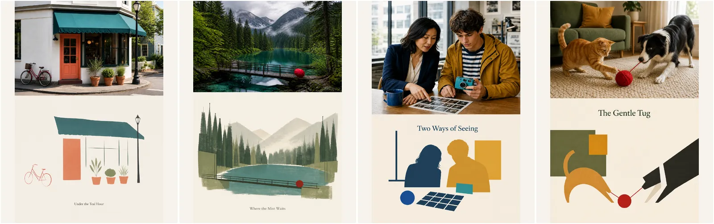</a>
</p>

### [Photo Relic Editorial / 纸上留影](https://github.com/wnby/photo-relic-editorial)

Pairs a real photograph with a lower paper-memory print, compressing subject identity, light, space, and mood into a few recognizable ink marks and negative space.

- **Author:** [wnby](https://github.com/wnby)
- **Input:** One authorized photograph; optional title language, layout, and series direction
- **Output:** A vertical photograph-and-paper-print editorial artwork
- **ImageGen role:** Preserves the upper photographic region and derives a lower modern print from source identity, light, color, edges, and scale relationships
- **Structure:** `SKILL.md`, `agents/openai.yaml`, a prompt guide, six Paper Beijing examples, and `LICENSE`
- **License:** MIT; rights to input photographs and bundled visual assets still require confirmation

<details>
<summary><strong>✨ Features & Notes</strong></summary>

**Features**

- Extracts 3–5 source cues and selects an explicit recipe across layout, print grammar, mark weight, title, and still/motion seed before generation.
- Builds a series identity with warm paper, deep ink blocks, negative-space cuts, and one source-derived warm accent rather than a full watercolor redraw or arbitrary swatches.
- Reduces people to small marks that retain posture and spacing, without requiring detailed faces; recognition and thumbnail legibility are explicit quality gates.

**Notes**

Our runs use only the four synthetic fixtures as content inputs, never upstream example images as generation references. All four retain source relationships for architecture, the two people, and the cat and dog, but the lower prints remain relatively pictorial; the lake is especially close to a watercolor retelling rather than the intended few abstract marks. Photo fidelity relies on model instructions rather than deterministic source restoration or pixel verification. It overlaps with Photo Abstract Editorial in subject matter but emphasizes paper, modern printmaking marks, and complete subject silhouettes rather than a purely geometric relationship panel.

</details>

<p align="center">
  <a href="examples/photo-relic-editorial/README.md">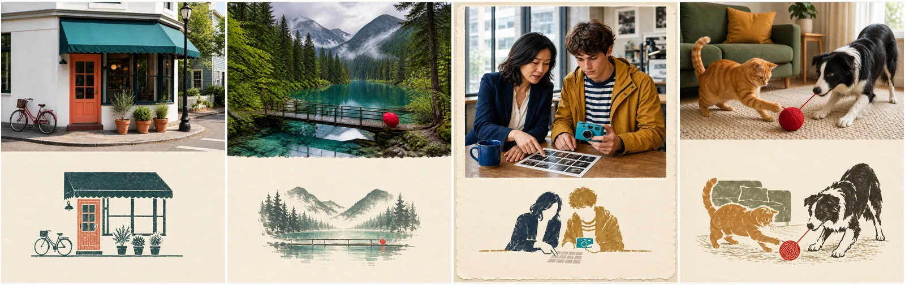</a>
</p>

### [Muge Photo Diptych](https://github.com/Yeshmuge/muge-photo-diptych)

Transforms a photograph into a vertical 2:3 handmade art-zine diptych, binding the observed scene to a memory layer through an inverted white cutout, a repeated dark silhouette, and a single connecting thread.

- **Author:** [Yeshmuge](https://github.com/Yeshmuge)
- **Input:** One portrait, animal, architecture, landscape, or still-life photo; optional main phrase, text fragments, connection mode, and accent color
- **Output:** A vertical 2:3 upper/lower art-zine diptych
- **ImageGen role:** Preserves the scene and subject relationships, inverts the upper subject into a detail-free pure-white silhouette, repeats it below as a matching dark silhouette, and extends one hand-drawn thread from a source-native linear element
- **Structure:** `SKILL.md`, `agents/openai.yaml`, a visual specification, normalized prompt template, usage examples, and two official reference images
- **License:** CC BY-NC 4.0; reference images are excluded unless explicitly marked; non-commercial sharing requires attribution and a change notice, while commercial use requires separate permission

<details>
<summary><strong>✨ Features & Notes</strong></summary>

**Features**

- Defines a clear constraint order: subject count, pose, and contour come before the white cutout, lower repetition, seam, thread, palette, and typography, making targeted QA and retries practical.
- Offers two connection modes: Mode A wraps a line around a person or animal's action, while Mode B originates from an existing architectural or object line; ambiguous scenes default to the safer Mode B.
- Derives the overall temperature and one accent from the source, then uses that accent for both the connecting thread and all handwriting instead of applying a generic sepia cast.
- Includes explicit rejection and retry rules for white-cutout purity, text, subject count, and thread origin, with a two-pass fallback when typography is unstable.

**Notes**

Our café and lake tests use Mode B, the portrait starts its thread at the contact sheet, and the cat-and-dog test turns the source yarn itself into a Mode A narrative line. All four outputs consistently produce the two-panel structure and source-aware palette. The portrait needed one surgical correction to remove a camera outline left inside the white silhouette, confirming that “completely blank” remains an important manual quality gate. Public sharing of derivatives should include `Diptych Skill by @Yeshmuge`.

</details>

<p align="center">
  <a href="examples/muge-photo-diptych/README.md">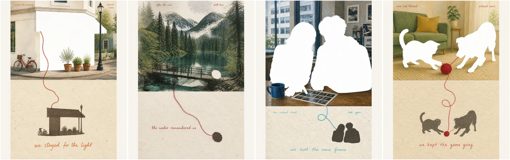</a>
</p>

### [Scenes Gathered Zine v1.3](https://github.com/Zeejay0/gathered-scenes-zine-skill/tree/main/skills/scenes-gathered-zine-v1-3)

Extends a recognizable source photograph into a tactile zine poster with torn-paper boundaries, abstract illustration, print texture, and restrained microtype.

- **Author:** [Zeejay0](https://github.com/Zeejay0)
- **Input:** One photograph; optional title, language, and relationship notes
- **Output:** A 3:5 vertical zine collage by default, or a landscape composition when appropriate
- **ImageGen role:** Preserves the central subject and space while deriving an illustrated field from source shapes, colors, and mood
- **Structure:** `SKILL.md`, `agents/openai.yaml`, and two official source/result examples
- **License:** Personal non-commercial use only; commercial, commissioned, internal, and paid use requires written permission

<details>
<summary><strong>✨ Features & Notes</strong></summary>

**Features**

- Builds a Scene Card first, recording subjects, spatial invariants, dominant motion, visual weight, color mood, abstractable forms, and quiet zones before prompt compilation.
- Its Minimal Abstraction Engine removes most small details and limits each piece to one primary illustration language plus at most one supporting language.
- New saturated colors must serve a compositional purpose; the Structural Removal Test asks whether removing a color would change the structure.
- Includes concrete constraints for photo privacy, text length, Chinese and English microtype, thumbnail review, and one targeted regeneration.

**Notes**

Both official examples preserve landmarks, bridges, crowds, and spatial depth while giving paper, torn edges, printmaking, and watercolor regions real compositional roles. The second keeps the source landscape orientation, suggesting that 3:5 is a default rather than a hard requirement. The roughly 400-line skill is comprehensive but concentrated almost entirely in `SKILL.md`, and only two official examples are available. Photo fidelity still depends on the image model; there is no deterministic compositing or pixel-level validation.

</details>

<p align="center">
  <a href="examples/scenes-gathered-zine-v1-3/README.md">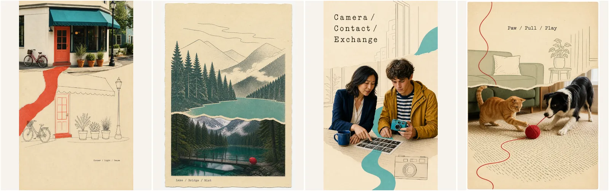</a>
</p>

### [Photo to Monthly Zine Postcard](https://github.com/shenchangyi/photo-to-monthly-zine-postcard/tree/main/skills/photo-to-monthly-zine-postcard)

Turns a photo into a 3:4 monthly zine postcard with the complete image above and watercolor, month, literary, music, and footer elements below.

- **Author:** [shenchangyi](https://github.com/shenchangyi)
- **Input:** One photo; optional month, handwritten line, signature, date, footer, reading reference, or song
- **Output:** A 3:4 vertical monthly photo postcard
- **ImageGen role:** Preserves the upper photo and derives the lower watercolor block and layout from its subjects, space, and light
- **Structure:** A compact `SKILL.md`, three workflow references, a full rule draft, visual references, and eight examples
- **License:** MIT

<details>
<summary><strong>✨ Features & Notes</strong></summary>

**Features**

- Uses five aspect-ratio routes with explicit `contain` sizing and placement for landscape, square, portrait, and extremely narrow inputs; it asks before cropping unusual images.
- Separates literary and music curation from generation: sources are researched and verified first, then passed to the generator as locked strings, with original narration or a blank song field as safe fallbacks.
- Defines relative size and hierarchy for the watercolor field, bookmark rail, month, vertical literature group, song, and three-part footer.
- Splits layout, content curation, and quality gates into focused references for clear progressive disclosure.

**Notes**

The eight finished examples are consistent in warm paper, photo-to-watercolor correspondence, right-rail hierarchy, and footer rhythm, and they cover ordinary landscapes, panoramic scenes, and a camera-framed input. The gallery does not publish the original source files, so the claim that the upper photo remains completely unchanged cannot be independently verified. `dusk-field-camera-frame.png` is 1024×1536 (2:3), not the stated hard 3:4 target. QA is a manual checklist without deterministic compositing, dimension checks, or text validation, and the skill does not explicitly require the built-in `$imagegen` tool.

</details>

<p align="center">
  <a href="examples/photo-to-monthly-zine-postcard/README.md">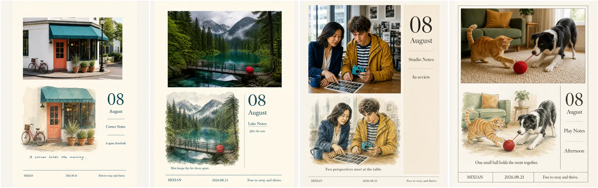</a>
</p>

### [Photo to Zine Postcard](https://github.com/Whiplashzeb/photo-to-zine-postcard)

Turns one photograph into a minimal zine-postcard set. The front embeds the complete source above generous whitespace, with just one source-specific hand-drawn motif, restrained metadata, and three sampled colors below; the back is a coordinated, writable postal layout.

- **Author:** [Whiplashzeb](https://github.com/Whiplashzeb)
- **Input:** One user photograph; optional title, subtitle, location, date, and index
- **Output:** Two coordinated portrait 2:3 images: a postcard front and a functional back
- **ImageGen role:** Embeds the real source on the front, selects one motif by identity, color, and silhouette for a restrained hand-drawn reinterpretation, then generates a back with matching paper, linework, and proportions
- **Structure:** One self-contained `SKILL.md`, bilingual READMEs, customization guidance, changelog and contribution docs, an example index, and nine official outputs
- **License:** MIT

<details>
<summary><strong>✨ Features & Notes</strong></summary>

**Features**

- Locks the front to “complete photo, generous transition space, lower-left metadata, one lower-right motif, exactly three swatches,” explicitly preventing the lower field from becoming a sample board or collage wall.
- Chooses the motif for source identity, attractive color, and clear silhouette; water, mountains, plants, and architecture default to hand drawing, while faces, hands, text, and precise machinery may fall back to a source crop.
- Permits only a title, short subtitle, location, date, and small index. Missing location and date values stay blank instead of being filled with invented placeholders.
- Keeps the back functional: an outer border, off-center divider, stamp box, address lines, and large message area form a restrained print-ready system.

**Notes**

Upstream publishes nine landscape and architecture outputs but not each example's original input, so its “unchanged photo” claim cannot be verified pixel by pixel. We combine both generated sides into each sample image: all three landscape inputs passed on the first generation, while the portrait input was initially cropped into a landscape frame and passed after one correction limited to source aspect ratio. All four retain exactly three swatches and a functional back, showing why `contain` placement remains a critical manual check in a generative composition workflow.

</details>

<p align="center">
  <a href="examples/photo-to-zine-postcard/README.md">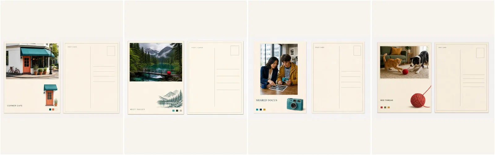</a>
</p>

### [GC Minimal Zine Poster v0.3.1](https://github.com/LiamGvchi/gc-minimal-zine-poster)

Transforms text, objects, moods, photos, or references into quiet paper-textured micro-editorial posters with generous negative space and one saturated focal color.

- **Author:** [LiamGvchi](https://github.com/LiamGvchi)
- **Input:** A text topic, article, photo, reference image, or image folder
- **Output:** A 3:5 raster poster by default, plus the final prompt, recipe, and rationale; analysis-only and prompt-only modes are supported
- **ImageGen role:** Calls built-in image generation, passes the real source in photo mode, checks preservation invariants, and allows one targeted regeneration
- **Structure:** `SKILL.md`, five references, six author examples, eight evals, Codex UI metadata, and a trilingual README
- **License:** MIT

<details>
<summary><strong>✨ Features & Notes</strong></summary>

**Features**

- Routes among Generate, Photo Input, Reference Analysis, Prompt-only, and Analyze + Generate, choosing the smallest mode that satisfies the request.
- Makes the visual system measurable: typically 70%–90% whitespace, an 8%–25% primary visual cluster, a saturated accent covering 0.8%–2.5% of the canvas, and one core metaphor rather than a full scene.
- Combines layout, focal carrier, typography, texture, and decoration axes, with batch-level variation rules that prevent repetitive centered-thumbnail results.
- Distinguishes edit targets, reference images, and supporting inserts, then records High, Medium, or Low preservation; people, pets, characters, artwork, and products default to High.
- Separates the Prompt Compiler, Reference Analysis, and Quality Gate, with evals covering identity, product geometry, reference non-copying, prompt-only output, and irrelevant icon leakage.

**Notes**

All six author examples are 686×1144, close to a strict 3:5 ratio, and consistently show scanned paper, large whitespace, small visual events, and a single-color focus. Layouts such as center fragment, dual panel, type-led, and offset cluster differ meaningfully. It is one of the clearest entries about invoking built-in ImageGen, passing source images, and regenerating after failure. However, the examples are text-led posters rather than public source/result photo pairs, so advanced preservation routes remain visually unverified. QA and evals are declarative rather than automated, and generated microtype remains model-dependent. The callable name remains `gc-minimal-zine-poster-v0-3` while the README displays v0.3.1 for installation compatibility.

</details>

<p align="center">
  <a href="examples/gc-minimal-zine-poster-v0-3/README.md">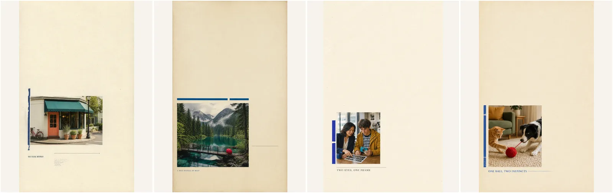</a>
</p>

### [Photo Riso Poster](https://github.com/luckdvr/photo-riso-poster)

Distills a photo or text theme into a quiet risograph archive poster by recording counts, spacing, occlusion, direction, and color roles, then rebuilding those relationships with two or three inks, restrained type, and generous empty paper.

- **Author:** [luckdvr](https://github.com/luckdvr)
- **Input:** One photo or a text theme, with optional faithful, standard, or minimal abstraction
- **Output:** One flat riso poster whose orientation follows the source, plus the exact prompt, evidence mapping, paper-temperature choice, and aspect rationale
- **ImageGen role:** Codex first deconstructs the photo visually, then sends a text-only evidence prompt to built-in image generation; the source photo is deliberately not attached to the generation call
- **Structure:** A single `SKILL.md`, bilingual README, MIT License, and multiple poster, source/result comparison, and abstraction-level examples
- **License:** MIT

<details>
<summary><strong>✨ Features & Notes</strong></summary>

**Features**

- Requires every visual mark to trace to a named source fact and rejects decoration added merely to make the result feel designed.
- Maps the source's large-area temperature and two or three dominant color roles to paper and separate ink layers, with grain, bleed, and slight misregistration supplying the print character.
- Offers faithful, standard, and minimal abstraction, moving from recognizable old-book illustration contours to geometric marks that preserve only count, position, direction, and rhythm.
- Treats typography as another evidence channel for counts, season, weather, date, and a short poetic phrase rather than random pseudo-editorial filler.

**Notes**

This is a restrained, single-page method skill with multiple public photo/result comparisons. Because it intentionally excludes the source photo from the final ImageGen call, it is better suited to testing whether visual analysis survives textual transfer than to strict identity or object-geometry preservation. All four of our text-only reconstructions retained the key counts, directions, color roles, and short English labels; the portrait anonymized faces as required, while the landscape and animal samples preserved the red umbrella, bridge line, and red-yarn relationship especially clearly. The author credits GC Minimal Zine Poster and Travel Photo Abstraction as inspirations while stating that no files, images, or text were copied.

</details>

<p align="center">
  <a href="examples/photo-riso-poster/README.md">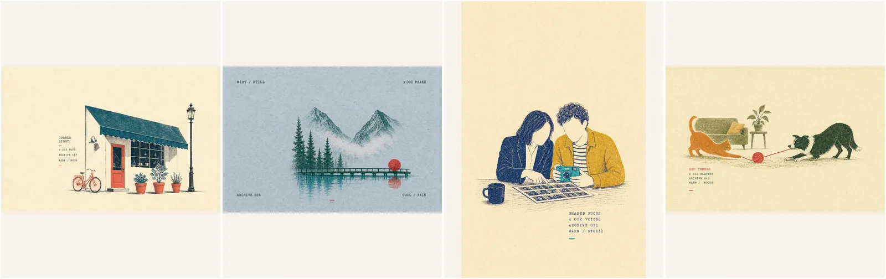</a>
</p>

### [Dreamcore Collage Poster](https://github.com/AndrwewHan/dreamcore-collage-poster)

Recomposes a theme or photo as a dense dreamcore collage with one recognizable anchor, several echoes, a memory environment, geometric interruptions, and one impossible relationship.

- **Author:** [AndrwewHan](https://github.com/AndrwewHan)
- **Input:** A text theme or up to five references with distinct roles
- **Output:** A vertical dreamcore, digital-memory, ritual-archive, or surreal collage poster
- **ImageGen role:** Uses Codex built-in `image_gen` for generation or editing without an external image backend
- **Structure:** A single `SKILL.md`, Codex UI metadata, and a compact README
- **License:** MIT

<details>
<summary><strong>✨ Features & Notes</strong></summary>

**Features**

- Decomposes the image into five functional layers—primary anchor, echo, environment, geometric interruption, and anomaly—instead of merely stacking dreamcore adjectives.
- Provides seven construction families, including fractured mosaic, altar grid, interface collage, and dark void, and requires batches to vary visual grammar rather than just subject position.
- Limits the palette to two to four dominant colors and assigns explicit media roles to CRT scanlines, halftone, JPEG blocks, copier dirt, or misregistration.
- Clearly separates dense dreamcore from whitespace-led minimal zines and defines an ordered role system for reference-image fusion.

**Notes**

The method is well specified, including native invocation, output paths, one targeted regeneration, and accidental-watermark checks. It fills the high-density collage end of this collection. The repository currently has no author-generated samples, evals, or automated QA, and its README is extremely brief, so cross-subject stability is not yet supported by public visual evidence. Short Chinese text, pseudo-interface labels, geometry, and reference-subject fidelity still require manual review.

</details>

<p align="center">
  <a href="examples/dreamcore-collage-poster/README.md">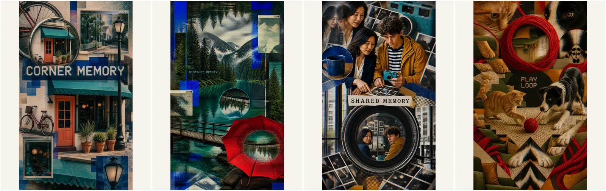</a>
</p>

### [Make Photo Stamp Archive](https://github.com/Dlcccc71913/skill-make-photo-stamp-archive)

Pairs a photo with warm archival paper, a small handmade stamp derived from the subject, and restrained typewriter annotations.

- **Author:** [Dlcccc71913](https://github.com/Dlcccc71913)
- **Input:** One or more photos; revisions may target the stamp, border, size, position, ink, title, paper age, or join direction
- **Output:** One flat raster per source photo; the default is a horizontal 55/45 photo-to-paper split
- **ImageGen role:** Calls built-in generation/editing for each photo and locks untouched attributes during revisions
- **Structure:** `SKILL.md`, a prompt/revision template, `agents/openai.yaml`, a trilingual README, and three linked examples
- **License:** MIT

<details>
<summary><strong>✨ Features & Notes</strong></summary>

**Features**

- Locks invariants in the photo panel—identity, faces, gestures, clothing, object count, architecture, signage, viewpoint, occlusion, and color relationships—before designing the stamp panel.
- Chooses circular, framed, ridge-shaped, arched, or custom stamp silhouettes from subject semantics instead of forcing every image into a rectangular thumbnail.
- Strictly defines the straight seam between the two main panels and forbids gradients, feathering, spines, overlap, diagonals, page-turn effects, and decorative dividers.
- Maps feedback such as “10% smaller,” “move to the upper right,” or “less aged paper” to single-attribute revisions while preserving everything else.
- Produces one independent asset per input photo rather than combining multiple photos into a contact sheet.

**Notes**

The three official 1448×1086 examples have clean seams, warm whitespace, and compact stamp groups; their building silhouettes, arched windows, and circular Buddha stamp show that silhouette selection is not a fixed template. The photo panel occupies roughly 50%–58%, so 55/45 is best treated as guidance. Source photos are not published separately, and the workflow sends the whole composition through a generation/edit model without deterministic compositing, so identity, signage, exact crops, and isolated revisions may drift. There are no evals or automated QA, and the examples do not cover people, multi-photo batches, vertical seams, or revision sequences. “Archive” describes the aesthetic—the raster output does not preserve originals, EXIF, indexing, or long-term archival metadata.

</details>

<p align="center">
  <a href="examples/make-photo-stamp-archive/README.md">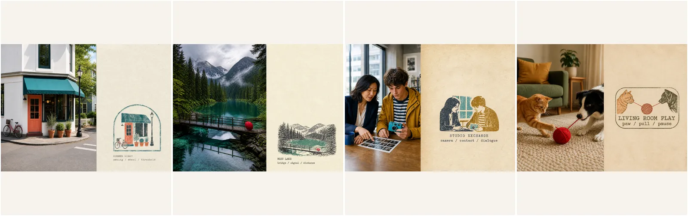</a>
</p>

### [Photo Revival](https://github.com/dacnay816y62-hub/photo-revival)

Treats ordinary snapshots as memory evidence, preserves their subject, spatial relationships, and mood, then redraws them as a tiny, vivid poetic illustration on white paper.

- **Author:** [dacnay816y62-hub](https://github.com/dacnay816y62-hub)
- **Input:** An everyday snapshot, travel fragment, building, object, food, animal, or daily-life photograph
- **Output:** A portrait 3:4 white-paper illustration page with localized color, restrained paper or collage traces, and optional tiny handwritten notes
- **ImageGen role:** Identifies one to three memorable anchors and redraws them with built-in ImageGen instead of applying a filter, photorealistic retouch, or pixel-level copy
- **Structure:** A concise `SKILL.md`, `agents/openai.yaml`, a Chinese usage guide, 17 public finished examples, and an MIT License
- **License:** MIT

<details>
<summary><strong>✨ Features & Notes</strong></summary>

**Features**

- Reserves 80–88% of the page as white paper while the illustrated subject occupies 10–16%, with an absolute 18% maximum.
- Concentrates color inside the tiny illustration and combines pencil edges, watercolor, dry brush, wax pastel, and light risograph grain without contaminating the blank field.
- Preserves the subject, pose, spatial relationships, key objects, and mood while requiring a fresh redraw rather than a photo-filter treatment.
- Limits text to dates, field notes, or poetic fragments so typography does not overpower the photographic memory.

**Notes**

It shares generous negative space with GC Minimal Zine Poster, but the objectives differ: GC Minimal can build a micro-editorial event from text or a photo and vary it through a recipe system, while Photo Revival specifically extracts memory anchors from a real photograph and compresses them into localized hand-drawn art. The upstream gallery is extensive but does not publish paired source photos, so fidelity still needs independent testing with our shared fixtures.

</details>

<p align="center">
  <a href="examples/photo-revival/README.md">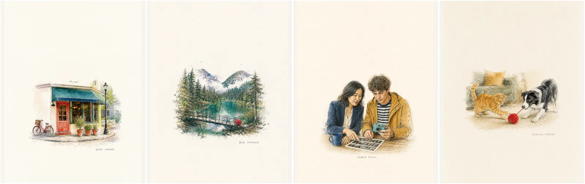</a>
</p>

### [HBG Travel Photo Redraw](https://github.com/Mr-funny/hbg-travel-photo-redraw)

Treats each travel photo as the sole factual source, then selects one modular method—printmaking, watercolor, architectural observation, postcard, textile, souvenir, or memory diorama—to produce a high-fidelity photo-to-redraw artwork.

- **Author:** [Mr-funny](https://github.com/Mr-funny)
- **Input:** One or more travel photos; optional style, layout, and use-case direction
- **Output:** One independent artwork per input; the default is a 3:4 vertical diptych pairing a high-fidelity photo with a redraw of the same scene
- **ImageGen role:** Uses built-in image generation for high-fidelity editing, preserving people, objects, architecture, terrain, and viewpoint before simplifying and reorganizing them through one selected style module
- **Structure:** A concise `SKILL.md`, shared constraints, a style catalog, 17 focused style modules, extension guidance, Codex metadata, and 27 official examples
- **License:** MIT

<details>
<summary><strong>✨ Features & Notes</strong></summary>

**Features**

- Uses three-level progressive disclosure—shared photo constraints, catalog routing, then exactly one style module—rather than loading all 17 styles into context.
- Defines invariants for identity and count, pose, architecture, terrain, viewpoint, source-derived color, and text; when a location is uncertain, it uses a scene theme rather than inventing a place name.
- Processes multiple photos through independent calls, forbids cross-scene grids, and allows only one targeted correction so a failed detail does not trigger unrelated composition or palette changes.
- Covers architectural ink observation, terrain relief, postage relief, enamel magnets, travel journals, textile craft, and memory dioramas, with a common interface for adding more modules.

**Notes**

The upstream repository publishes 17 style modules, with 27 examples across eight of them. Its modularity and progressive loading are unusually mature, although most examples show only finished outputs rather than paired sources and reproducible run records. Our four samples route to architectural ink observation, lakeside terrain, travel memory field note, and felted memory diorama; they preserve subject count, key objects, color, and short English text well. The default claim that the photo panel remains unchanged still relies on model compliance rather than deterministic compositing, so hands, exact pixels, and generated text require review. The indoor pet scene is outside the skill's native travel scope and is deliberately interpreted here as a domestic memory souvenir to preserve the shared input set.

</details>

<p align="center">
  <a href="examples/hbg-travel-photo-redraw/README.md">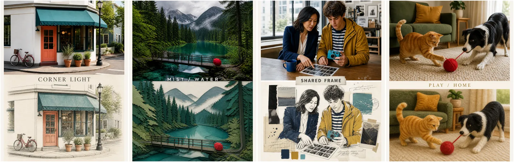</a>
</p>

### [Travel Memory Sticker Card](https://github.com/carolinaaafy/travel-memory-sticker-card)

Redraws one travel, street, landscape, lifestyle, portrait, or pet photo as a horizontal collectible card: a dominant scene illustration on the left, six source-derived stickers on the right, and three English phrases summarizing its memory cues below.

- **Author:** [carolinaaafy](https://github.com/carolinaaafy)
- **Input:** One travel, street, landscape, lifestyle, portrait, or pet photo
- **Output:** One 3:2 horizontal memory card with a dominant illustration, exactly three English keyword phrases, and exactly six stickers
- **ImageGen role:** Inspects the source, selects an identification anchor, sticker motifs, and keywords, then redraws the complete card with built-in `image_gen`; permits one directed regeneration only when a hard constraint fails
- **Structure:** `SKILL.md`, Codex metadata, a lightweight README, and one visual style guide
- **License:** No open-source license declared upstream

<details>
<summary><strong>✨ Features & Notes</strong></summary>

**Features**

- Fixes the composition at roughly 66–68% for the left illustration and 30–32% for the right sticker rail, surrounded by one continuous warm off-white paper edge.
- Selects one identification anchor from the source; landmark text defaults to none and may appear at most once when genuinely useful.
- Builds a tactile matte-gouache, cut-paper, and light risograph-grain treatment from 5–8 broad color families and 3–6 large masses.
- Requires exactly six separate source-derived sticker motifs and exactly three English keyword phrases, each printed once.

**Notes**

All four shared inputs passed on the first generation: keyword count, sticker count, panel proportions, and subject counts followed the specification, so no regeneration was needed. We have not yet tested the optional path that preserves and renders one real landmark name verbatim, and the upstream repository publishes no author-generated examples. Because it declares no license, confirm permission before reuse or redistribution.

</details>

<p align="center">
  <a href="examples/travel-memory-sticker-card/README.md">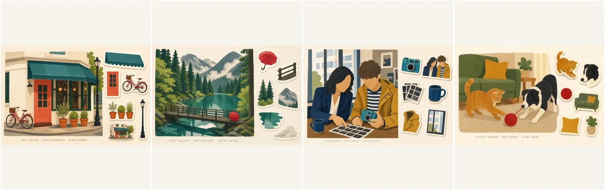</a>
</p>

### [Pocket Postcard](https://github.com/kaijie-czyh/pocket-postcard-skill)

Mails a photo or sentence as a vintage handwritten postcard, keeping a recognizable photo on one side and placing a short note, postmark, place, and weather shorthand on the other.

- **Author:** [kaijie-czyh](https://github.com/kaijie-czyh)
- **Input:** A photo, or a theme, sentence, mood, place, and content brief
- **Output:** One 3:2 landscape or 2:3 portrait handwritten postcard, plus the final prompt and recipe notes
- **ImageGen role:** Uses built-in image generation by default; photo mode prefers image-to-image subject preservation before composing the photo region, handwriting, postmark, and aged paper surface
- **Structure:** `SKILL.md`, bilingual READMEs, six author examples, an optional MiniMax test script, and an MIT License
- **License:** MIT

<details>
<summary><strong>✨ Features & Notes</strong></summary>

**Features**

- Uses a fixed eight-field prompt compiler for canvas, photo region, handwriting, postal marks, paper, color, emotion, and negative constraints.
- Combines layout, stamp, handwriting, paper tone, mood, and one high-chroma postal accent into recipes whose variations change more than position.
- Gives subject fidelity priority in photo mode, favors fewer and larger decorations, and permits shorter copy when that protects faces.
- A single saturated postal hue, matte cardstock, soft wear, and a faint fold make the result feel like an object that has actually traveled.

**Notes**

All four runs produced a clear photo region, handwriting area, and round postmark, with readable place and weather fields. To avoid inventing real travel metadata, we used only visible scene descriptions for place and weather. Model-generated postmark dates are visual props and should not be treated as factual metadata.

</details>

<p align="center">
  <a href="examples/pocket-postcard/README.md">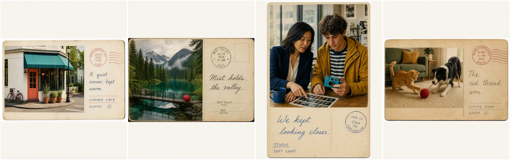</a>
</p>

### [Street Photo Illustration](https://github.com/fangzhengjin/skills-hub/tree/main/skills/street-photo-illustration-skill)

Keeps a real photographic environment while replacing only its people with black-ink or colorful editorial-chibi characters, optionally adding place-aware typography and doodles.

- **Author:** [fangzhengjin](https://github.com/fangzhengjin)
- **Input:** Street, travel, lifestyle, casual, or commercial-space photos, with optional mode, copy, and decoration intensity
- **Output:** A 3:4 photo-plus-illustrated-character editorial image by default
- **ImageGen role:** Uses the source as a scene and character lock, replacing people in place while preserving pose, clothing, accessories, and the photographic environment
- **Structure:** `SKILL.md`, `agents/openai.yaml`, black-ink and color-chibi prompt templates, an icon, and ten author examples
- **License:** MIT

<details>
<summary><strong>✨ Features & Notes</strong></summary>

**Features**

- Defines character replacement rather than full-image illustration: architecture, streets, furniture, merchandise, light, perspective, and depth remain photographic.
- Both BLACK INK and COLOR CHIBI reduce faces to dot-eye logic while imposing unusually strict locks on adult proportions, long-limbed rhythm, and pose silhouette.
- CUSTOM COPY, AUTO COPY, and NO TEXT are mutually exclusive; when typography is active, it must respond to the actual café, city, travel, or commercial context.
- Two execution templates and a detailed QA list cover subject counts, duplicates, hidden faces, clothing detail, and environmental drift.

**Notes**

The skill natively handles people only. Our two-person fixture is therefore a normal case; the café and lake infer a courier and umbrella-holding traveler, while the animal fixture treats the cat and dog as replacement targets. Those three are deliberate out-of-scope generalization stress tests, not upstream promises. All four use COLOR CHIBI + NO TEXT. Their environments remain visibly photographic, but the results are not pixel-identical composites.

</details>

<p align="center">
  <a href="examples/street-photo-illustration/README.md">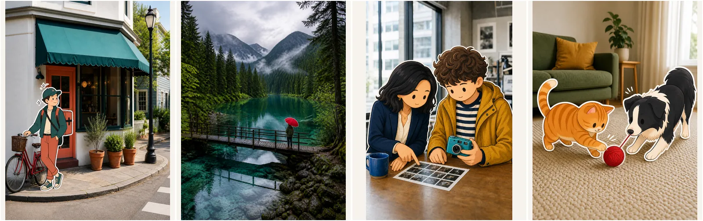</a>
</p>

### [Heart Sticker ImageGen Skill](https://github.com/SpaceZephyr/heart-sticker-imagegen-skill)

Turns a person, pet, object photo, or exact short text into a sticker by recommending suitable styles, waiting for confirmation, and then invoking Codex built-in `image_gen`.

- **Author:** [SpaceZephyr](https://github.com/SpaceZephyr)
- **Input:** A person, pet, or object image; alternatively, exact text to render
- **Output:** Eleven image-sticker styles, nine text-sticker styles, custom styling, or background extraction
- **ImageGen role:** Compiles the selected source prompt into a built-in `image_gen` edit or generation request and adds subject-preservation, error, and text-review constraints
- **Structure:** `SKILL.md`, Codex metadata, image and text style libraries, a case index, a source manifest, and 31 generated examples
- **License:** No independent open-source license; the 20 base prompts come from `mundane799699/heart-sticker`, whose README reserves all rights, so redistribution and commercial use require separate review

<details>
<summary><strong>✨ Features & Notes</strong></summary>

**Features**

- Makes “collect material → recommend 3–5 styles → wait for confirmation → generate” a hard gate, avoiding generation spend before the user chooses.
- Distinguishes local paths from conversation images and selects either `referenced_image_paths` or `num_last_images_to_include` correctly.
- Loads eleven image styles and nine text styles on demand, with routing guidance for people, pets, action scenes, clean cutouts, short slogans, and longer copy.
- Locks the user's exact text and asks for one text-only correction when characters are wrong; the source manifest records the original repository, commit, and extraction paths.

**Notes**

Our samples use cartoon sticker, vintage comic, kawaii 3D, and clay. The method can be forced onto non-character architecture and landscapes, while the two people, camera, pets, and yarn ball remain correctly counted; `NICE SHOT!` also renders accurately. The café result does not strictly follow the requested plain off-white background, showing how source style prompts and appended constraints can compete. Licensing is the largest limitation: this repository explicitly declares no independent open-source license, and its base prompts come from an all-rights-reserved upstream. `SKILL.md` also contains hard-coded WeChat customer-service routing for the trigger phrases “print stickers” and “image API”; that is a commercial service hook rather than an ImageGen method and should be reviewed separately before adoption or modification.

</details>

<p align="center">
  <a href="examples/heart-sticker-imagegen/README.md">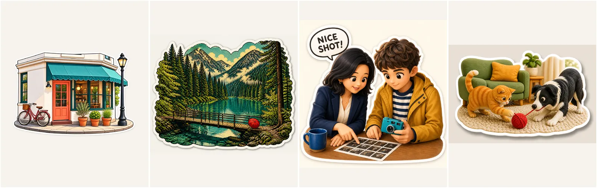</a>
</p>

### [Starryear Threefold Memory](https://github.com/Starryear/Starryear-Threefold-Memory)

Splits one locked documentary photograph into three continuous layers of memory: a perceptual abstraction derived from the source, the untouched photograph as evidence, and a relational memory map built from routes, nodes, intervals, and afterimages.

- **Author:** [Starryear](https://github.com/Starryear)
- **Input:** One travel, landscape, architecture, plant, animal, portrait, or quiet documentary photograph
- **Output:** A vertical `1920×3240` triptych by default, assembled without gaps from three equal `1920×1080`, 16:9 panels
- **ImageGen role:** Generates the perceptual and relational-memory panels separately; the source photo remains locked as the middle evidence layer, and a deterministic script handles assembly and dimension checks
- **Structure:** A root `SKILL.md`; the downloadable package adds two references, `agents/openai.yaml`, `compose_triptych.py`, and 10 official triptych examples
- **License:** No open-source license declared; the author explicitly reserves reuse rights for the original source photographs

<details>
<summary><strong>✨ Features & Notes</strong></summary>

**Features**

- Separates `WHAT I SAW / WHAT HAPPENED / WHAT STAYED`, explicitly rejecting three-filter variations of the same photograph.
- Requires every generated mark to trace back to a source fact such as shape, axis, interval, repetition, occlusion, light, or color.
- Keeps the top panel minimally recognizable while forcing the bottom panel into a different relational grammar of routes, nodes, grids, and afterimages.
- Uses the original photograph only in deterministic middle-panel assembly; `compose_triptych.py` validates aspect ratio, order, seams, dimensions, and delivery state.

**Notes**

The official repository shows 10 polished travel and nature examples, but its references, script, and examples are distributed only inside a downloadable ZIP, so copying the root `SKILL.md` alone leaves relative paths unresolved. The method also cites principles from `photo-abstract-editorial` and `travel-photo-abstraction`, while expanding the full generation scaffold inside the package. All four of our examples pass the upstream script's `DELIVERY PASS`; the animal-memory panel needed one targeted repair to separate it from the perception layer, while the portrait fixture loses some tabletop information under the default `cover` crop. People, animals, and complex architecture still need manual checks for count, recognition cues, and middle-photo cropping. Public visibility should not be mistaken for permission to redistribute or use commercially.

</details>

<p align="center">
  <a href="examples/starryear-threefold-memory/README.md">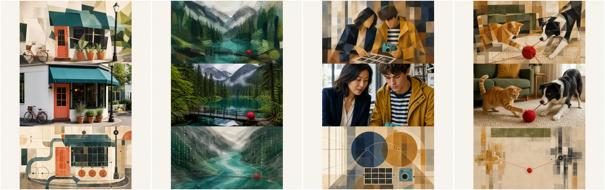</a>
</p>

### [Outsider Art v1.2](https://github.com/fihaaade/skills/tree/main/outsider-art)

Translates photo semantics or a text theme into a flat, dense, and quiet naïve-art poster: top-down map-like ground meets upright objects, each broad color zone carries one handmade texture, and tiny faceless figures establish scale.

- **Author:** [fihaaade](https://github.com/fihaaade)
- **Input:** One photograph used only as semantic reference, or a text theme such as a place, season, memory, or everyday activity
- **Output:** A text-free raster poster, 2:3 portrait by default or 3:2 landscape when appropriate, plus one short Chinese creative rationale
- **ImageGen role:** Compiles a complete prompt from a Field Card, generates a flat original illustration with the available image tool, reviews it at full and thumbnail size, and allows at most one targeted repair
- **Structure:** `outsider-art/SKILL.md` and `agents/openai.yaml`; currently no separate reference images, scripts, or evals
- **License:** No open-source license declared in the upstream repository

<details>
<summary><strong>✨ Features & Notes</strong></summary>

**Features**

- Photo mode extracts only place, spatial bands, activity, seasonal color, and mood; tracing, cropping, collaging, and retaining photographic pixels are explicitly forbidden.
- Builds a mixed-projection world from 2–5 large color zones and limits each zone to one even texture; calm comes from dense repetition rather than broad emptiness.
- Locks the palette to paper white, warm ink black, 2–4 muted scene colors, and exactly one saturated accent with a compositional job.
- Defines executable gates for figure scale, filled silhouettes, facelessness, active poses, edge treatment, text, and failed-output repair.

**Notes**

This is a rule-dense single-file skill with a specific visual language, prompt compiler, and QA loop, but the repository currently includes no official samples, automated evaluation, or repair script, so consistency depends largely on model compliance with a long prompt. All four of our examples preserve the key count relationships and a single saturated accent, and the orientation switches appropriately by subject; personal identity is reduced to faceless color masses as designed. Photo mode intentionally discards pixels and personal identity. It is well suited to semantic translations of places, seasons, and daily activity, but not to edits that require photographic composition or facial fidelity.

</details>

<p align="center">
  <a href="examples/outsider-art-v1/README.md">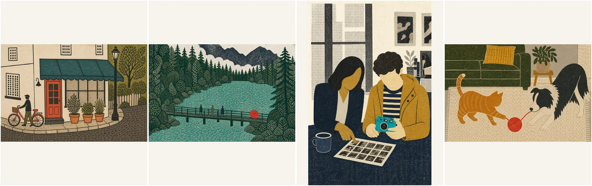</a>
</p>

### [Phosphor Relay Style](https://github.com/fihaaade/skills/tree/main/phosphor-relay-style)

“Photograph the screen, not the scene”: stages a photo or brief as a close-range rephotograph of a luminous broadcast display, turning fine phosphor grids, moiré, a cold field, one warm event, and failed highlight/shadow exposure into physical material.

- **Author:** [fihaaade](https://github.com/fihaaade)
- **Input:** One photograph in Treat mode, or a scene brief in Originate mode
- **Output:** A screen-rephotography image in 4:3 by default, with support for 3:2, 1:1, or exact dimensions, plus the final prompt, nine-axis recipe, and QA status
- **ImageGen role:** Edits the source in Treat mode or generates a new frame in Originate mode, then checks grid, moiré, color field, exposure, focus, anonymity, and composition before at most one repair
- **Structure:** `SKILL.md`, Codex metadata, `EXAMPLES.md`, a quality-anchor index, a 16-class repair playbook, 10 reference frames, and 28+ trial outputs
- **License:** No open-source license declared in the upstream repository

<details>
<summary><strong>✨ Features & Notes</strong></summary>

**Features**

- Treat mode locks the source subject, composition, crop, and moment while overriding material with a grid, cold field, one warm event, failed tonal extremes, and “subject soft / grid sharp” focus.
- A nine-axis recipe explicitly controls aspect ratio, framing family, single or paired structure, signal condition, color event, focus behavior, moment, grid type, and text degradation.
- Requires hundreds of fine phosphor columns to remain visible through highlights, shadows, and midtones with genuine moiré; regular halftone dots or a simple scanline overlay fail.
- Uses quality-anchor deltas and a repair playbook to suppress example copying, coarse dots, film looks, VHS, neon cyberpunk, and generic glitch art.

**Notes**

The visual constraints, failure taxonomy, and inspection loop are unusually complete, and the upstream includes a substantial reference and stress-test set. The skill anonymizes real people by default. Treat mode asks an image to remain recognizably the same source while strongly changing temperature, exposure, and sharpness, so identity and fine-detail fidelity are not primary goals. All four of our Treat examples retain the source scene, count, and single warm event, with grid structure visible through highlights, shadows, and midtones; the model nevertheless adds a slight rounded screen edge, so the set should be read as `DONE_WITH_CONCERNS` under the upstream gates. Keeping the fine grid alive inside crushed blacks remains the most fragile requirement. The repository has no license, and reference-frame provenance should be reviewed before redistribution.

</details>

<p align="center">
  <a href="examples/phosphor-relay-style/README.md">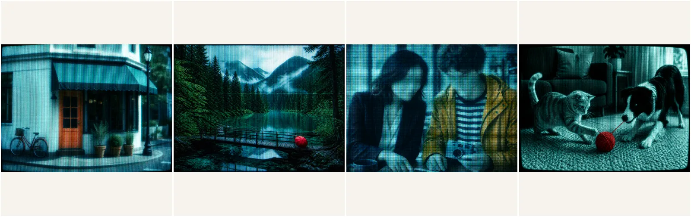</a>
</p>

<a id="branding--identity"></a>
## Branding & Identity

### [IP as Logo](https://github.com/s1dashu/ip-as-logo-skill)

Generates extremely simplified, rounded square mascot candidates designed to remain recognizable at 32×32.

- **Author:** [s1dashu](https://github.com/s1dashu)
- **Input:** A specific animal, object, or character; directions may be inferred from product context, audience, and brand personality
- **Output:** Six independent 1:1 raster candidates with labels, directions, composition, prompt/color mappings, dimensions, and paths
- **ImageGen role:** Generates each candidate independently under shape, palette, proportion, and small-size recognition constraints
- **Structure:** A single `SKILL.md`, README, MIT License, and one showcase wall
- **License:** MIT

<details>
<summary><strong>✨ Features & Notes</strong></summary>

**Features**

- Proposes three reasoned IP directions from product purpose, audience, and personality, then generates two candidates per direction by default; a chosen direction receives six controlled variations.
- Tests fixed lower-left and lower-right compositions across the six-image batch, generating, saving, and labeling each image independently instead of asking the model for a confusing grid.
- Uses a Complexity Budget built around one continuous silhouette, at most one species cue, two internal color regions, and minimal facial marks—well targeted to small mascots.
- Deliberately omits terms such as `logo`, `brand mark`, and `app icon` from generation prompts to reduce unwanted frames, text, and showcase mockups.
- Adapts constraints to either modern single-prompt interfaces or older separate negative-prompt APIs and records the model, provider, and actual constraint mode.

**Notes**

The showcase animals, ghosts, robots, and objects share bold rounded silhouettes, restrained color, and corner crops, making the method useful for fast brand exploration. The repository publishes only one 2560×2200 montage—not the individual candidates, prompts, product briefs, 32×32 tests, or repeated runs. It also does not treat an existing character as an explicit edit target, so “IP” here means new mascot exploration rather than identity-preserving conversion. Generation is intentionally treated as a random draw with no inspection, selection, retry, or post-processing. The final asset is a raster image on a solid background, not a production logo system with SVG, transparency, monochrome, wordmark lockups, trademark checks, or brand applications.

</details>

<p align="center">
  <a href="examples/ip-as-logo/README.md">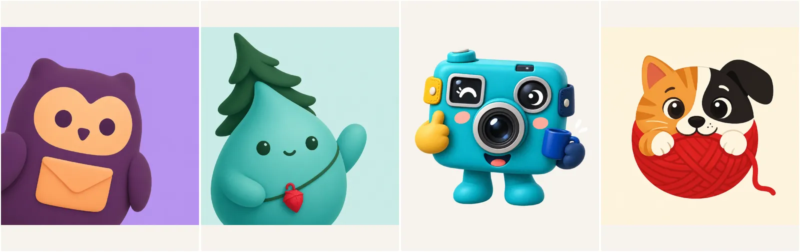</a>
</p>

### [30x-image](https://github.com/norahe0304-art/30x-image)

Combines a brand `DESIGN.md`, eight marketing templates, variation axes, and anti-slop rules to create many kinds of branded marketing images.

- **Author:** [norahe0304-art](https://github.com/norahe0304-art)
- **Input:** A brand profile or URL, design tokens, Figma Variables, CSS, screenshots, and a written brief
- **Output:** Brand-consistent standalone marketing rasters plus a JSON manifest
- **ImageGen role:** Requires OpenAI/Codex built-in `image_generation` and stops rather than substituting HTML, SVG, or local drawing
- **Structure:** An approximately 800-line entry skill, three references, brand profiles, and Codex metadata
- **License:** MIT

<details>
<summary><strong>✨ Features & Notes</strong></summary>

**Features**

- Converts a brand into a nine-part profile plus numeric `taste:` values, then uses variance, density, art direction, spacing, realism, and text density to choose template axes.
- Treats each asset as its own template rather than using one universal prompt; carousels generate each slide independently instead of chaining image-to-image edits.
- Combines general anti-slop rules with each brand profile's `Don't` list to suppress purple neon, vague calls to action, fake placeholder brands, and unsupported visual defaults.
- Defines separate `init`, generation, and local-edit paths, with records for prompts, tool parameters, chosen axes, files, and manifests.

**Notes**

This is one of the few system-level skills that maps a brand profile to many marketing asset types, and its methodology is dense. The repository bundles only the Stripe profile, not the advertised 60+ brands or public renders; those are fetched through `npx getdesign`. Its instructions also assume that the built-in tool exposes Responses API fields such as `size`, `quality`, `n`, `output_format`, and `input_image_mask`. Several of these are explicit CLI/API fallback controls in the official Codex ImageGen skill, so the real tool schema must be checked per harness. The upstream M0–M3 states are author acceptance records, not independent results from this collection.

</details>

<p align="center">
  <a href="examples/30x-image/README.md">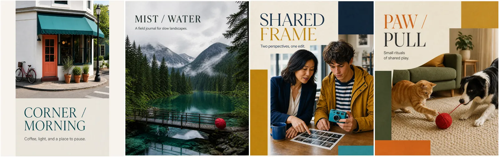</a>
</p>

### [GPT Image 2 Ecommerce](https://github.com/buluslan/gpt-image2-ecommerce)

Maps a natural-language request and optional product reference to hero images, lifestyle shots, A+ content, social posts, UGC, packaging, model photography, storefronts, and campaigns through 25 structured scene templates.

- **Author:** [buluslan](https://github.com/buluslan)
- **Input:** Product description, category, selling points, style, and scene requirements; optional product or environment reference images
- **Output:** Independent e-commerce images across 25 scene types and their variants
- **ImageGen role:** Matches and simplifies one JSON template, then invokes Codex built-in ImageGen through `codex exec`; an optional local HTTP image service is also supported
- **Structure:** An approximately 180-line `SKILL.md`, 25 standalone JSON templates, a hybrid `imagegen.sh` runner, README, banner, and MIT License
- **License:** MIT

<details>
<summary><strong>✨ Features & Notes</strong></summary>

**Features**

- Covers 25 common commerce tasks, including hero, lifestyle, flat lay, macro, poster, social, UGC, model, comparison, packaging, infographic, exploded view, ghost mannequin, seasonal campaign, device mockup, and physical storefront imagery.
- Reads only the template matching the request, then fills non-empty variables, style overrides, and category tips rather than loading the whole library into one prompt.
- Gives UGC, livestream, and social routes explicit anti-AI constraints for phone model, noise, color cast, imperfections, lived-in environments, and non-professional framing.
- Supports both reference-free and product-reference generation, and can route its runner between direct Codex CLI execution and an optional local HTTP service.

**Notes**

This is fundamentally an e-commerce template router plus a nested Codex CLI executor, not a direct caller of the current harness tool. Its `allowed-tools` frontmatter follows a Claude-style convention, the normal path launches a new `codex exec` process, and result handling assumes `~/.codex/generated_images/`; cleanup instructions also delete the corresponding session directory, so paths and deletion scope should be audited before integration elsewhere. Our samples cover a storefront, a four-season umbrella campaign, camera lifestyle photography, and pet-toy UGC. The storefront and portrait routes change the source conservatively, the seasonal grid demonstrates the clearest template value, and UGC mainly changes crop and texture. The 25 templates do not ship with per-template outputs or automated evals, so logos, packaging text, exact structure, and grid consistency remain manual review items.

</details>

<p align="center">
  <a href="examples/gpt-image2-ecommerce/README.md">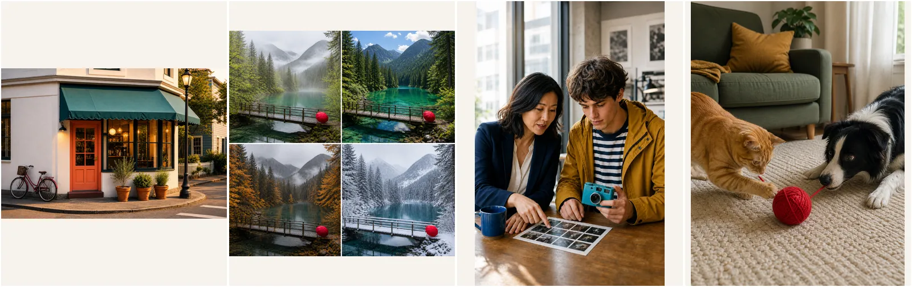</a>
</p>

<a id="craft--textile"></a>
## Craft & Textile

### [Yarn Rug Reference](https://github.com/rlx-better/yarn-rug-reference)

Simplifies an image into a low-color handmade yarn, tufted-rug, or textile interpretation and presents it beneath the original.

- **Author:** [rlx-better](https://github.com/rlx-better)
- **Input:** One source image and an optional textile-style reference
- **Output:** A 2:3 vertical before/after comparison
- **ImageGen role:** Rebuilds the source as a 6–8-color blocky yarn rug while preserving subject, composition, and fiber direction
- **Structure:** `SKILL.md`, `agents/openai.yaml`, and five reference images
- **License:** MIT

<details>
<summary><strong>✨ Features & Notes</strong></summary>

**Features**

- Reduces photographic detail and color before adding fiber texture, avoiding the common failure of simply overlaying a textile texture on a photo.
- Assigns unified color families to large regions such as sky, ground, architecture, and water, substantially reducing chromatic noise and fragmented gradients.
- Preserves primary subject relationships while intentionally discarding secondary detail; its landscape, animal, and portrait references remain semantically legible.
- Gives concrete material counterexamples, excluding beads, plastic, mosaic, regular woven lines, and decorative fringe.

**Notes**

The references show convincing pile, color blocking, and compositional consistency, with a believable tufted-rug feel. The implementation is still prompt-only: it has no deterministic compositing or dimension-validation scripts, and `SKILL.md` does not explicitly invoke built-in `$imagegen`. The stated 1080×1620 canvas, fixed pixel coordinates, and source-region fidelity should therefore be treated as generation targets rather than guarantees that every run can verify exactly.

</details>

<p align="center">
  <a href="examples/yarn-rug-reference/README.md">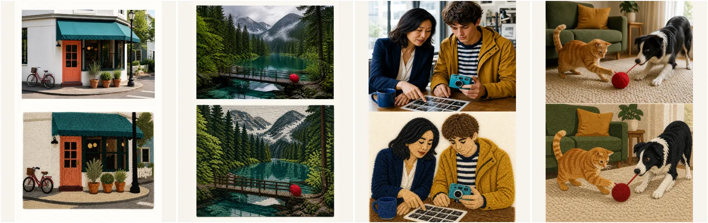</a>
</p>

### [Photo to Organic Knit](https://github.com/NalaZhang27/photo-to-organic-knit)

Selects a few recognition anchors from a photograph, then reorganizes them as a concept-driven textile art poster made from knit, crochet, felt, boucle, and loose fibers with deliberate negative space.

- **Author:** [NalaZhang27](https://github.com/NalaZhang27)
- **Input:** One landscape, portrait, or square photograph; optional exact two-to-four-word English title
- **Output:** A knitted-wool art poster or brand visual that preserves source orientation and normally includes a short title formed from one yarn strand
- **ImageGen role:** Uses the photo as subject evidence and the bundled textile image as a tactile-quality reference, then uses built-in ImageGen to redesign hierarchy, scale, spacing, silhouette, viewpoint, layering, negative space, and visual path
- **Structure:** `SKILL.md`, `agents/openai.yaml`, a complete style specification, one style reference, two before/after showcases, contribution guidance, and security documentation
- **License:** MIT; source photographs and third-party material do not become reusable merely because the Skill is licensed

<details>
<summary><strong>✨ Features & Notes</strong></summary>

**Features**

- Sorts source elements into retain, transform, and discard groups, then requires at least three structural changes so the result cannot collapse into a wool filter.
- Selects one primary and at most two supporting devices from negative-space symbols, asymmetric monuments, textile islands, yarn paths, scale contrast, and layered collage.
- Keeps the textile vignette at roughly 55–60% of canvas width and 50–55% of its height, surrounded by warm-ivory editorial space rather than edge-to-edge material.
- Uses uneven stitches, restrained loose ends, fuzzy fibers, pulled loops, and irregular edges to suggest a believable handmade object while rejecting plastic or glossy 3D surfaces.

**Notes**

It does not duplicate Yarn Rug Reference despite the shared fiber medium. Yarn Rug mainly simplifies the original composition into a low-color tufted version and presents a before/after comparison; Organic Knit treats the photo as raw material, removes background information, invents a visual metaphor, and recomposes an independent poster. Its bundled style image is a tactile and quality reference only, so the workflow explicitly forbids copying that image's train, bridge, hills, palette, or caption.

</details>

<p align="center">
  <a href="examples/photo-to-organic-knit/README.md">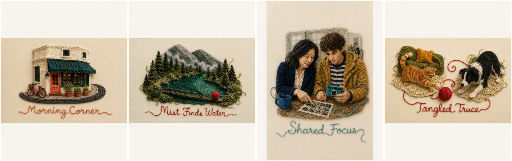</a>
</p>

<a id="illustrations--posters"></a>
## Illustrations & Posters

### [Oriental Editorial Poster](https://github.com/dacnay816y62-hub/fantasy-dongfang-jianyuehaibao)

Builds Chinese cultural editorial posters, publication covers, and typographic experiments from real cultural evidence, material logic, refined Chinese titles, and structural whitespace.

- **Author:** [dacnay816y62-hub](https://github.com/dacnay816y62-hub)
- **Input:** A title, theme, exhibition, brand, or cultural brief; optional references, short-keyword batches, and A/B/C comparison requests
- **Output:** A complete 3:4 Chinese editorial poster by default, with support for multi-topic batches, three-direction A/B/C tests, and comparison boards
- **ImageGen role:** Image generation is mandatory: Mode A creates a more expressive image-title fusion, while Mode B generates a calmer publication-style complete layout with a clearer title field and reading hierarchy
- **Structure:** `SKILL.md`, `agents/openai.yaml`, two composition and typography references, layout-reference assets, ten examples, and a v2 test suite containing images, prompts, and selected triptychs
- **License:** No open-source license declared upstream; reference images do not imply commercial-use permission

<details>
<summary><strong>✨ Features & Notes</strong></summary>

**Features**

- Runs a concept gate before every poster: six candidates must describe material fact, semantic pivot, title mechanism, non-interchangeability, and text reserve, then clear a scored threshold before generation.
- Defaults to one hero evidence item, one title action, one dominant axis, one small interruptor, and at most one accent color, explicitly rejecting generic seals, ink splashes, QR codes, pseudo-microtype, and tourism-poster aesthetics.
- Uses A/B/C directions for archival intervention, single-object evidence, and typographic structure, evaluates complete groups, and limits repeated use of giant cropped type, shadows, or other mechanisms.
- Prefers material from museums, libraries, and archives for cultural subjects and requires source and rights-status tracking instead of presenting generated reinterpretations as historical evidence.

**Notes**

The repository publishes a substantial Image 2 test set and selected triptychs that show how experiments converged into v2. It is more concerned with material inevitability, semantic mechanisms, and group evaluation than a generic “Chinese style” prompt. The tradeoff is a long `SKILL.md`, with some paths requiring online research into calligraphy and cultural evidence. Our four tests used awning shadow, water reflection, a lens-light band, and yarn tension as distinct title mechanisms; all four Chinese titles—“檐下,” “雾线,” “共焦,” and “牵引”—rendered correctly, while subject count and the cat–dog tug interaction remained intact. With no license file upstream, permission should be confirmed before copying, modifying, redistributing, or using the work commercially.

</details>

<p align="center">
  <a href="examples/oriental-editorial-poster/README.md">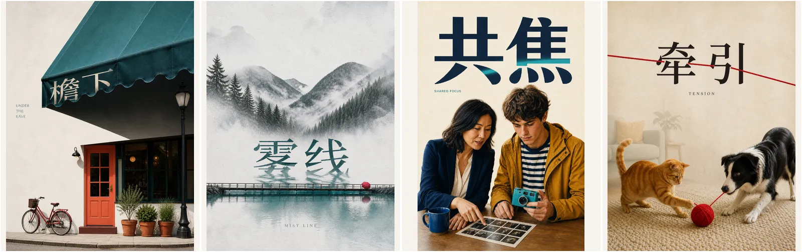</a>
</p>

### [Ian Xiaohei Illustrations](https://github.com/helloianneo/ian-xiaohei-illustrations)

Translates key claims, processes, states, and metaphors from Chinese articles into 16:9 white-background Xiaohei illustrations.

- **Author:** [helloianneo](https://github.com/helloianneo)
- **Input:** A Chinese article, post, blog, Notion/Markdown document, or single idea
- **Output:** Four to eight standalone body illustrations by default, or a shot list
- **ImageGen role:** Uses built-in `image_gen` and generates each illustration separately
- **Structure:** A compact `SKILL.md`, five references, fourteen style anchors, and example prompts
- **License:** MIT

<details>
<summary><strong>✨ Features & Notes</strong></summary>

**Features**

- Finds cognitive anchors instead of illustrating every paragraph evenly; each image carries one judgment or structure.
- Requires Xiaohei to perform the central action rather than appear as decoration, and each visual metaphor must be newly invented for the current article.
- Sets explicit generation and QA constraints for white backgrounds, whitespace, limited accent colors, short Chinese annotations, and avoiding slide-like layouts.
- Separates character design, style DNA, composition patterns, prompt templates, and checklists into references while keeping the entry file near one hundred lines.

**Notes**

The public examples are notably consistent in their white ground, black protagonist, red-orange-blue annotations, and absurd physical actions, making the skill particularly useful for Chinese workplace and methodology content. Its strength is the sequence “extract a point, then invent an action metaphor,” not a generic illustration style pack. Generated Chinese text can still drift, and character consistency depends on prompting and human review. An English wrapper and mascot extension exists as `illustrations-codex-skill`, but it explicitly credits this project, so the original author repository remains the primary entry.

</details>

<p align="center">
  <a href="examples/ian-xiaohei-illustrations/README.md">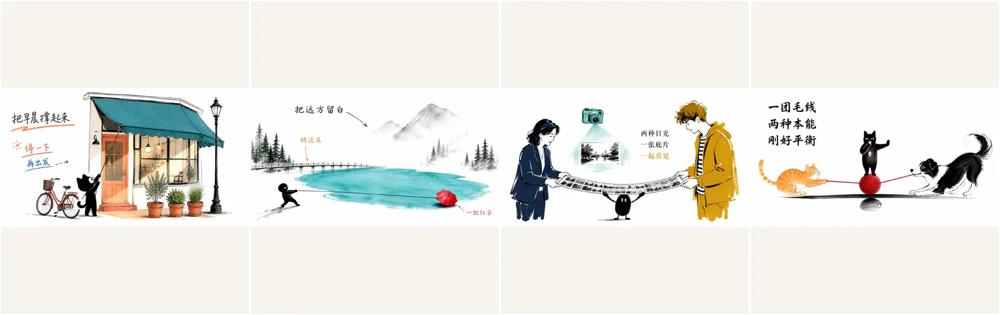</a>
</p>

### [Ian Xiaohei Scenes](https://github.com/helloianneo/ian-xiaohei-scenes)

Uses Xiaohei, real objects, and physical action to illustrate workplace situations and project stories, with an ultra-wide narrative mode.

- **Author:** [helloianneo](https://github.com/helloianneo)
- **Input:** Body copy, a theme, retrospective, personal story, or five to eight sequential beats
- **Output:** A 16:9 white-studio scene or an approximately 2.6:1–3:1 long-form image
- **ImageGen role:** Locks a quality master, then generates, compares, and selectively regenerates each scene
- **Structure:** A detailed `SKILL.md`, seven references, and seven master-quality examples
- **License:** MIT

<details>
<summary><strong>✨ Features & Notes</strong></summary>

**Features**

- Forces an abstract idea into one real hero object, one core physical conflict, a Xiaohei action, and two to four short labels.
- Makes “reference, do not copy” actionable: each standard image must change at least three of the hero object, spatial direction, action, props, label position, or viewpoint.
- Builds scroll mode from irregular curved paths, physical-object nodes, and staged actions rather than simply placing cards in a row.
- Uses two quality gates: master lock, character action, aspect ratio, and factual grounding are mandatory, while minor text or material defects can be recorded for iteration.

**Notes**

Seven examples clearly distinguish hand-drawn explanatory diagrams from white-studio object scenes, and the scroll master demonstrates an unusual approach to visualizing personal experience. The rules are thorough, but `SKILL.md` exceeds 300 lines and relies heavily on browsing master references, making it more expensive to run than a lightweight prompt skill. It also carries a strong creator-specific IP and is not suited to neutral, unbranded commercial illustration.

</details>

<p align="center">
  <a href="examples/ian-xiaohei-scenes/README.md">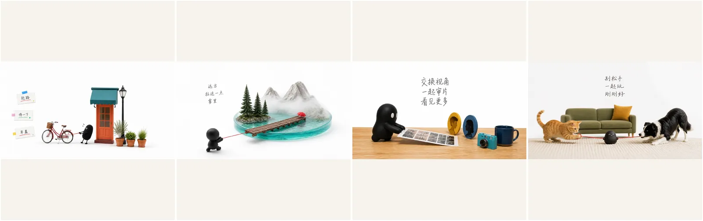</a>
</p>

### [Story Cover](https://github.com/worldwonderer/oh-story-claudecode/tree/main/skills/story-cover)

Infers a visual direction from a book title and genre, then combines an optional reference image with exact title, author, and platform ratio requirements to generate a web-fiction or novel cover.

- **Author:** [worldwonderer](https://github.com/worldwonderer)
- **Input:** Book title, author or pen name, and publishing platform; optional genre, reference image, and style requirements
- **Output:** A 2:3 portrait cover by default, or 3:4 for Tomato Novel, with a saved output path
- **ImageGen role:** Defaults to built-in `image_gen`, infers genre from title keywords, compiles style and typography, and uses edit/reference generation when an image is supplied
- **Structure:** `skills/story-cover/SKILL.md` inside a larger serialized-fiction toolkit, plus one reference covering ten genre styles
- **License:** MIT

<details>
<summary><strong>✨ Features & Notes</strong></summary>

**Features**

- Locks title, author, and platform before generation instead of letting the model fill missing publication data with placeholders.
- Routes historical romance, urban fiction, fantasy, mystery, science fiction, healing fiction, and other genres to distinct color, light, subject, and typography strategies.
- Defines complete title, correct author, legible genre signal, and thumbnail readability as a release-oriented quality gate.
- Falls back to an API only when built-in generation is unavailable, checking configuration without exposing credentials.

**Notes**

We fixed the author line to `IMAGEGEN SKILLS` and used `CORNER CAFE`, `MIST VALLEY`, `SHARED FOCUS`, and `RED THREAD` to test title rendering consistently. All four first-pass covers preserved the title, author line, and subject count. Production publishing would still require manual checks for typography, safe areas, and platform crops.

</details>

<p align="center">
  <a href="examples/story-cover/README.md">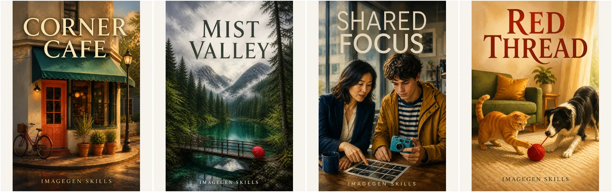</a>
</p>

### [TaiT CRT Interface Skill](https://github.com/TaiT-tt/tait-crt-interface-skill)

Re-authors people, animals, objects, or scenes as circa-1980s CRT computer-interface illustrations: one large bitmap wallpaper subject, three to six unequal early Macintosh/Minitel windows, scanlines, signal artifacts, and spherical barrel distortion.

- **Author:** [TaiT-tt](https://github.com/TaiT-tt)
- **Input:** A portrait, group photograph, animal, object, scene, or described theme, plus a named or image-derived palette and an aspect ratio
- **Output:** One finished CRT retro computer-interface raster illustration at the selected ratio
- **ImageGen role:** Rebuilds a new bitmap subject from a few identity anchors, adds feature-extraction windows and period interface geometry, and either renders the final surface directly or hands it to same-resolution CRT finalization in a fully capable Codex environment
- **Structure:** `SKILL.md`, `agents/openai.yaml`, three focused references, palette and visual assets, a CRT finalizer, and multiple author examples
- **License:** No open-source license declared upstream

<details>
<summary><strong>✨ Features & Notes</strong></summary>

**Features**

- Locks the subject roster, ordering, interaction, and a small identity-anchor set before deliberately severing the source contour, preventing the workflow from collapsing into an automatic pixelation filter.
- Requires the subject, windows, icons, and glyphs to share one square pixel lattice, with three to six unequal windows and one to three partial feature extractions forming a visible hierarchy.
- Uses a strict palette-then-ratio intake, while skipping both questions when valid values are already supplied.
- Separates `codex-full` and `portable-direct` capability paths; the portable path compiles scanlines, pixel bloom, misregistration, barrel curvature, and the fixed signature into one direct generation.

**Notes**

Our four samples use the image-derived palette, 4:3 for landscape inputs, and 3:4 for the portrait. The café, mountain lake, two people, camera, cat, dog, and yarn ball all remain recognizable, and the fixed `tait-crt-interface-skill` signature is readable. Scanlines, window hierarchy, and curved CRT edges are unusually consistent across the set. Because this environment used `portable-direct`, exact two-to-five-color compliance and a mathematically shared integer grid were judged visually rather than verified through the deterministic report. The upstream repository has no license file or licensing statement, so permission should be confirmed before copying, modifying, or using it commercially.

</details>

<p align="center">
  <a href="examples/tait-crt-interface-skill/README.md">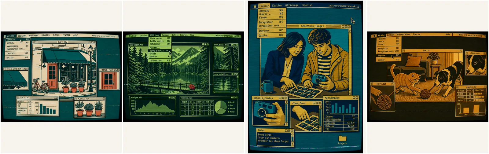</a>
</p>

<a id="presentations--diagrams"></a>
## Presentations & Diagrams

### [Ian Handdrawn PPT](https://github.com/helloianneo/ian-handdrawn-ppt)

Turns articles, courses, PDFs, DOCX files, or existing presentation material into complete Chinese hand-drawn technical explainer slides.

- **Author:** [helloianneo](https://github.com/helloianneo)
- **Input:** An article, document, course deck, script, outline, or rough idea
- **Output:** A 21:9 cover, 16:9 body/slide PNGs, and a multi-page contact sheet
- **ImageGen role:** Generates each page as a raster and uses deterministic tools only for exact text, cropping, or dimensions
- **Structure:** An entry `SKILL.md`, six narrative and visual references, theme tokens, and four examples
- **License:** MIT

<details>
<summary><strong>✨ Features & Notes</strong></summary>

**Features**

- Selects a narrative type such as teaching, persuasive, or report, then chooses page archetypes semantically instead of following a mechanical template order.
- Locks paper, titles, page numbers, linework, palette, characters, and spacing before multi-page generation; only the central semantic graphic changes with content.
- Distinguishes cover and body-page proportions and requires final checks for page dimensions, Chinese accuracy, and whole-deck rhythm.
- Degrades sensibly when generated text is unstable: reduce the text budget first, then leave label slots for deterministic typesetting if needed.

**Notes**

The public examples maintain a convincing near-white paper surface, fine lines, pale color, and consistent page skeleton. “PPT” describes the appearance of the final visuals: the primary output is text baked into PNG images, not an editable PPTX, and the skill does not package PDF or PPTX files. Only four pages are public, so consistency across a long deck remains a useful future test.

</details>

<p align="center">
  <a href="examples/ian-handdrawn-ppt/README.md">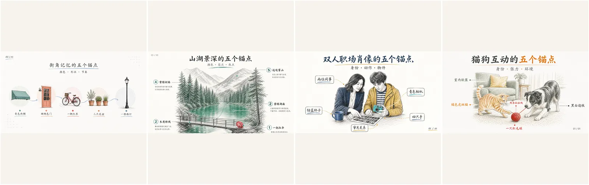</a>
</p>

### [Codex Illustrator](https://github.com/99Gaoxiaoqi/codex-illustrator)

Detects passages in Markdown that need visual explanation and routes them to Mermaid, Excalidraw, or ImageGen.

- **Author:** [99Gaoxiaoqi](https://github.com/99Gaoxiaoqi)
- **Input:** A Markdown document, with optional cover or presentation-image needs
- **Output:** Markdown with image references, standalone illustrations, covers, or presentation graphics
- **ImageGen role:** Uses built-in `image_gen.imagegen` for creative visuals and deterministic tools for structural diagrams
- **Structure:** `SKILL.md`, `agents/openai.yaml`, three references, five styles, two export scripts, and a workflow diagram
- **License:** MIT

<details>
<summary><strong>✨ Features & Notes</strong></summary>

**Features**

- Does not force every visual through generation: flows, hierarchies, and relationship diagrams may use Mermaid or Excalidraw, while metaphors, scenes, and covers use ImageGen.
- Scans heading hierarchy and visual opportunities first, then generates predictably named assets and writes them back into Markdown with explicit source connections.
- Covers body illustrations, covers, and presentation visuals in one workflow, making it useful for studying how a general visual orchestrator routes tasks.

**Notes**

This is a hybrid skill whose main value lies in deciding when to use each visual tool rather than enforcing one art style. Its instructions and style library are substantial, but it has less public visual evidence than the Ian and Baoyu collections. Because it also edits the document, evaluation should check insertion points and reference integrity in addition to the final image.

</details>

<p align="center">
  <a href="examples/codex-illustrator/README.md">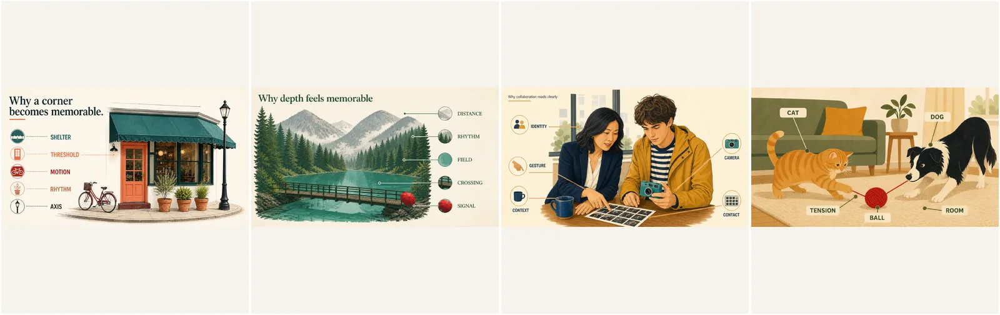</a>
</p>

### [Baoyu Visual Skills Suite](https://github.com/JimLiu/baoyu-skills)

A multi-skill suite for article illustrations, covers, comics, infographics, and Xiaohongshu card sets.

- **Author:** [Jim Liu](https://github.com/JimLiu)
- **Input:** An article, topic, or publishing need; optional references, brand colors, audience, style, and layout
- **Output:** Article images, covers, sequential comics, infographics, or card sets, with saved prompts
- **ImageGen role:** Supports several runtimes and prefers native `imagegen` when detected in Codex
- **Structure:** Five independent skills with their own workflows, references, and examples
- **License:** MIT

<details>
<summary><strong>✨ Features & Notes</strong></summary>

**Features**

- Covers a broad task range without putting every rule into one entry file: article illustrations, covers, comics, infographics, and social cards are modeled separately.
- Usually treats style and layout as independent choices and provides many real examples as a visual vocabulary.
- Plans content structure, pacing, and continuity before multi-image generation; saved prompts make review and reruns practical.
- Clearly prioritizes native Codex ImageGen while preserving portability across agents and backends.

**Notes**

This is the most complete suite found in the current collection and is a strong reference for category-level evaluation. The tradeoff is a large repository and configuration surface, and it is not built-in-only: the same skills include branches for other runtimes and providers. It is listed as one suite rather than consuming five entries with closely related components.

</details>

<p align="center">
  <a href="examples/baoyu-article-illustrator/README.md">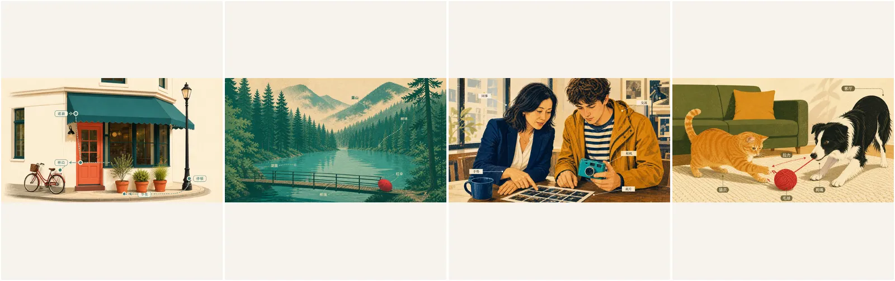</a>
</p>

<p align="center">
  <a href="examples/baoyu-cover-image/README.md">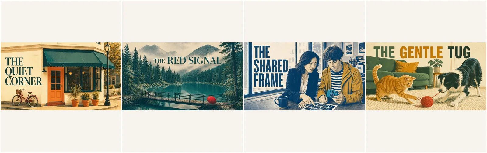</a>
</p>

<p align="center">
  <a href="examples/baoyu-comic/README.md">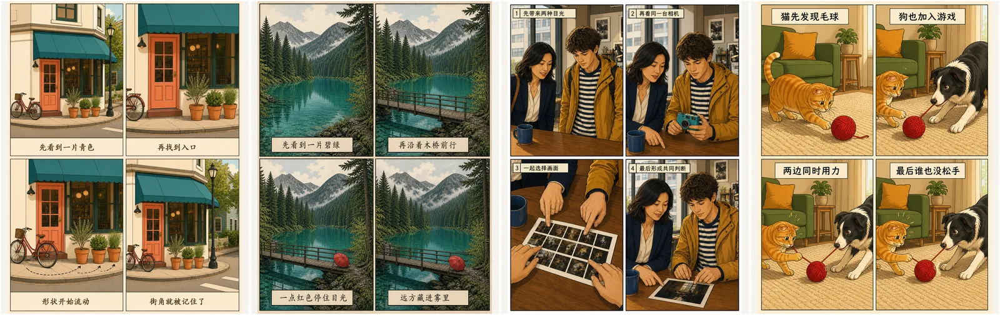</a>
</p>

<p align="center">
  <a href="examples/baoyu-infographic/README.md">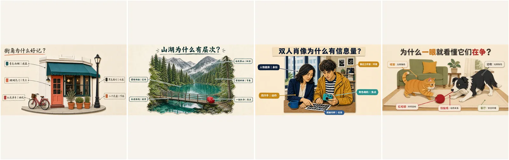</a>
</p>

<p align="center">
  <a href="examples/baoyu-xhs-images/README.md">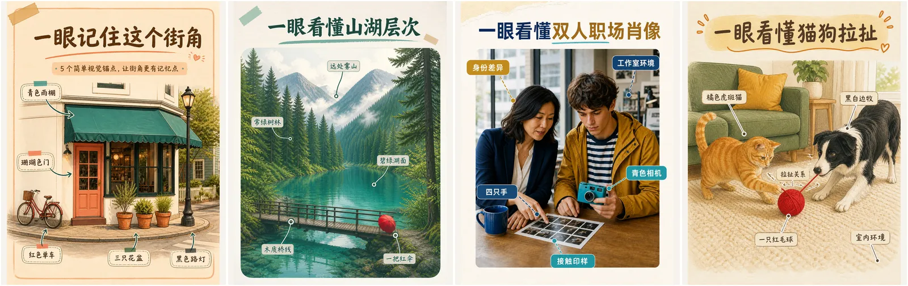</a>
</p>

### [Codex Image: Technical Infographics](https://github.com/philipbankier/codex-image-skill)

Creates source-grounded technical infographics, explainers, and content packs from URLs, briefs, local files, or repositories.

- **Author:** [Philip Bankier](https://github.com/philipbankier)
- **Input:** A URL, pasted text, local file, or local repository
- **Output:** `research-brief.md`, `image-prompt.md`, and `final.png`; pack mode produces three targeted outputs
- **ImageGen role:** Uses only Codex built-in `gpt-image-2` and forbids direct API calls or API-key requests
- **Structure:** A skill file, three templates, three examples, acceptance docs, tests, and static checks
- **License:** MIT

<details>
<summary><strong>✨ Features & Notes</strong></summary>

**Features**

- Decomposes source material into claims, relationships, audience, required labels, text budget, and sensitive information before generation—well suited to technical content and codebases.
- Splits social assets and dense infographics into separate director routes, controlling mobile readability and structural density independently.
- Uses P0/P1/P2 tiers for exact text and records the chosen visual grammar, pre-generation checks, and one retry delta in the prompt.
- Includes five house looks intended to escape the common dark SaaS-card-and-arrow default.

**Notes**

This is a very new community project with a strong execution contract, privacy boundary, and quality gate, and it explicitly targets current built-in Codex capabilities. The repository mainly exposes briefs, prompts, and acceptance fixtures rather than a substantial public gallery. Its style stability and technical fidelity should therefore be judged after running our own examples.

</details>

<p align="center">
  <a href="examples/codex-image/README.md">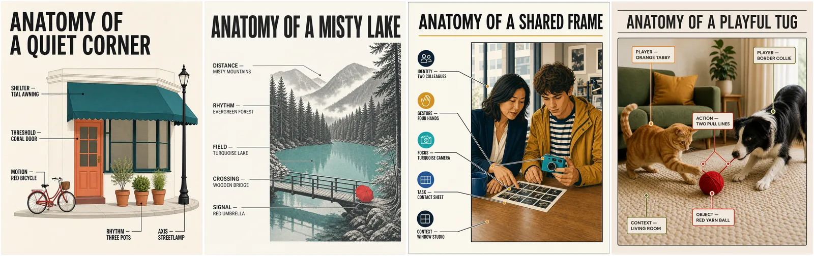</a>
</p>

### [Codex Paper Figure Skill](https://github.com/pengqianhan/codex-paper-figure-skill)

Explores academic-figure composition with built-in ImageGen, then rebuilds the result as editable native Draw.io geometry.

- **Author:** [Pengqian Han](https://github.com/pengqianhan)
- **Input:** Paper text, method or result descriptions, mechanism diagrams, model architectures, or graphical-abstract ideas
- **Output:** A `.drawio` file, with an optional raster reference and PNG/SVG/PDF previews
- **ImageGen role:** Generates composition references without treating unreliable raster text as the editable final
- **Structure:** One `SKILL.md`, Codex metadata, and two Draw.io/preview examples
- **License:** MIT

<details>
<summary><strong>✨ Features & Notes</strong></summary>

**Features**

- Combines ImageGen's strength in composition exploration with deterministic tools for exact text, connections, and editability.
- Parses scientific claims, entities, relationships, required labels, and constraints first, then checks XML, arrow direction, panel order, and exported previews explicitly.
- Provides a separate workflow for external icon sources, licenses, and attribution, falling back to editable primitives when rights cannot be confirmed.

**Notes**

This is a boundary entry: ImageGen is an important intermediate step, but the final artifact is not a bitmap. That “generated reference → native reconstruction” pattern directly addresses text accuracy and editability in academic figures, so it remains in the collection with a hybrid label. The current version is still early and publishes only two example groups.

</details>

<p align="center">
  <a href="examples/codex-paper-figure-skill/README.md">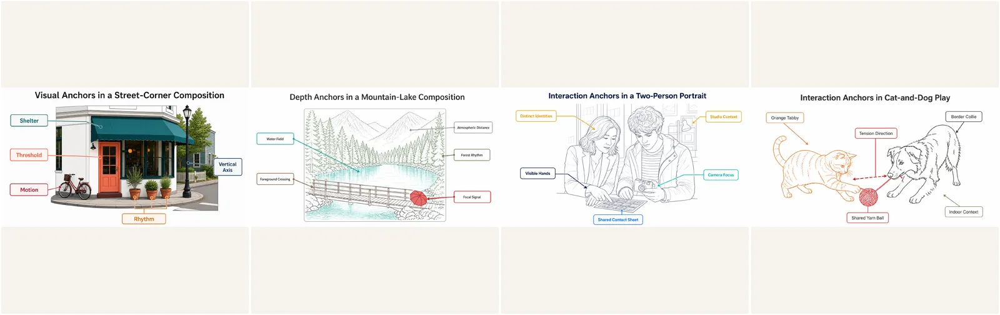</a>
</p>

### [Image to SVG](https://github.com/cheshireyang/image-to-svg-skills)

Decomposes a complex overview into independently regenerated PNG elements, then assembles them into a self-contained SVG whose text, arrows, panels, and layout remain second-editable.

- **Author:** [cheshireyang](https://github.com/cheshireyang)
- **Input:** A confirmed complex design, overview, mechanism, or framework image, with optional paper or structural context
- **Output:** Multiple generated PNG elements, a contact sheet, a self-contained SVG, and an optional PNG preview
- **ImageGen role:** Defaults to built-in `image_gen` and must regenerate each reusable sub-element from the confirmed overview as visual reference rather than cropping the source
- **Structure:** `SKILL.md`, prompt references, Codex metadata, `assemble_svg_layout.py`, a Pillow dependency, and complete SVG/preview examples
- **License:** No open-source license declared upstream

<details>
<summary><strong>✨ Features & Notes</strong></summary>

**Features**

- Explicitly rejects wrapping one whole PNG in an SVG shell: a complex source must map to multiple concrete element image files.
- Requires image-to-image for every sub-element; semantic descriptions and source crops cannot replace model-generated assets.
- Keeps exact titles, labels, arrows, frames, numbering, and spacing SVG-native while preserving rich imagery as replaceable embedded PNG layers.
- Co-locates overviews, elements, contact sheets, SVGs, and previews beside the source or requested output for project-level reproducibility.

**Notes**

A complete run generates multiple sub-elements for every source and then executes the assembly script, which does not map cleanly to this README's one-preview-per-input grid. The images below are therefore image-to-image four-stage overview proofs, not complete SVG deliverables, and they do not imply that the raster art has been fully vectorized. This pass evaluates whether the decomposition and assembly concept can be communicated visually.

</details>

<p align="center">
  <a href="examples/image-to-svg/README.md">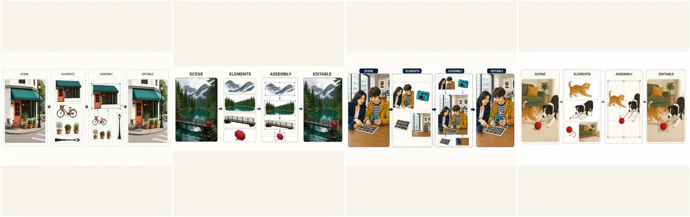</a>
</p>

<a id="ui--product-design"></a>
## UI & Product Design

### [Prototype Native UI with Image Generation](https://github.com/dnesdan/Skills/tree/main/prototype-ui-with-imagegen)

Explores several native Apple or Android UI directions, compares them with product and platform constraints, and implements only after selection.

- **Author:** [dnesdan](https://github.com/dnesdan)
- **Input:** A component, screen, state, or short flow; optional screenshots, product content, and platform constraints
- **Output:** Three native UI directions by default, up to five, with an annotated sheet and comparison; selected work can be rebuilt in SwiftUI or Jetpack Compose
- **ImageGen role:** Uses Codex ImageGen for visual hypotheses, never as production UI
- **Structure:** `SKILL.md` plus focused references for backends, prompting, native components, implementation, dialogue, and validation
- **License:** No open-source license declared upstream

<p align="center">
  <a href="examples/prototype-ui-with-imagegen/README.md">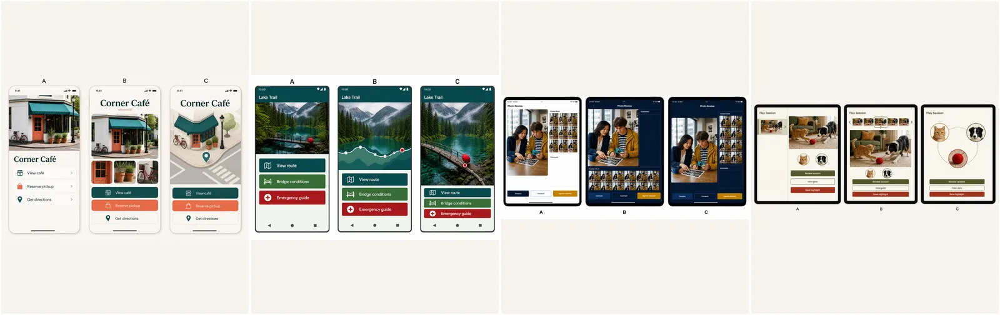</a>
</p>

### [Frontend App Builder](https://github.com/openai/plugins/tree/main/plugins/build-web-apps/skills/frontend-app-builder)

An official OpenAI composite skill that designs complete pages, UI states, or game screens before implementing and validating them in a browser.

- **Author:** [OpenAI](https://github.com/openai)
- **Input:** A new or existing frontend project, product brief, content, and requirements; optional references and backend provider
- **Output:** Visual concepts, production bitmap assets, a responsive implementation, and browser-validation screenshots
- **ImageGen role:** Creates full-page or state-level design references before coding and supplies production bitmap assets
- **Structure:** `SKILL.md`, `agents/openai.yaml`, and references for website concepts and visual validation
- **License:** No open-source license declared upstream

<p align="center">
  <a href="examples/frontend-app-builder/README.md">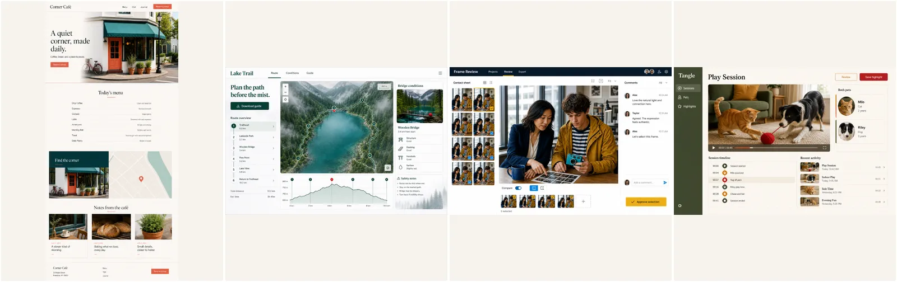</a>
</p>

### [Img to Frontend](https://github.com/am-will/codex-skills/tree/main/skills/img-to-frontend)

Generates four genuinely distinct web directions, waits for a user choice, then implements the selected responsive frontend.

- **Author:** [am-will](https://github.com/am-will)
- **Input:** An existing frontend repository or website brief, content, references, and technical constraints
- **Output:** Four differentiated concepts, the selected implementation, and multi-viewport QA screenshots
- **ImageGen role:** Requires four separate `$imagegen` calls before implementation begins
- **Structure:** `SKILL.md`, `agents/openai.yaml`, and one visual-iteration reference
- **License:** MIT

<details>
<summary><strong>✨ Features & Notes</strong></summary>

**Features**

- Makes “design before code” a hard gate and requires four directions to differ in structure, hierarchy, typography, interaction model, information architecture, and brand behavior—not merely color.
- Treats user selection as a clear phase boundary; only the chosen direction is decomposed into layout, components, responsive behavior, and acceptance criteria.
- Validates wide desktop, constrained desktop or tablet, and mobile views, correcting the largest visual discrepancy each round.

**Notes**

Its distinction from Prototype Native UI with Image Generation is clear: this skill targets the web and requires implementation as a real frontend, while the latter focuses more on Apple and Android native-product direction finding. Four high-quality concept images significantly increase runtime and generation usage, so it suits full design engagements rather than a small button edit.

</details>

<p align="center">
  <a href="examples/img-to-frontend/README.md">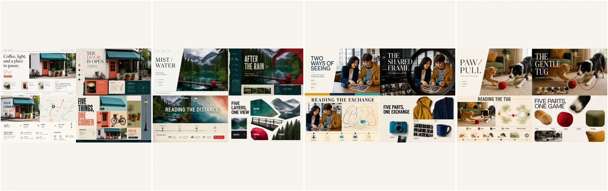</a>
</p>

### [Taste Image Generation Suite](https://github.com/Leonxlnx/taste-skill#image-generation-skills)

A set of image-only skills for web sections, mobile screens and flows, and full brand-identity boards.

- **Author:** [Leonxlnx](https://github.com/Leonxlnx)
- **Input:** A website section, mobile screen or flow, or brand-system brief; optional content, platform, audience, and references
- **Output:** One landscape image per web section, mobile image sets, or a 2×2 to 3×3 brand-system board
- **ImageGen role:** Provides instructions compatible with ChatGPT Images, Codex image mode, and other image agents
- **Structure:** Three standalone skills: `imagegen-frontend-web`, `imagegen-frontend-mobile`, and `brandkit`
- **License:** MIT

<details>
<summary><strong>✨ Features & Notes</strong></summary>

**Features**

- The web skill enforces one independent image per section and records a composition anchor and background mode, avoiding one giant page image and repetitive text-left/image-right layouts.
- The mobile skill locks iOS, Android, or cross-platform mode before constraining safe areas, navigation, device framing, readable text, cross-screen state, and a design bible.
- Brandkit starts from category, audience, emotional promise, and core metaphor, requiring logo, color, typography, imagery, and digital or physical applications to form an explainable system on one board.
- All three skills include extensive anti-slop lists and variation engines covering purple gradients, meaningless cards, fake luxury, irrelevant imagery, and default SaaS composition.

**Notes**

The rule set is enormous: the three `SKILL.md` files total more than 3,200 lines. They work well as a visual specification library, but progressive disclosure and per-run context cost are weak. They are tool-agnostic image instructions rather than built-in-only executors: the files do not explicitly invoke Codex `image_gen`, manage local outputs, or provide a standalone ImageGen gallery or automated QA. The repository's Floria examples demonstrate the broader Taste frontend ecosystem, not these three image skills in isolation, so they are labeled “Codex image mode compatible.”

</details>

<p align="center">
  <a href="examples/taste-imagegen-frontend-web/README.md">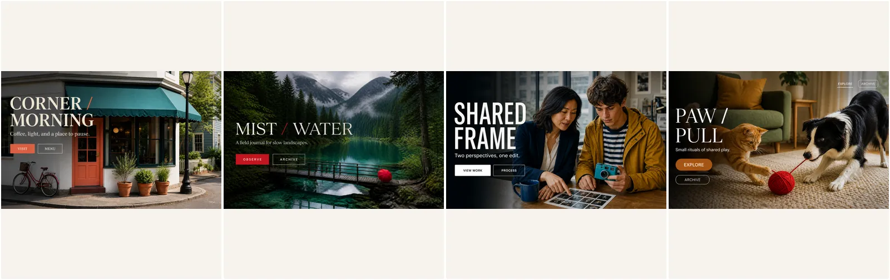</a>
</p>

<p align="center">
  <a href="examples/taste-imagegen-frontend-mobile/README.md">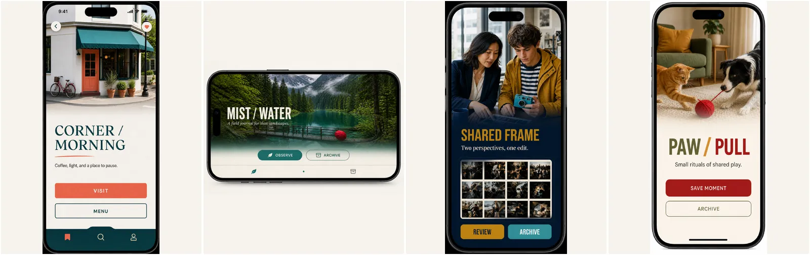</a>
</p>

<p align="center">
  <a href="examples/taste-brandkit/README.md">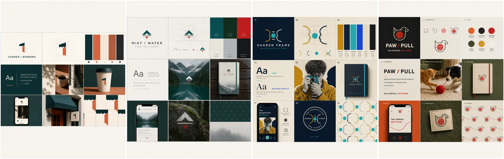</a>
</p>

### [HIAPI Icon Skills](https://github.com/HiAPIAI/hiapi-icon-skills)

Generates consistent icon sets for apps, websites, and product features, supporting sheets, standalone PNGs, revisions, and transparency preparation.

- **Author:** [HiAPIAI](https://github.com/HiAPIAI)
- **Input:** One to twenty icon subjects; optional style, palette, output mode, background, and reference character
- **Output:** A multi-icon sheet or one 1:1 image per subject, with request, jobs, manifest, and QC state
- **ImageGen role:** The local CLI builds deterministic jobs; each visual is delegated to Codex built-in `image_gen`
- **Structure:** A compact skill, ten styles, five palettes, planning/registration/QC CLIs, examples, and tests
- **License:** MIT

<details>
<summary><strong>✨ Features & Notes</strong></summary>

**Features**

- Defines style as a structured preset covering material, surface, geometry, proportions, camera, lighting, shadow, edges, detail density, background, and cross-image consistency.
- Batch mode requires comparable semantic and geometric complexity, a shared optical baseline, and consistent visual weight; individual mode creates a separate job for each subject.
- Revision manifests inherit the parent system and change one named defect without overwriting the approved prompt; states move strictly from planned to generated_unreviewed to approved or needs_revision.
- Transparency uses chroma keying, alpha extraction, and edge checks and is not misrepresented as native transparent generation.

**Notes**

The upstream test suite passes 12/12 locally. Two 1254×1254 examples also demonstrate consistent macaron material, camera, face geometry, shadow, and palette, plus basic continuity when revising the search icon. Public visual evidence currently covers only one of ten styles, five icon subjects, and an opaque background; other materials, individual export, chroma-key removal, and complex functional icons still need evaluation. HIAPI is the project brand, but normal execution explicitly avoids submitting paid HIAPI jobs.

</details>

<p align="center">
  <a href="examples/hiapi-icon-skills/README.md">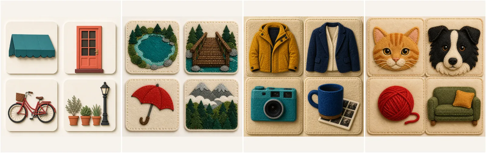</a>
</p>

### [Identity Skill](https://github.com/Sac-Y/identity-skill)

An image-first personal-site workflow that generates and locks section references before extracting assets, implementing, and validating the site.

- **Author:** [Sac-Y](https://github.com/Sac-Y)
- **Input:** A résumé, LinkedIn profile, project links, personal narrative, references, or a style direction
- **Output:** Section references, render contract, asset manifest, responsive site, fidelity ledger, and QA screenshots
- **ImageGen role:** Prefers `imagegen-frontend-web`; otherwise uses a bundled adapter for references and approved assets
- **Structure:** An approximately 480-line workflow, eight references, twelve samples, and an evidence validator
- **License:** MIT

<details>
<summary><strong>✨ Features & Notes</strong></summary>

**Features**

- Adds four approval gates before coding—content and style, reference images, asset decomposition, and generated assets—turning images into a version-locked implementation contract.
- Places each approved reference in an immutable directory with a SHA-256 record; changes to the protagonist, medium, crop, hierarchy, or responsive behavior trigger `reference-invalidated` and return the workflow to design.
- Decomposes sections into code-native elements, shared textures, fused scenes, and independent media slots while recording bounding boxes, aspect ratios, width share, and responsive mode.
- Final validation checks desktop, ultrawide, and mobile evidence, per-section state, a fresh review, reference hashes, and whether a screenshot is merely a renamed reference image.

**Notes**

This is a hybrid boundary entry: ImageGen creates references and some assets, while the final deliverable is a coded website. Twelve bundled samples cover quiet cinematic blue, dark editorial, and multi-element heroes, with two negative examples for letter-like repeated copy and excessive clutter. The README video is not a complete offline-rerunnable project. The validator proves evidence and hash integrity, not true visual 1:1 fidelity. Upstream also allows falling back to pasting a prompt into GPT on the web when built-in ImageGen is unavailable, so every run should record the actual backend.

</details>

<p align="center">
  <a href="examples/identity-skill/README.md">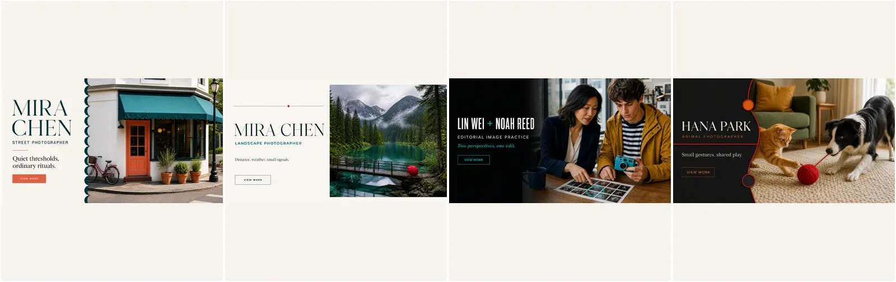</a>
</p>

<a id="game-assets--characters"></a>
## Game Assets & Characters

### [Hatch Pet](https://github.com/openai/skills/tree/main/skills/.curated/hatch-pet)

Creates an animatable pet from a concept or reference. ImageGen supplies the base look and actions; deterministic scripts handle layout, slicing, mirroring, validation, atlases, and previews.

- **Author:** [OpenAI](https://github.com/openai)
- **Input:** A pet concept, brand cues, product name, or character references; name, description, and style may be inferred
- **Output:** An 8×9 atlas, `spritesheet.webp`, `pet.json`, contact sheet, GIF preview, and validation records
- **ImageGen role:** Composes `$imagegen` for the character and action rows, then scripts transparency, slicing, atlasing, QA, and packaging
- **Structure:** `SKILL.md`, metadata, references, complete spritesheet/validation scripts, and `LICENSE.txt`
- **License:** Apache-2.0

<p align="center">
  <a href="examples/hatch-pet/README.md">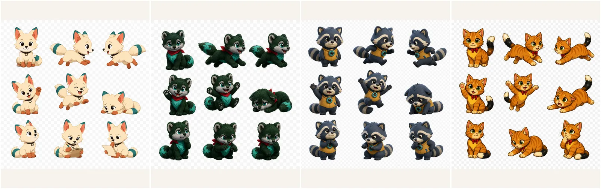</a>
</p>

### [Character Sprite Maker](https://github.com/Clad3815/character-sprite-maker)

A character-sprite and animation-row workflow focused on consistency, strict chroma backgrounds, task-state tracking, and validation.

- **Author:** [Clad3815](https://github.com/Clad3815)
- **Input:** A character concept, style, animation list, frame count, cell size, viewpoint, and optional references
- **Output:** Configurable PNG/WebP spritesheets, frames, a contact sheet, GIF preview, and `character.json`
- **ImageGen role:** Uses `$imagegen` for the baseline, action rows, and repairs; scripts perform deterministic processing and validation
- **Structure:** `SKILL.md`, `agents/`, `references/`, `scripts/`, `examples/`, and `LICENSE.txt`
- **License:** Apache-2.0

<p align="center">
  <a href="examples/character-sprite-maker/README.md">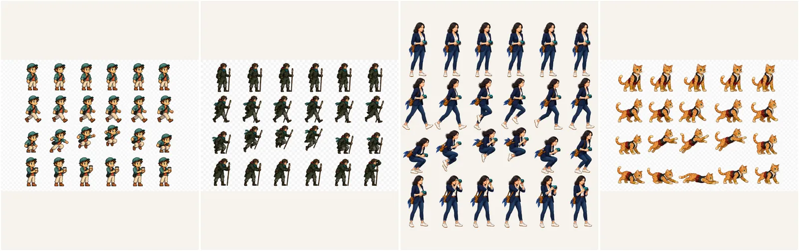</a>
</p>

### [Generating Dot Assets](https://github.com/abagames/agentic-gamedev-skills/tree/main/.agents/skills/generating-dot-assets)

An ImageGen skill for game objects, props, icons, and transparent-background pixel assets.

- **Author:** [abagames](https://github.com/abagames)
- **Input:** One object, target pixel dimensions, and output path; optional style, palette, color count, chroma key, and fit mode
- **Output:** An exact-size transparent pixel asset plus prompt, raw, cutout, and pixelized intermediates
- **ImageGen role:** Generates a high-resolution source with built-in `image_gen`, then uses ImageMagick for cutout, pixelization, fitting, and validation
- **Structure:** `SKILL.md`, an ImageGen recovery reference, and cutout/pixelize/fit/validate scripts
- **License:** MIT

<p align="center">
  <a href="examples/generating-dot-assets/README.md">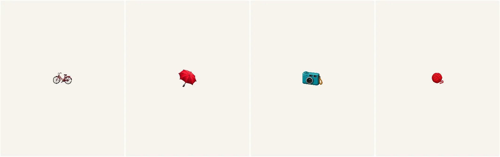</a>
</p>

### [Generate 2D Sprite](https://github.com/0x0funky/agent-sprite-forge/tree/main/skills/generate2dsprite)

A production-oriented 2D sprite workflow that plans characters, creatures, props, and effects from natural language or references, then cleans chroma keys, extracts frames, aligns assets, runs QC, and exports transparency.

- **Author:** [0x0funky](https://github.com/0x0funky)
- **Input:** A character, creature, NPC, prop, spell, or FX brief; optional references, action, view, frame count, grid, anchor, and engine constraints
- **Output:** Transparent PNG frames, animation grids or strips, GIF previews, assembled atlases, QC metadata, and optional Godot/Unity runtime assets
- **ImageGen role:** Uses built-in `image_gen` for raw sprites or animation grids on solid magenta; local processors only remove the key, slice frames, normalize scale and anchors, validate, and export
- **Structure:** `SKILL.md`, `agents/openai.yaml`, mode and prompting references, layout and character-anchor tools, a sprite processor, atlas/GIF exporters, and tests
- **License:** MIT

<details>
<summary><strong>✨ Features & Notes</strong></summary>

**Features**

- Infers the smallest useful asset plan from character type, action, and runtime needs instead of requiring users to prescribe grids and frame counts.
- Generates and reviews high-value actions such as idle, run, and attack separately before deterministic atlas assembly, reducing identity and scale drift across mixed actions.
- Separates body motion, projectiles, impacts, and wide attack effects, with character anchors, shared scale profiles, feet lines, and safe-area constraints.
- Extends beyond characters to map-prop packs, spell bundles, summons, transparent GIFs, and engine atlases.

**Notes**

Its scope is broader than the existing Sprite Pipeline: that entry focuses on normalizing action strips from one approved seed, while this Skill also handles asset planning, reference-derived variants, character/FX separation, complex atlases, and engine delivery. The workflow is substantial, but each action still needs visual QA because scripts cannot determine whether identity has drifted.

</details>

### [Generate 2D Map](https://github.com/0x0funky/agent-sprite-forge/tree/main/skills/generate2dmap)

Plans baked backgrounds, layered scenes, tilemaps, or side-scrolling stages from a map brief, then connects generated terrain and objects to editable maps, collision, and engine scenes.

- **Author:** [0x0funky](https://github.com/0x0funky)
- **Input:** A map theme, type, view, gameplay purpose, target engine, and optional visual references; dimensions, grids, layers, collision, and interactables may be specified
- **Output:** Map foundations, layered backgrounds, transparent objects, tile or terrain atlases, placement/collision/zone metadata, QA previews, and optional Godot/Unity scenes
- **ImageGen role:** Uses built-in `image_gen` for foundations, environmental layers, scene references, and object art; deterministic scripts handle extraction, preview composition, dimension checks, placement data, and engine wiring
- **Structure:** `SKILL.md`, `agents/openai.yaml`, map strategies and layered-map contracts, prop/terrain extraction and preview scripts, Godot/Unity delivery contracts, and tests
- **License:** MIT

<details>
<summary><strong>✨ Features & Notes</strong></summary>

**Features**

- Treats baked raster, layered raster, tilemap, grid, room-chunk, and side-scroll maps as distinct delivery modes instead of forcing every request into one flattened image.
- Builds playable layered scenes from a prop-free foundation, then a dressed visual reference, then separate runtime platforms, doors, hazards, pickups, and occluders.
- Classifies compact, wide, tall, collision-critical, and repeatable objects so unsuitable assets are not forced into square prop packs.
- Records walkability, collision, spawns, camera bounds, triggers, and occupant policies structurally, with actor-readability checks at the real gameplay camera.

**Notes**

This is a map-production and engine-delivery Skill, not merely a stylized scene generator. Our four photographic fixtures can test how it transfers subject matter, palette, and spatial cues, but they cannot fairly cover collision, playability, or engine wiring; those capabilities need a dedicated map-shaped input.

</details>

### [Minecraft Image Generation](https://github.com/Jahrome907/minecraft-agent-skills/tree/main/.codex/skills/minecraft-imagegen)

Generates pack concepts, banners, marketplace thumbnails, texture look-dev, server branding, and HUD/menu mockups for Minecraft projects.

- **Author:** [Jahrome907](https://github.com/Jahrome907)
- **Input:** Project context, asset type, theme, style, and use; optional existing packs, textures, or brand references
- **Output:** `pack.png` concepts, banners, thumbnails, texture look-dev, branding, UI mockups, and briefs
- **ImageGen role:** Calls built-in `image_gen` by default; generated textures are concepts for a manual pixel pass
- **Structure:** An approximately 190-line skill, prompt patterns, recipes, a brief scaffold, and handoff guidance
- **License:** MIT

<details>
<summary><strong>✨ Features & Notes</strong></summary>

**Features**

- Clearly separates bitmap concepts from deterministic resource-pack work such as `pack.mcmeta`, block models, blockstates, fonts, sounds, and shaders.
- Gives each asset type a distinct acceptance target: 64×64 silhouette for `pack.png`, desktop and mobile crops for banners, front view and even lighting for textures, and realistic control spacing for UI.
- Recommends saving both a high-resolution source and a target-size deliverable; when text is unsettled, it separates art-only and composed versions for later editing.
- Provides end-to-end routes for refreshing an existing `pack.png`, handing texture concepts into a resource pack, and producing UI or server-brand mockups.

**Notes**

This is a domain router and briefing skill rather than a complete image-geometry pipeline like Sprite Pipeline. Scaling, pixel cleanup, tiling, and pack wiring are explicitly left to people or other skills. The repository has no public generated examples dedicated to `minecraft-imagegen`, so its process and source can be reviewed, but its visual quality and vanilla-faithful consistency cannot yet be assessed.

</details>

<p align="center">
  <a href="examples/minecraft-imagegen/README.md">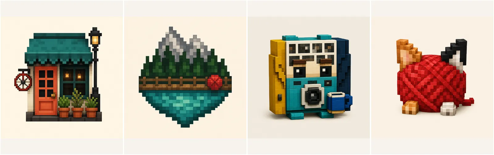</a>
</p>

### [Sprite Pipeline](https://github.com/openai/plugins/tree/main/plugins/game-studio/skills/sprite-pipeline)

An official OpenAI game-studio skill that generates action strips from an approved character or seed, then normalizes, slices, aligns, and previews them deterministically.

- **Author:** [OpenAI](https://github.com/openai)
- **Input:** An approved seed frame, target action, frame count, dimensions, and alignment requirements
- **Output:** Normalized frames, action strips, and preview sheets ready for a game pipeline
- **ImageGen role:** Uses an installed general `imagegen` skill for a full action row while this skill supplies game constraints
- **Structure:** `SKILL.md`, metadata, a workflow reference, and canvas, normalization, and preview scripts
- **License:** No open-source license declared upstream

<details>
<summary><strong>✨ Features & Notes</strong></summary>

**Notes**

Compared with a prompt that merely asks for a sprite sheet, this workflow confines the generative model to visual content and gives geometry, frame count, dimensions, and preview assembly to deterministic scripts. That makes it a stronger engineering baseline for evaluation.

</details>

<p align="center">
  <a href="examples/sprite-pipeline/README.md">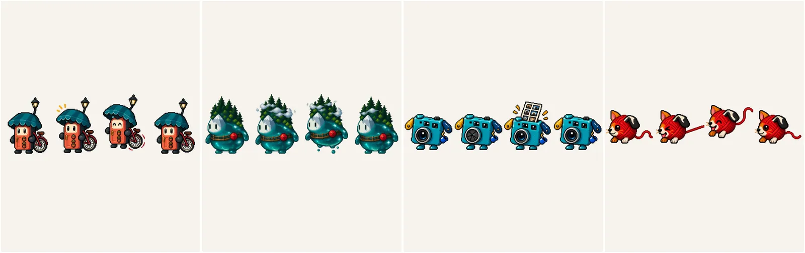</a>
</p>

<a id="storyboards--visual-narratives"></a>
## Storyboards & Visual Narratives

### [Agentara Cinematic Visual Skills](https://github.com/agentara/skills/tree/main/skills/aigc)

A paired poster and storyboard workflow that turns video-project context into 3:4 key art and timed 3×3, 4×3, or 4×4 boards.

- **Author:** [agentara](https://github.com/agentara)
- **Input:** A video plan, story brief, character references, existing boards, product or brand assets, or a prior poster
- **Output:** A poster with optional spec, or storyboard scenes plus a video-generation script
- **ImageGen role:** Uses built-in `image_gen` by default and prioritizes available character and storyboard references
- **Structure:** Two standalone workflows: `video-poster-design` and `video-storyboard`
- **License:** MIT

<details>
<summary><strong>✨ Features & Notes</strong></summary>

**Features**

- When the direction is unclear, the poster skill proposes three to five genuinely different concepts across composition, typography, lighting, and mood before generating the selected one.
- The storyboard skill routes by duration to 9, 12, or 16 panels and encodes panel number, duration, shot change, and character, costume, prop, and geographic continuity in one generation contract.
- Both share character-asset discovery rules: an existing character sheet must be supplied as an image reference rather than merely redescribed in text.
- After the storyboard, the workflow produces a video prompt script whose timing matches the panels and connects static imagery, action, camera, sound, and editing rhythm.

**Notes**

The domain information architecture is clear, but the repository ships no finished outputs or evals. The storyboard also asks an image model to satisfy exact grids, numbering, duration text, and multi-panel character continuity in one image—all known weak points. Because it forbids deterministic grid assembly, evaluation should inspect panel count, text, and continuity rather than treating 9, 12, or 16 panels as guaranteed. Deterministic poster typesetting is suggested only as a second pass and has no bundled implementation.

</details>

<p align="center">
  <a href="examples/video-poster-design/README.md">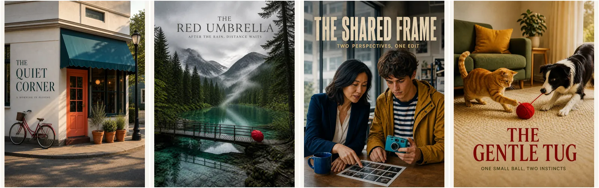</a>
</p>

<p align="center">
  <a href="examples/video-storyboard/README.md">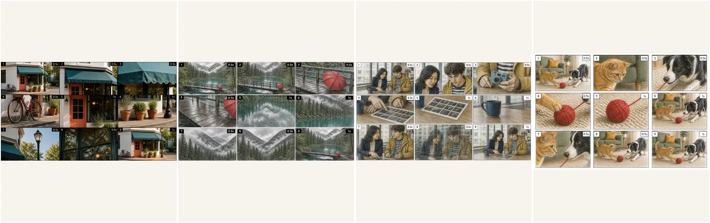</a>
</p>

### [TT Material Animation](https://github.com/pbwheel/tt-design/tree/main/skills/tt-material-animation)

Designs opening and ending endpoints for clay, paper, collage, ink, printmaking, sand, felt, and other physical media, then compiles the material-plausible transformation between them into a short-video prompt.

- **Author:** [pbwheel](https://github.com/pbwheel)
- **Input:** An image or text brief with a theme or intent, plus a selected material direction and execution mode
- **Output:** One endpoint sheet or two 9:16 endpoint frames, followed by a physically executable video prompt; optional video generation
- **ImageGen role:** After material and mode confirmation, uses built-in `image_gen` for a two-panel sheet or sequential reference frames, passing the opening frame visually into the ending-frame generation path
- **Structure:** `SKILL.md`, Codex metadata, material-selection guidance, eight physical-media contracts, an eval suite, and an MIT License
- **License:** MIT

<details>
<summary><strong>✨ Features & Notes</strong></summary>

**Features**

- Treats handmade media as physical contracts rather than adjectives: each material defines signature, light, composition, motion grammar, endpoint difference, avoids, and failure corrections.
- Uses three confirmation gates—direction, mode, endpoint preview—while allowing direct execution when the request already contains those decisions.
- Requires video prompts to use transformations the material can physically support, such as tearing, folding, stacking, absorbing, blooming, stitching, or pulling, rejecting weightless morphs.
- Its one-sheet mode presents unlabeled side-by-side 9:16 opening and ending panels for fast art-direction review.

**Notes**

Following the project's earlier decision to force all selected skills across all four fixtures, we used one-sheet endpoint mode directly: handmade torn paper for the café, ink wash for the lake, editorial minimal collage for the duo, and felt textile for the animals. All four show a readable endpoint difference and consistent material identity. We did not continue into video generation, so this pass does not evaluate temporal continuity.

</details>

<p align="center">
  <a href="examples/tt-material-animation/README.md">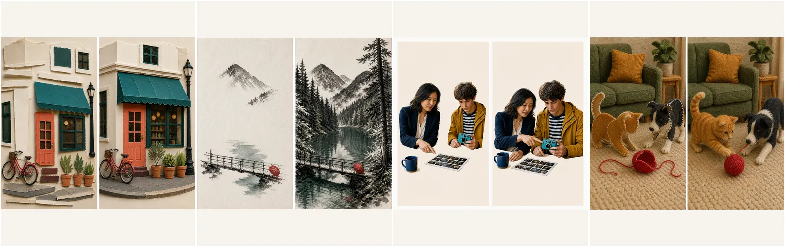</a>
</p>

### [Storyboard Skill](https://github.com/abel-vs/storyboard-skill)

A community skill for building storyboards and continuous visual narratives with imagegen.

- **Author:** [abel-vs](https://github.com/abel-vs)
- **Input:** A built, planned, or conceptual product; features from code, specs, or conversation; optional design references
- **Output:** Interactive HTML, GitHub-renderable Markdown, JSON, and per-feature storyboard images
- **ImageGen role:** Generates frames in parallel through an imagegen CLI; this is an API-key CLI path, not built-in-only
- **Structure:** `SKILL.md`, `assets/template.html`, `references/styles.md`, and `evals/evals.json`
- **License:** No open-source license declared upstream

<p align="center">
  <a href="examples/storyboard-skill/README.md">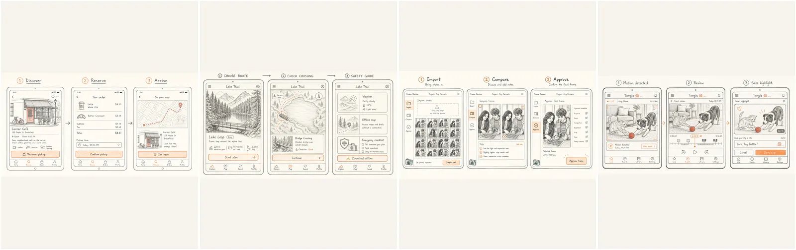</a>
</p>

<a id="contributing"></a>
## Contributing

<a id="sample-inputs--reproduction"></a>
### Sample Inputs & Reproduction

#### Source images

All four inputs were generated or edited with the system `imagegen` skill. Repository-relative paths keep them visible in forks, clones, and on GitHub.

<p align="center">
  <a href="fixtures/README.md">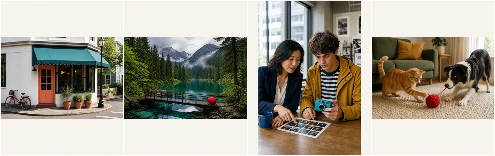</a>
</p>

Outputs live under `examples/<skill-id>/`. Directory names match skill IDs and filenames match the input scenes. When a skill requires several directions, they are combined into one scene board so the README still shows one image per input.

After adding or replacing samples, install ImageMagick and run `python3 scripts/build_showcase_previews.py`. The script rebuilds the lightweight four-up previews and per-skill full-resolution galleries, then validates preview counts in both READMEs.

### Curation

Projects are preferred when they:

- Target Codex directly or can be discovered and run in Codex
- Use harness built-in `image_gen` by default, or clearly document composition with a general imagegen skill
- Provide a reusable method or workflow rather than one prompt
- Publish a reviewable `SKILL.md` and usage guide, preferably with an output example
- Explain inputs, outputs, use cases, and limitations
- State a clear license
- Can be traced to the original author repository

Projects are usually excluded when they:

- Merely wrap a third-party image API without a Codex workflow
- Primarily use SVG, Canvas, HTML/CSS, or local drawing libraries
- Offer only prompt screenshots without reviewable source
- Are unattributed copies or violate upstream licensing
- Have only a weak connection to image generation

### Submit a skill

Issues and pull requests are welcome. A useful submission includes the project name and original repository, a short description, author, inputs and outputs, the role of `image_gen`, package structure, examples, license, and why it belongs here.

Suggested format:

```md
### [Skill Name](https://github.com/owner/repo)

One sentence explaining the visual task.

- **Author:** [owner](https://github.com/owner)
- **Input:** ...
- **Output:** ...
- **ImageGen role:** ...
- **Structure:** ...
- **License:** ...
```

## Disclaimer

“Awesome” means worth studying or using; it is not an endorsement of security, stability, output quality, or licensing scope. Review third-party source and licenses before installation. GitHub visibility does not imply permission to copy, modify, or use a project commercially.

<a id="related-collections"></a>
## Related Collections

These broader collections help discover candidates and understand the Agent Skills ecosystem. Inclusion there does not imply compliance with this repository's ImageGen, example, or licensing standards.

<a id="official-foundations"></a>
### Official Foundations

- [Image Generation Skill](https://github.com/openai/skills/tree/main/skills/.system/imagegen) — General Codex imagegen skill and its generation, editing, prompting, saving, and review rules.
- [Codex bundled imagegen sample](https://github.com/openai/codex/tree/main/codex-rs/skills/src/assets/samples/imagegen) — Bundled sample in the Codex source tree.
- [OpenAI Plugins](https://github.com/openai/plugins) — Current official plugin and skill examples.
- [Build skills](https://learn.chatgpt.com/docs/build-skills) — Official Skills and `SKILL.md` documentation.
- [Save workflows as skills](https://learn.chatgpt.com/use-cases/reusable-codex-skills) — Official reusable Codex skill workflow.
- [Get from idea to proof of concept](https://learn.chatgpt.com/use-cases/idea-to-proof-of-concept) — Official ImageGen prototyping workflow.

> The `openai/skills` repository is deprecated. Prefer `openai/plugins` and `openai/codex` for current official examples.

### Skills discovery

- [Awesome Codex Skills](https://github.com/composio-community/awesome-codex-skills) — A broad Codex skills collection.
- [Awesome Agent Skills](https://github.com/VoltAgent/awesome-agent-skills) — A large cross-runtime directory with dedicated OpenAI sections.
- [Agent Skill Index](https://github.com/heilcheng/awesome-agent-skills) — A multilingual guide and index across runtimes.
- [skills.sh](https://skills.sh) / [vercel-labs/skills](https://github.com/vercel-labs/skills) — A searchable ranking and installation CLI.

### Design and plugin ecosystem

- [Awesome Design Skills](https://github.com/bergside/awesome-design-skills) — Design-system and `SKILL.md` / `DESIGN.md` resources focused mainly on UI and design language.
- [Awesome Codex & ChatGPT Plugins](https://github.com/hashgraph-online/awesome-codex-plugins) — A broader collection of Codex plugins, skills, and resources.
