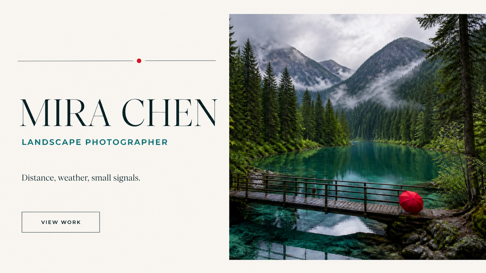
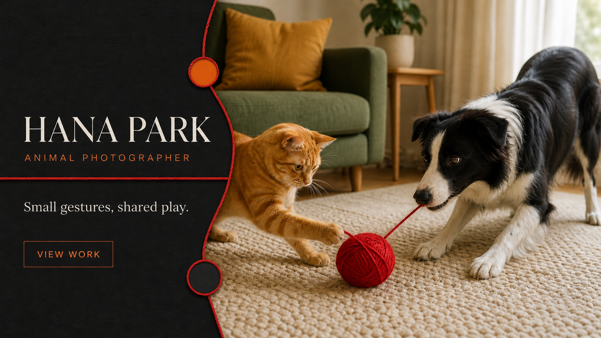

  <h1>Identity Skill</h1>
  
<a href="../../README.md">← 中文首页</a> · <a href="../../README_EN.md">English home</a> · <a href="https://github.com/Sac-Y/identity-skill">Upstream Skill ↗</a>

  
四张统一输入的高清生成结果 · Full-resolution outputs from four standardized inputs

<table>
  <tr>
    <td width="25%" align="center"> <code>人造 / 建筑 · Built / Architecture</code></td>
    <td width="25%" align="center"> <code>自然 / 景观 · Nature / Landscape</code></td>
    <td width="25%" align="center"> <code>人物 / 道具 · People / Props</code></td>
    <td width="25%" align="center"> <code>动物 / 互动 · Animals / Interaction</code></td>
  </tr>
</table>
